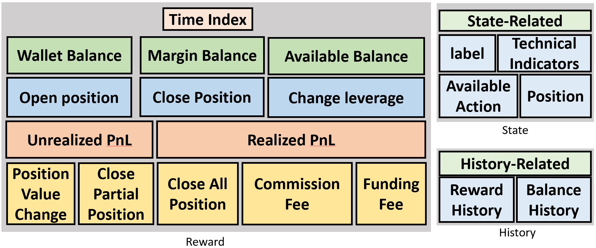
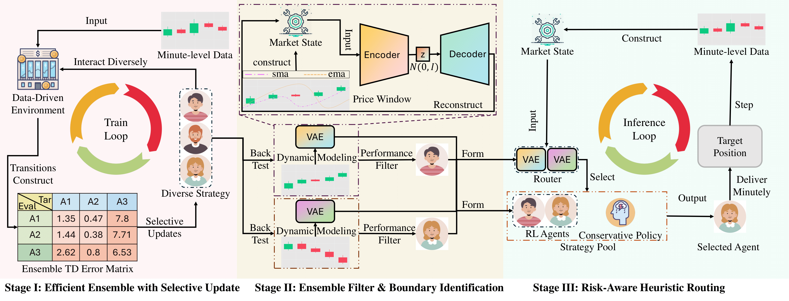

# FineFT 

This repository provides the full data preprocessing pipeline, along with the corresponding processed datasets used to construct the backtesting environment, train the FineFT algorithm, and implement the baselines presented in the related literature. Additionally, it includes result analysis and visualizations that illustrate the motivation behind our approach.

## Environment Installation

Utilize `conda create -n FineFT python==3.10.14` to create the corresponding download environment.

Utilize `conda activate FineFT` to activate the corresponding download environment.

Utilize `pip install -r requirements.txt` to install all the indepencies.

## Trading Environment 
The trading environment design is in [`env/env_class`](env/env_class/base_env.py), most of the trading process described in the Appendix C is implemented in the [`utils`](env/env_class/futures_util.py). Different environment provide different history record. 

To activate a trading environment, you will need a [`df.feather`](dataset/BNBUSDT/df.feather), [`state_features.npy`](dataset/BNBUSDT/state_features.npy), which are both provided the previous data preprocess and [`maintenance_margin_ratio_dict.npy`](dataset/BNBUSDT/maintenance_margin_ratio_dict.npy), which is provided by the [exchange](https://www.binance.com/en/futures/trading-rules/perpetual/leverage-margin) to calculate the maintenance margin.

The environment's base elements are listed as follow.

## FineFT Algorithm
Here we demonstrate the FineFT algorithm training, validating and testing process. The overall pipline of FineFT is demonstrated as follows.

### Additional Data Proprocess
Create train, valid and test dataset: [`python datahandler/preprocess_data.py`](datahandler/preprocess_data.py).

Split valid dataset into multi dynamics: [`python datahandler/slice_model.py`](datahandler/slice_model.py).

Create VAE dataset: [`python datahandler/vae_data_creation.py`](datahandler/vae_data_creation.py).

### Stage I: Efficient Ensemble with Selective Update
Train the low level agent: [`python RL/DiHFT/low_level/weight_advantage_pretrain.py`](RL/DiHFT/low_level/weight_advantage_pretrain.py).
### Stage II: Ensemble Filter & Boundary Identification
Backtest the ensemble: [`bash script/test/DiHFT/low_level/main.sh`](script/test/DiHFT/low_level/main.sh).

Filter the ensemble: [`python analysis/pick_agent/FineFT_single_agent_with_different_position.py`](analysis/pick_agent/FineFT_single_agent_with_different_position.py).

Train VAE: [`python RL/DiHFT/VAE/main.py`](RL/DiHFT/VAE/main.py).

### Stage III: Risk-Aware Heuristic Routing
Tuning parameter on valid dataset: [`python RL/DiHFT/high_level/vae_routing_optuna.py`](RL/DiHFT/high_level/vae_routing_optuna.py).

Pick the right paramter: [`python analysis/pick_agent/DiHFT_high_level_heurstic.py`](analysis/pick_agent/DiHFT_high_level_heurstic.py)

Backtest on the test dataset: [`python RL/DiHFT/high_level/vae_routing_final_result_macro_action.py`](RL/DiHFT/high_level/vae_routing_final_result_macro_action.py).

### Script

We provide shell script to easily conduct these experiments [here](script), containing additional experiment for other baselines as well. 

## Visualization & Analysis Tool
Three tsne plot for motivation part: [`python analysis/motivation_finding/create_tsne_result.py`](analysis/motivation_finding/create_tsne_result.py).

Train valid test data Visualization: [`python analysis/plot/valid_test_comparison.py`](analysis/plot/valid_test_comparison.py).

