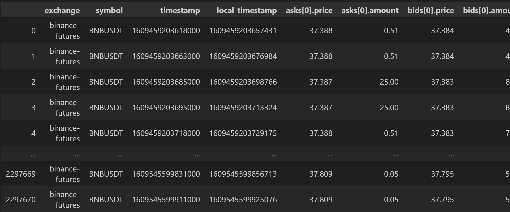
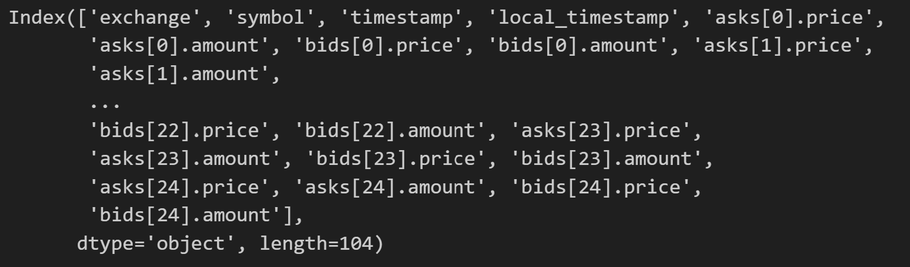
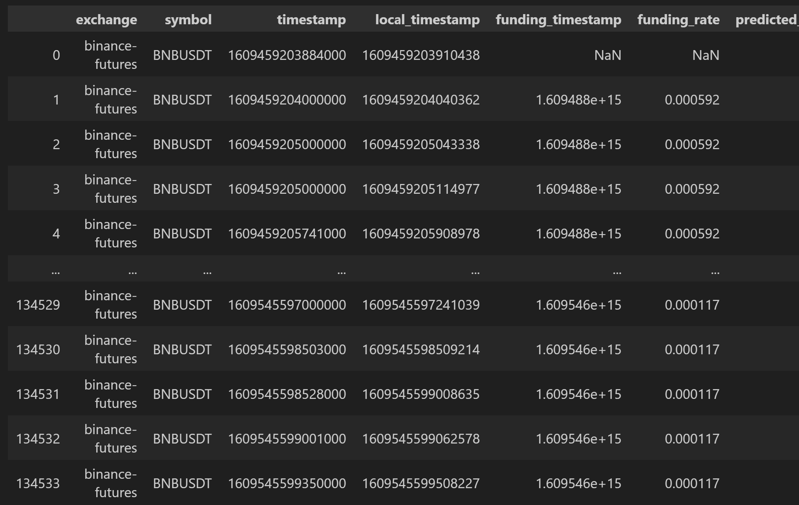
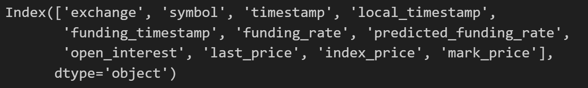
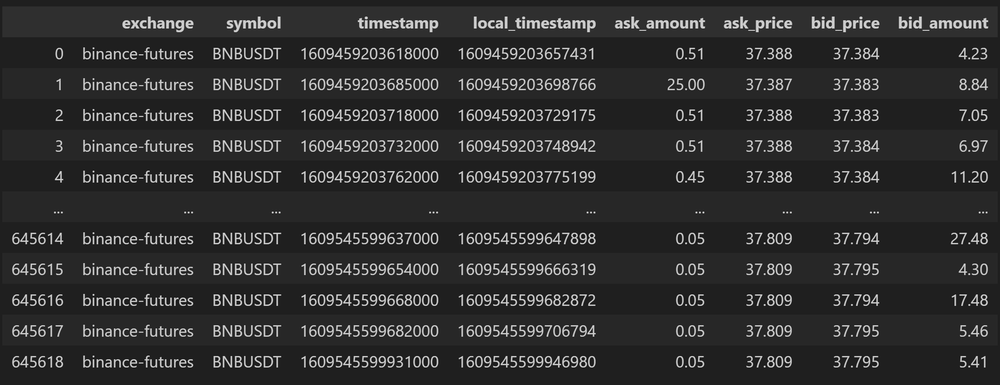
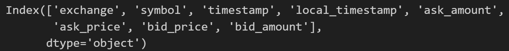
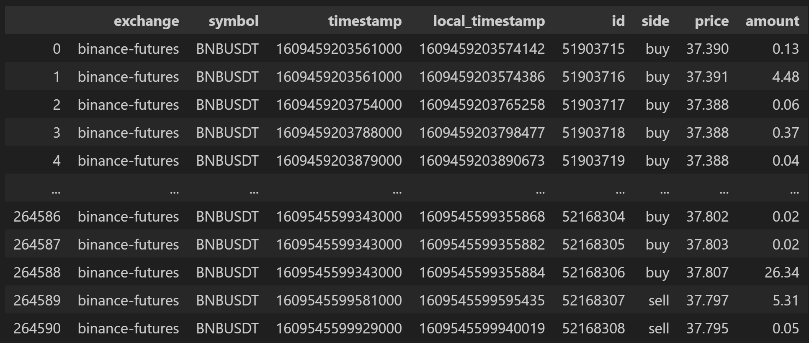
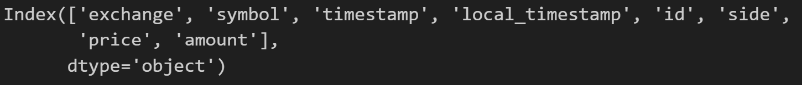
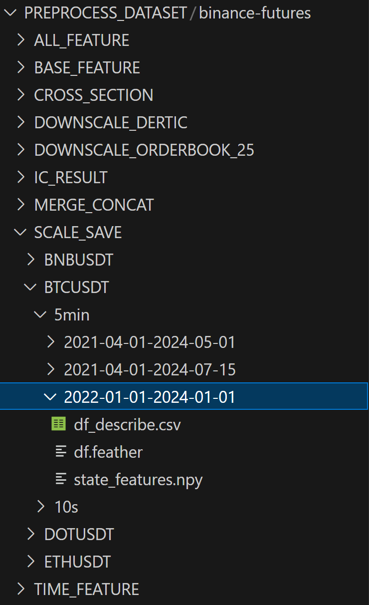
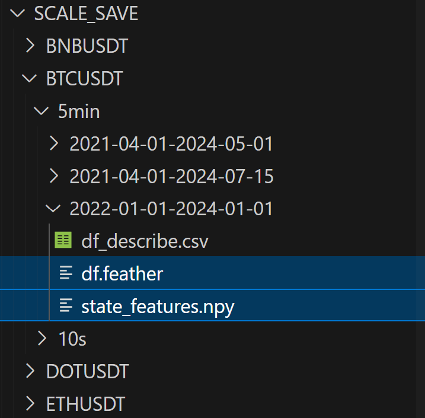

# FineFT Code Space

Here, we provide a code space for data prerpocessing and source code for the algorithm of FineFT and baselines used to compare with the FineFT

# [Data](data_preprocess/README.md) 
Here, we demonstrate the data format needed to utilize the high-fidelity trading environment in FineFT.

## Environment Installation

Utilize `conda create -n data_preprocess python==3.10.14` to create the corresponding download environment.

Utilize `conda activate data_preprocess` to activate the corresponding download environment.

Utilize `pip install -r requirements.txt` to install all the indepencies.

## Base Data 

Here, we introduce the how to download the data with tardis and their format. Recommendations for additional information source are also provided for users to construct their own technical indicators (we do not provide data preprocess for the addtiional information source). Additional code for checking the integrity of downloaded content is also provided.

### Overview
There are 2 kinds of features used in the high-fiedility enviornment provided in the FineFT code:
- Reward Features: those features are used to calculate the reward used in the environment, which includes: [`book_snapshot_25`](https://docs.tardis.dev/downloadable-csv-files#book_snapshot_25) and  [`derivative_ticker`](https://docs.tardis.dev/downloadable-csv-files#derivative_ticker).
- Market state features: those featreus are used to construct the market state representation described in the FineFT paper, which includes: [`quotes`](https://docs.tardis.dev/downloadable-csv-files#quotes) and [`trades`](https://docs.tardis.dev/downloadable-csv-files#trades). But it does not mean that you must stick to the construction of the technical indicators. You can take in any source of information helpful for the RL agent conducting trading. 

Here, we provide [`download data script`](script_download/download/all.sh) using [tardis](https://tardis.dev/). You might need to purchase an API key to fully utilize our code. 

In conclusion: there are 4 kinds of files needed to fully utlize our following data preprocess code: [`book_snapshot_25`](https://docs.tardis.dev/downloadable-csv-files#book_snapshot_25), [`derivative_ticker`](https://docs.tardis.dev/downloadable-csv-files#derivative_ticker)
[`quotes`](https://docs.tardis.dev/downloadable-csv-files#quotes) (optional) and [`trades`](https://docs.tardis.dev/downloadable-csv-files#trades) (optional). 

### Book_Snapshot_25
[`Book_Snapshot_25`](https://docs.tardis.dev/downloadable-csv-files#book_snapshot_25), is a snapshot of limit order book with 25 levels. The data is used to calculate the executed price for market order in the environment. Tardis provides data sample [here](https://docs.tardis.dev/downloadable-csv-files#book_snapshot_25). Additionally, we provide the correponding columns and dataframe in case you want to use your own data.

| Dataframe Snapshot | Column Names |
|------------|------------|
|  |  |

### Derivative_Ticker
[`Derivative_Ticker`](https://docs.tardis.dev/downloadable-csv-files#derivative_ticker), is a snapshot of the funding rate and mark price. The data is used to calculate the condition of liquidation and value change in the margin balance. Tardis provides data sample [here](https://docs.tardis.dev/downloadable-csv-files#derivative_ticker). Additionally, we provide the correponding columns and dataframe in case you want to use your own data.

| Dataframe Snapshot | Column Names |
|------------|------------|
|  |  |

Please notice that we might only need the `local timestamp`, `funding timestamp`, `funding rate`, and `mark price` to utilize the trading environment. 

### Quotes
[`Quotes`](https://docs.tardis.dev/downloadable-csv-files#quotes), records the event of best ask and best bid in the limit order book. The data is used to construct technical indicators helpful to predict the future mark price movement. Tardis provides data sample [here](https://docs.tardis.dev/downloadable-csv-files#derivative_ticker). Additionally, we provide the correponding columns and dataframe in case you want to use your own data.

| Dataframe Snapshot | Column Names |
|------------|------------|
|  |  |

### Trades
[`Trades`](https://docs.tardis.dev/downloadable-csv-files#trades), records executed orders. The data is used to construct technical indicators helpful to predict the future mark price movement. Tardis provides data sample [here](https://docs.tardis.dev/downloadable-csv-files#trades). Additionally, we provide the correponding columns and dataframe in case you want to use your own data.

| Dataframe Snapshot | Column Names |
|------------|------------|
|  |  |

### Recommendations for Additional Information Source
[`liquidations`](https://docs.tardis.dev/downloadable-csv-files#liquidations) can be viewed as a speicial kind of trade, where the orders are conducted because of lack of margin balance. The operator useful in the trades should be useful in liquidations as well since they share the same data structure.

[`incremental_book_l2`](https://docs.tardis.dev/downloadable-csv-files#incremental_book_l2) records every event happened in a limit order book. The data amount is the largest among all the data structure. `Incremental_book_L2` and `trades` together, records every event in the market. It is also the data format used by the most companies to construct features.

### Check Integrity

You may use the [`python over_view/checkout_download.py`](data_preprocess/over_view/checkout_download.py) to check whether all the needed files are downloaded properly.

Next, we introduce how we processed the original data into the format which can be directly utlized in FineFT's environment.

## Future Data Preprocess

Here we demonstrate how we process the data, and check data integrity and finally derive the data needed in the trading environment. We first provide an overview of each part and their functions. And then we talk about each part in details. Finally we provide a single line code for you to easily configure your target trading pair, frequency and number of cores you want to run simultaneously to boost the effiency and the way you want to select the technical indicators to construct your market state.

### Overview
Here, we demonstrate how we process the base data, including:
- Downscale reward data (`book_snapshot_25` and `derivative_ticker`) to configurable frequency.
- Create base features (OHLCV) and remove duplication for technical indicator data (`trades` and `quotes`) to configurable frequency.
- Create instantaneous features for the preprocessed data (`down_scale_book_25`,`down_scale_derivative_ticker`,`OHLCV`,`quotes_wo_duplications`) to capture the future mark price movement.
- Merge reward data, base feature and instantaneous features based on the timestamp.
- Concat all the merged data from the configurable start date and end date.
- Create time-rolling features based on the merged data.
- Merge the time-rolling features to the merged data.
- Calculate feature importance based on your choice from 3 options
- Construct the final data used in the trading environment and the names of correponding market technical indicators.

### Downscale Reward Data

Here we provide codes for directly downscaling the frequency from the original data for [`book_snapshot_25`](data_preprocess/operator_futures/orderbook_25/down_scale_single_shot_base_other.py) and [`derivative_ticker`](data_preprocess/operator_futures/derivative_ticker/down_scale_single_shot.py). The code runs for a single date for specific trading pair. However, `book_snapshot_25` is extremly large and might cause the programm to exceed the ram during running. To save the computional cost, we also provide code for downscaling from a finer time span instead of directly from the raw data for both [`book_snapshot_25`](data_preprocess/operator_futures/orderbook_25/down_scale_single_shot_base_other.py) and [`derivative_ticker`](data_preprocess/operator_futures/derivative_ticker/down_scale_single_shot_base_other.py). 

We add `memory_profiler` to the code to help record the ram it takes and you can estimate how much process you want to run simultaneously, which can be easily controlled in the final script.

### Create Base Features and Remove Duplication

Here we provide [codes](data_preprocess/operator_futures/features_related/base_feature.py) for aggregating the original trades to OHLCV for future technical indicator constructions and remove duplications in the quotes to prevent data ambiguity. The code runs for a single date for specific trading pair.

### Create Instantaneous Features

Here we provide [codes](data_preprocess/operator_futures/features_related/create_feature.py) for create base technical indicators using the information from the just one timestamp (no time-rolling involving) from downscaled 25-level orderbook snashot, downscaled derivative ticker, OHLCV, and quotes. The code runs for a single date for specific trading pair.

### Merge Features
Here, we provide [codes](data_preprocess/operator_futures/merge_concat/merge.py) for merging the downscaled reward features and the technical indicators we created so far. The code runs for a single date for specific trading pair.

### Concat Features
Here we provide [codes](data_preprocess/operator_futures/merge_concat/concat.py) for concat the dataframe containing the merging information regarding dates. The input should be 2 specific dates, indicating the start date and the end date for constructing the dataframe for a specific trading pair. We utilize multi-thread to acceralate the IO, for easier construction of dataset for long time span.

### Create Time-rolling Features
Here, we provide [codes](data_preprocess/operator_futures/time_operator/create_feature.py) for creating time-rolling features. Here you can specifiy the window choices. We refer [Alpha 158](https://github.com/microsoft/qlib/blob/98f569eed2252cc7fad0c120cad44f6181c3acf6/qlib/contrib/data/handler.py#L142) in [`qlib`](https://github.com/microsoft/qlib/) to construct rolling window features for OHLCV like features and single-price features.

### Merge and Clean
Here, we provide [code](data_preprocess/operator_futures/merge_all/merge_clean.py) for merging the time-rolling features to the previous merge dataframe and remove the column containing NAN.

### Feature Selection
Here, we provide code for proper selecting technical indicators helpful to predict the future mark price movement. We provide 4 methods to select the technical indicators: which all involves selecting features based on the feature importance calculation(here are where 4 methods different from each other) for mulitple-length window mark price movement, calculating the correaltion's for the important features to remove the duplicates.

To be more specifical, we first calculate serval targets: the mark price movement in the next (1,6,12) columns, which is configurable as well. It is important for the market state to cover different time scale future mark price prediction ability so that the RL agent can learn to plan instead of just focusing on 1-step reward.

The 4 ways for calculating the feature importance are
- `IC`: Directly calculate the [`Pearson correlation`](https://en.wikipedia.org/wiki/Pearson_correlation_coefficient) between each feature and target, and utilize the absolute value of the correlation as the feature importance.

- `Rank IC`: Rank each single target and each technical featuers regarding timestamp for the whole dataset, then calculate the Pearson correlation between each feature rank and target rank, and utilize the absolute value of the correlation as the feature importance. This method is more robust than IC, because the result of `IC` can be easily influenced by the extreme value in the dataset.

- `Linear Lasso`: Use linear regression to predict the target using the technical indicators and utilize the paramters as the feature importnace. This method is similiar to IC, and it maintain the independece of the selected features.

- `Catboost`: Utilize catboost to regress the target using the technical indicators and directly utlize the feature importance provided by the catboost. Since catboost involves non-linear operator, the result is fit for constructing market state representation (that is also how the market state representation is constructed in the FineFT).

### Scale and Save
Here, we utilize the log operator to indentify each selected feature scale and utilize the log result to normalize the technical features so that the original scale will not influence the training result.

### Check Integrity
Since from downscaling reward data to merging features involves dealing with single date data, it is very likely that the ram exceeds the capacity and some process are lost. Therefore, we provide [`integrity check code`](data_preprocess/over_view/checkout_read_create_feature.py) to make sure there is no data missing before the concat.

### Final Script
You can simply utilze a script like [`bash script_preprocess/future_upgraded/total_process/BNBUSDT/5min/20210401-20240101.sh`](data_preprocess/script_preprocess/future_upgraded/total_process/BNBUSDT/5min/20210401-20240101.sh), where you can configure the target frequency `target_freq=5min`, start date `start_date=2022-01-01`, end date `end_date=2024-01-01`, symbol `symbol=BNBUSDT`, the process number for downscaling trades, quotes and derivative ticker bacasue they all occupy smaller ram `max_processes_1=100`, the process number for downscaling book snapshot 25, because it occupies large ram `max_processes_2=20` and root path for you to store you result `root_path="."`. Please notice that we do not integrate the integrity check into this script.

## The Final Result of this process & Suggestions
After the preprocess, you should get something like the below picture. You can take the `df.feather` and `state_features.npy` as the input of FineFT code to construct the code. 

| Overall Result | Input of FineFT |
|------------|------------|
|  |  |

The download of a single trading pair with a 2-year length requires 800 G. It is recommended to download half year data per 24 hours if you store the data in a SATA, otherwise the intensive IO operations may cause the SATA drives to disconnect.

# [FineFT](FineFT/README.md) 

This repository provides the full data preprocessing pipeline, along with the corresponding processed datasets used to construct the backtesting environment, train the FineFT algorithm, and implement the baselines presented in the related literature. Additionally, it includes result analysis and visualizations that illustrate the motivation behind our approach.

## Environment Installation

Utilize `conda create -n FineFT python==3.10.14` to create the corresponding download environment.

Utilize `conda activate FineFT` to activate the corresponding download environment.

Utilize `pip install -r requirements.txt` to install all the indepencies.

## Trading Environment 
The trading environment design is in [`env/env_class`](FineFT/env/env_class/base_env.py), most of the trading process described in the Appendix C is implemented in the [`utils`](FineFT/env/env_class/futures_util.py). Different environment provide different history record. 

To activate a trading environment, you will need a [`df.feather`](dataset/BNBUSDT/df.feather), [`state_features.npy`](FineFT/dataset/BNBUSDT/state_features.npy), which are both provided the previous data preprocess and [`maintenance_margin_ratio_dict.npy`](FineFT/dataset/BNBUSDT/maintenance_margin_ratio_dict.npy), which is provided by the [exchange](https://www.binance.com/en/futures/trading-rules/perpetual/leverage-margin) to calculate the maintenance margin.

The environment's base elements are listed as follow.

## FineFT Algorithm
Here we demonstrate the FineFT algorithm training, validating and testing process. The overall pipline of FineFT is demonstrated as follows.

### Additional Data Proprocess
Create train, valid and test dataset: [`python datahandler/preprocess_data.py`](FineFT/datahandler/preprocess_data.py).

Split valid dataset into multi dynamics: [`python datahandler/slice_model.py`](FineFT/datahandler/slice_model.py).

Create VAE dataset: [`python datahandler/vae_data_creation.py`](FineFT/datahandler/vae_data_creation.py).

### Stage I: Efficient Ensemble with Selective Update
Train the low level agent: [`python RL/DiHFT/low_level/weight_advantage_pretrain.py`](FineFT/RL/DiHFT/low_level/weight_advantage_pretrain.py).
### Stage II: Ensemble Filter & Boundary Identification
Backtest the ensemble: [`bash script/test/DiHFT/low_level/main.sh`](FineFT/script/test/DiHFT/low_level/main.sh).

Filter the ensemble: [`python analysis/pick_agent/FineFT_single_agent_with_different_position.py`](FineFT/analysis/pick_agent/FineFT_single_agent_with_different_position.py).

Train VAE: [`python RL/DiHFT/VAE/main.py`](FineFT/RL/DiHFT/VAE/main.py).

### Stage III: Risk-Aware Heuristic Routing
Tuning parameter on valid dataset: [`python RL/DiHFT/high_level/vae_routing_optuna.py`](FineFT/RL/DiHFT/high_level/vae_routing_optuna.py).

Pick the right paramter: [`python analysis/pick_agent/DiHFT_high_level_heurstic.py`](FineFT/analysis/pick_agent/DiHFT_high_level_heurstic.py)

Backtest on the test dataset: [`python RL/DiHFT/high_level/vae_routing_final_result_macro_action.py`](FineFT/RL/DiHFT/high_level/vae_routing_final_result_macro_action.py).

### Script

We provide shell script to easily conduct these experiments [here](FineFT/script), containing additional experiment for other baselines as well. 

## Visualization & Analysis Tool
Three tsne plot for motivation part: [`python analysis/motivation_finding/create_tsne_result.py`](FineFT/analysis/motivation_finding/create_tsne_result.py).

Train valid test data Visualization: [`python analysis/plot/valid_test_comparison.py`](FineFT/analysis/plot/valid_test_comparison.py).

## License

FineFT: Efficient and Risk-Aware Ensemble Reinforcement Learning for Futures Trading  
© 2025 Molei Qin  

This work is licensed under the Creative Commons Attribution 4.0 International License (CC BY 4.0).  
https://creativecommons.org/licenses/by/4.0/

repo DOI: 10.5281/zenodo.18139892
