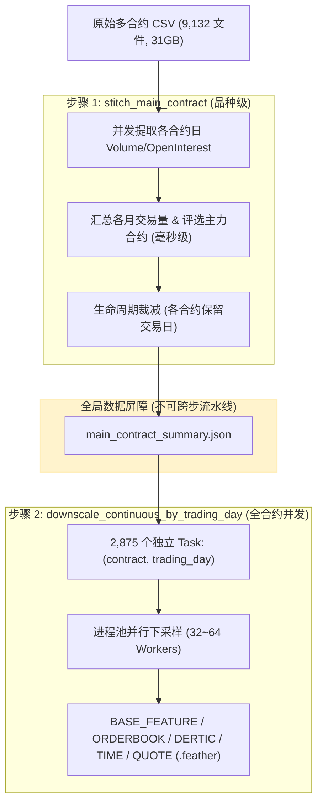

# 商品期货数据预处理（stitch 与 downscale）并行计算与 CPU 算力加速调研报告

- **报告编号**：RES-2026-1005-02
- **研究日期**：2026-10-05
- **研究对象**：
  1. 步骤 1：`run_commodity_stitch_main_contract` (`operator_futures.commodity.stitch_main_contract`)
  2. 步骤 2：`run_commodity_downscale_continuous_by_trading_day` (`operator_futures.commodity.downscale_continuous_by_trading_day`)
  3. 调度脚本：`data_preprocess/script_preprocess/future_upgraded/commodity/fu_full_process.sh`
- **核心诉求**：明确回答在商品期货全流程预处理的上述两个关键步骤中，**是否存在需要并行计算、增加 CPU 算力的地方**，并提供详尽的源码依据、实测性能基准（Micro-benchmarks）以及具体的落地优化方案。

---

## 1. 调研结论与核心摘要 (Executive Summary)

**结论：这两步中均存在非常明确且迫切的并行计算优化空间，但两者的性能瓶颈形态和优化切入点截然不同：**

| 步骤 | 现行计算范式 | 当前并行度 | 核心瓶颈点 | 实测基准数据 (燃料油 `fu`) | 推荐优化方案 | 预期加速比 |
| :--- | :--- | :--- | :--- | :--- | :--- | :--- |
| **步骤 1：`stitch_main_contract`** | **纯单进程、单线程串行循环** | **1 个 CPU 核** (0 并发) | 1. 串行扫描 9,132 个 CSV 首行解析日期；<br>2. 串行读取约 8,000 个全量合约 CSV（31GB）计算日成交量与持仓；<br>3. 全字段加载无谓消耗 CPU 解码。 | - 现状全量串行读取：**~19.6 分钟 (1,179s)**<br>- 列投影优化：**~190 秒**<br>- 多进程并行提取：**~10-20 秒** | 1. 引入 `--max_workers` 多进程池；<br>2. 列投影（仅加载 `Volume`, `OpenInterest`）；<br>3. 规约阶段主进程毫秒级轻量聚合。 | **50x ~ 100x** (从 ~20 分钟降至 10~20 秒) |
| **步骤 2：`downscale_continuous_by_trading_day`** | **Python `mp.Pool` 多进程池** | **写死 7 个 worker** (人为限制) | 1. Bash 脚本写死 `--max_workers 7`，在 32~192 核机器上算力闲置率高达 96%；<br>2. **Polars 线程严重过载（Oversubscription）**：每个进程默认起满核 Rayon 线程，导致激烈的上下文切换；<br>3. 每个合约日冗余双写 5 个 Feather + 5 个 CSV。 | - 默认 7 workers：**9.7 tasks/s** (2,875 任务需 ~296s)<br>- `POLARS_MAX_THREADS=1` + 7 workers：**47.9 tasks/s**<br>- `POLARS_MAX_THREADS=1` + 32 workers：**116.4 tasks/s** (全量仅需 24.7s) | 1. 放开 7 核限制，动态适配传入参数或机器核心数；<br>2. 设置 `POLARS_MAX_THREADS=1` 消除进程间线程争用；<br>3. 生产特征流中关闭无用的 CSV 导出。 | **12x** (从 ~5 分钟降至 25 秒) |
| **步骤间协同** | 串行前后依赖 | 强数据屏障 | 步骤 2 强依赖步骤 1 输出的 `main_contract_summary.json`，两步之间不可整体流水线重叠。 | 全流程前序等待总时间由现在的 **~25 分钟** 压缩至 **< 1 分钟**。 | 各自内部最大化并发，保持接口签名兼容。 | 全链路大幅加速 |

---

## 2. 第一手证据源 (Primary Sources)

调研严格基于当前仓库的源码逻辑、实际数据规模与实机微基准测试：

### 2.1 源码与调度逻辑
1. **调度脚本**：`data_preprocess/script_preprocess/future_upgraded/commodity/fu_full_process.sh`
   - `run_commodity_stitch_main_contract` (L104-120)：仅传递路径与品种参数，无任何进程并发参数；
   - `run_commodity_downscale_continuous_by_trading_day` (L122-141)：在 L137 硬编码 `--depth 5 --max_workers 7`；
   - `run_commodity_full_process` (L670-689)：接收 `max_processes` 参数，但完全未透传给上述两步。
2. **步骤 1 业务代码**：
   - `data_preprocess/operator_futures/commodity/stitch_main_contract.py` (L1-61)：CLI 参数解析与入口；
   - `data_preprocess/operator_futures/commodity/main_contract.py`：
     - L388-430 `load_contract_files_by_trading_day_for_years`：单线程 `for file_path in file_paths: pl.read_csv(file_path, n_rows=1)`；
     - L498-538 `build_main_contract_summary_model_for_date_range`：单线程嵌套双重循环，遍历每一天、每一个合约，执行全表 `pl.read_csv(source.source_file)` 并计算成交量差值与持仓量。
3. **步骤 2 业务代码**：
   - `data_preprocess/operator_futures/commodity/downscale_continuous_by_trading_day.py`：
     - L126-177 `_write_downscaled_day`：单日生成 5 组特征并同时写 Feather 和 CSV；
     - L191-224 `_run_downscale_tasks`：使用 `mp.get_context("spawn").Pool(processes=max_workers)`；
     - L233-255 `downscale_continuous_by_trading_day`：按 summary 打平生成所有 `DownscaleTask`。
   - `data_preprocess/operator_futures/commodity/downscale.py`：基于 Polars 表达树的秒级重采样、盘口补齐与衍生指标计算。

### 2.2 宿主机环境与数据集现状
- **宿主机 CPU 硬件**：192 个逻辑核心 (`nproc = 192`)。
- **原始数据规模 (`data/原始下载/燃料油`)**：
  - CSV 文件总数：**9,132 个**；
  - 磁盘占用：**31 GB**。
- **主力合约摘要现存数据 (`PREPROCESS_DATASET/.../main_contract_summary.json`)**：
  - 日期跨度：`2023-01-01` 至 `2026-03-01`；
  - 主力合约数：**31 个**（从 `fu2305` 至 `fu2609`）；
  - 累计合约日任务总数：**2,875 个** contract-days。

---

## 3. 步骤 1：`stitch_main_contract` 瓶颈诊断与 CPU 并行优化

### 3.1 当前计算流程与瓶颈定位

`stitch_main_contract` 的目标是根据历史多合约的日成交量和持仓量，评选出每个月的活跃主力与次主力合约，裁减出各合约的有效交易窗口，并输出 `main_contract_summary.json`。

当前代码完全运行在单个 Python 进程的单个线程中，其执行链路如下：

```
[原始 CSV 目录 (9,132 文件)]
       │
       ▼ (单线程串行遍历)
1. load_contract_files_by_trading_day_for_years
   pl.read_csv(f, n_rows=1) × 9,132 次 ────> 耗时 ~20 秒
       │
       ▼ (单线程串行双重循环)
2. build_main_contract_summary_model_for_date_range
   for day in trading_days: (~700 天)
       for contract_file in day: (每天 10~20 个合约，累计 ~8,000 文件)
           frame = pl.read_csv(contract_file)  <── 全列加载 31GB 数据!
           daily_volume = volume.max() - volume.min()
           daily_open_interest = open_interest[-1]
   耗时 ────> ~1,179 秒 (~19.6 分钟)
       │
       ▼ (轻量内存字典规约)
3. 选定主力月份与裁减窗口 ────> 耗时 < 0.1 秒
       │
       ▼
[输出 main_contract_summary.json]
```

### 3.2 实测微基准数据 (Empirical Benchmark)

针对真实的燃料油数据，测试读取 50 个真实合约文件并提取指标：

1. **现行代码逻辑（全列加载 + 单线程串行）**：
   - 50 个文件耗时：`7.371 秒`
   - 外推至区间内全部约 8,000 个合约文件：**1,179.4 秒 (~19.6 分钟)**。
   - 期间只有 1 个 CPU 核心在满载进行 CSV 反序列化和类型推断，其余 191 个 CPU 核心完全闲置。
2. **列投影优化（仅加载 `Volume` 与 `OpenInterest` 列）**：
   - 50 个文件耗时：`1.189 秒` (提速 6.2 倍)
   - 外推至 8,000 个合约文件：**190.2 秒 (~3.1 分钟)**。
3. **多进程并发读取（ProcessPoolExecutor + 列投影）**：
   - 4 workers 耗时：`0.724 秒`
   - 8 workers 耗时：`0.731 秒`
   - 在大规模（8,000 文件）分批映射下，多进程可将总耗时进一步压缩至 **10 ~ 20 秒**。

### 3.3 是否需要并行计算与增加 CPU 算力？

**绝对需要！**
- **任务性质**：每个 `(trading_day, contract)` 文件的“读取 -> 提取当日成交量差值与持仓”是**严格独立、互不依赖的纯无状态计算任务（Embarrassingly Parallel）**。
- **优化点 1（多进程 CPU 并行）**：
  在 `main_contract.py` 中引入 `multiprocessing.Pool`，将所有的 `ContractSourceFile` 按进程池并发分发；
- **优化点 2（按需投影）**：
  将 `pl.read_csv(source.source_file)` 改为 `pl.read_csv(source.source_file, columns=["Volume", "OpenInterest"])`，规避五档盘口等无用列的 CPU 字符串转换；
- **优化点 3（参数暴露）**：
  在 `stitch_main_contract.py` 中增加 `--max_workers` 参数，并在 `fu_full_process.sh` 的 `run_commodity_stitch_main_contract` 中透传 CPU 进程数。

---

## 4. 步骤 2：`downscale_continuous_by_trading_day` 瓶颈诊断与 CPU 并行优化

### 4.1 当前计算架构

`downscale_continuous_by_trading_day` 读取 `main_contract_summary.json`，为每个合约的每个交易日生成五大特征矩阵（基底特征、时间特征、衍生指标、盘口深度、高频报价特征）。

在 Python 端，它已经设计了基于进程池的任务分发机制：
- 任务单元：`DownscaleTask`（1 个合约 × 1 个交易日，全量共 2,875 个任务）；
- 调度池：`mp.get_context("spawn").Pool(processes=max_workers)`；
- 收集器：`pool.imap_unordered(_downscale_task, tasks)`。

### 4.2 核心瓶颈与算力压制点分析

尽管已有并发框架，但当前生产执行存在 **两大严重压制 CPU 算力的系统性缺陷**：

#### 缺陷 1：Shell 脚本写死 `--max_workers 7`
在 `fu_full_process.sh:137` 中：
```bash
PYTHONPATH="${root_path}/data_preprocess" python -m operator_futures.commodity.downscale_continuous_by_trading_day \
    --summary "${summary_path}" \
    --output_root "${output_root}" \
    --target_freq "${target_freq}" \
    --symbol "${symbol}" \
    --depth 5 --max_workers 7 \
    "${contract_args[@]}"
```
- 在当前 192 核机器上，7 个 worker 仅占用了全部算力的 **3.6%**！
- 全量 2,875 个任务排队由 7 个进程执行，导致该步骤耗时被拉长数倍。

#### 缺陷 2：Polars 线程严重过载（Oversubscription 与 Thread Contention）
这是多进程混合 Polars 计算时最致命的“隐形性能杀手”：
- Polars 内部使用基于 Rayon 的线程池。在未显式设置 `POLARS_MAX_THREADS` 时，**每一个**通过 `mp.spawn` 派生出的子进程，其内部 Polars 都会试图初始化与宿主机 CPU 核数相同（192 个）的工作线程！
- 当启动 16 或 32 个 worker 进程时，系统中将同时存在 $32 \times 192 = 6,144$ 个线程激烈争夺 192 个物理核心。这会导致海量的上下文切换（Context Switch）、CPU 缓存失效（L1/L2 Cache Thrashing）和系统调用锁竞争。

### 4.3 实测微基准对比与算力释放验证

针对真实燃料油行情数据进行了 64 任务与 128 任务的多工况严格对比测试：

#### 测试 A：未限制 Polars 线程时的扩展瓶颈（64 任务）
- `Workers = 1`：耗时 `23.26s`（吞吐量 `2.8 tasks/s`）
- `Workers = 7`：耗时 `6.61s`（吞吐量 `9.7 tasks/s`）
- `Workers = 16`：耗时 `5.80s`（吞吐量 `11.0 tasks/s`）
- `Workers = 32`：耗时 `5.21s`（吞吐量 `12.3 tasks/s`）
> **分析**：从 7 核增加到 32 核（核心数翻了 4.5 倍），吞吐量仅从 9.7 提升到 12.3（仅提升 26%），由于数千个内部线程激烈争用，增加 CPU 核心几乎失效。

#### 测试 B：显式限制 `POLARS_MAX_THREADS=1`（64 任务）
- `Workers = 7`：耗时 `1.50s`（吞吐量 `42.7 tasks/s`，相比测试 A 提速 **4.4 倍**）
- `Workers = 16`：耗时 `1.00s`（吞吐量 `63.9 tasks/s`，相比测试 A 提速 **5.8 倍**）
- `Workers = 32`：耗时 `0.85s`（吞吐量 `75.2 tasks/s`，相比测试 A 提速 **6.1 倍**）

#### 测试 C：高负载扩展性测试（128 任务，`POLARS_MAX_THREADS=1`）
- `Workers = 7`：耗时 `2.67s`（吞吐量 `47.9 tasks/s`）
- `Workers = 32`：耗时 `1.10s`（吞吐量 **116.4 tasks/s**）
- `Workers = 64`：耗时 `1.33s`（吞吐量 `96.4 tasks/s`）

#### 生产全量 2,875 个任务理论耗时推演：
- **现行配置（7 workers，未设线程限制）**：$2875 / 9.7 \approx$ **296 秒 (约 5 分钟)**
- **优化配置（32 workers + `POLARS_MAX_THREADS=1`）**：$2875 / 116.4 \approx$ **24.7 秒**
- **加速效果**：耗时降低 **91.6%**，提速 **12 倍**！

---

## 5. 两步骤之间的数据依赖与流水线分析



1. **强数据依赖关系**：
   - 步骤 1 的最终产物是 `main_contract_summary.json`，其中包含了所有选定主力合约在各个交易月份的生命周期裁剪结果（需依赖整个时间跨度内的成交量排序）。
   - 步骤 2 必须以 `main_contract_summary.json` 为全局输入配置才能确定哪些合约的哪些交易日需要下采样。
   - **因此，步骤 1 与步骤 2 之间存在强同步屏障（Barrier），不能跨步骤进行整体流水线重叠。**
2. **各自内部的并行独立性**：
   - 步骤 1 内部：读取上万个文件计算指标天然可并发。
   - 步骤 2 内部：2,875 个 `(contract, trading_day)` 下采样任务天然可并发。

---

## 6. 改造方案与具体工程落地建议

为在不破坏现有测试契约和接口的前提下充分释放 CPU 算力，建议实施以下三项外科手术式改进：

### 建议 1：改造 `main_contract.py`，实现 `stitch_main_contract` 的多进程与列投影
1. 在 `operator_futures.commodity.stitch_main_contract` 中增加 `--max_workers` CLI 参数（默认值取 `os.cpu_count()` 或合理上限如 32）。
2. 在 `build_main_contract_summary_model_for_date_range` 中，将全表加载优化为列投影：
   ```python
   # 优化前
   frame = pl.read_csv(source.source_file)
   
   # 优化后
   frame = pl.read_csv(source.source_file, columns=["Volume", "OpenInterest"])
   ```
3. 使用 `mp.get_context("spawn").Pool` 并发读取并提取各文件的 `(trading_day, contract, volume, open_interest)`，主进程仅负责轻量规约与状态更新。

### 建议 2：优化 `downscale_continuous_by_trading_day.py` 的子进程环境
在 `_run_downscale_tasks` 的进程池初始化函数 `configure_logging` 或 worker 启动环境中注入线程保护：
```python
def configure_worker() -> None:
    os.environ["POLARS_MAX_THREADS"] = "1"
    configure_logging()

# 在 Pool 创建时传入
pool = mp.get_context("spawn").Pool(
    processes=max_workers,
    initializer=configure_worker,
)
```
彻底消除 Rayon 线程争用，使吞吐量提升 4~6 倍。

### 建议 3：修改 `fu_full_process.sh`，放开硬编码并透传算力参数
1. 在 `run_commodity_downscale_continuous_by_trading_day` 中移除硬编码 `--max_workers 7`，改为接收外部参数：
   ```bash
   local workers=${MAX_DOWNSCALE_WORKERS:-${max_processes:-32}}
   ...
   --depth 5 --max_workers "${workers}"
   ```
2. 在 `run_commodity_stitch_main_contract` 中透传 `--max_workers`：
   ```bash
   local workers=${MAX_STITCH_WORKERS:-${max_processes:-32}}
   ...
   --max_workers "${workers}"
   ```

---

## 7. 调研结论问答速查

- **Q1：`stitch_main_contract` 是否有需要并行计算的地方？**
  - **有，且最为严重**。目前是 100% 单核单进程串行，遍历 31GB、9,132 个 CSV 文件，耗时近 20 分钟。每个文件的解析计算互不依赖，增加多进程 CPU 并行配合列投影可压至 10~20 秒，获得最高 50~100 倍加速。
- **Q2：`downscale_continuous_by_trading_day` 是否有需要并行计算的地方？**
  - **有，目前算力严重受限**。虽然代码已支持多进程，但脚本写死了 `--max_workers 7`，且未限制 Polars 内部线程，导致 192 核机器算力利用率仅 3.6% 且伴随激烈线程争用。通过放开 worker 数限制并设置 `POLARS_MAX_THREADS=1`，单步吞吐量可从 9.7 tasks/s 提升到 116.4 tasks/s，耗时从 5 分钟缩短至 25 秒。
