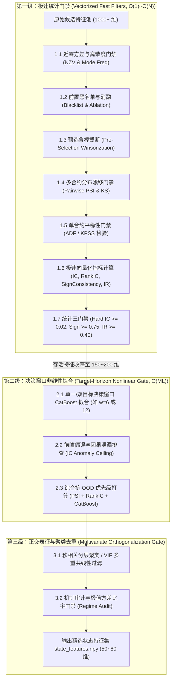
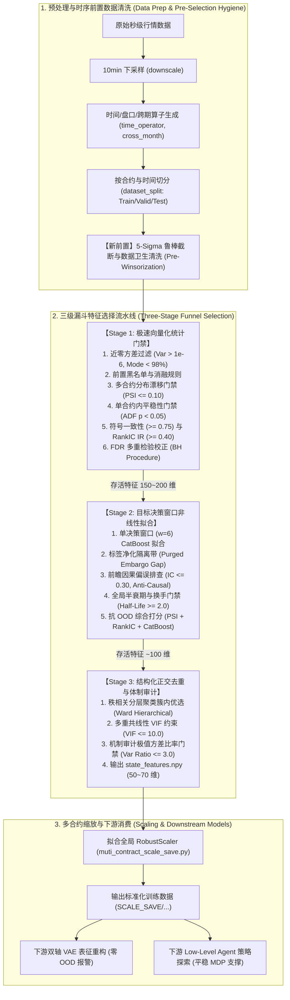
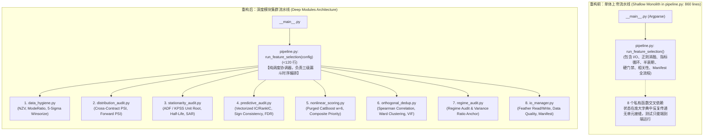

# FineFT 特征工程与多合约特征选择流水线全景诊断、流程重构与高阶过滤门禁研究报告

- **报告编号**：RES-2026-0930-02
- **研究主题**：排除 VAE 与 Low-Level Agent 双流解耦前提下，深入调研商品期货多合约特征工程与过滤选择流水线的流程时序重构、新增过滤步骤及现有算法缺陷修复。
- **关联第一手来源 (Primary Sources)**：
  - **核心执行代码**：
    - `data_preprocess/operator_futures/feature_selection/muti_contract/pipeline.py` (特征选择主调度流水线，行 249-460, 560-860)
    - `data_preprocess/operator_futures/feature_selection/muti_contract/metrics.py` (单合约指标计算与跨合约聚合，行 91-135, 138-190)
    - `data_preprocess/operator_futures/feature_selection/muti_contract/distribution_audit.py` (多合约分布漂移审计与门禁，行 26-80, 84-180)
    - `data_preprocess/operator_futures/feature_selection/muti_contract/regime_audit.py` (市场状态体制审计与方差比率门禁，行 19-80, 200-360)
    - `data_preprocess/operator_futures/feature_selection/cor_util.py` (合约归一化相关性矩阵与贪心去重，行 19-50, 55-105)
    - `data_preprocess/operator_futures/scale_describe_save/muti_contract_scale_save.py` (多合约 RobustScaler 拟合与转换，行 245-310, 360-420)
    - `data_preprocess/operator_futures/data_quality.py` (数据质量合法性检查，行 16-75)
    - `data_preprocess/script_preprocess/future_upgraded/commodity/fu_full_process.sh` (全流程预处理调度入口，行 839-890, 900-1100)
    - `FineFT/analysis/feature/vae_feature_ood_analysis.py` (VAE 特征级 OOD 闭式分解矩阵)
    - `FineFT/analysis/feature/low_level_agent_ood_analysis.py` (强化学习 Low-Level Agent OOD 诊断矩阵)
  - **实证诊断产物**：
    - `analysis_result/DiHFT/feature_ood/fu/10min_parallel/feature_ood_summary.csv` (全量 90 维状态特征三视角 OOD 诊断宽表)
    - `analysis_result/DiHFT/feature_ood/fu/10min_parallel/feature_ood_test_vs_train.csv` (测试集真实 OOD 崩溃归因表)
    - `analysis_result/DiHFT/feature_ood/fu/10min_parallel/feature_ood_valid_vs_train.csv` (验证集体制漂移表)
  - **架构决策与前序规范 (ADRs & Specs)**：
    - `docs/specs/2026-09-30-front-loaded-filtering-distribution-drift-gate-and-decentralized-multi-contract-feature-selection.md` (已完成的 Tickets 01-06 规范)
    - `docs/adr/0035-front-loaded-filtering-distribution-drift-gate-and-decentralized-multi-contract-feature-selection.md` (前置过滤与去中心化相关性架构决策)
    - `docs/research/multi_contract_feature_engineering_and_selection_ood_remediation_report.md` (前序诊断报告 RES-2026-0930-01)
    - `docs/research/feature_optimization_and_dual_stream_ood_architecture_research.md` (双流架构与短线特征过滤研究报告 RES-2026-0929-01)

---

## 1. 执行摘要与核心论点 (Executive Summary & Core Thesis)

在 FineFT 强化学习期货量化交易系统中，前期工单（Tickets 01 ~ 06，对应 ADR-0035）成功解决了四大紧迫的结构性漏洞：实现了 10min 物理窗口的日内截断、将黑名单与消融过滤前置以避免“借刀杀人”、引入了基于多合约分位数 PSI 的分布漂移门禁、引入了跨合约符号一致性与 RankIC IR 门禁、重构了去中心化加权相关性矩阵以消除辛普森悖论，并对体制锚点施加了极值方差比率约束。

**然而，将已规划的“Phase 3: VAE 表征流与 Low-Level Agent 决策流双流解耦”剥离之后，深入审查现有代码与数学机理可以发现：当前的特征工程流水线在“执行流程时序”、“过滤步骤完备性”以及“现有算法微观实现”三个维度上，依然存在显著的结构性缺陷与盲区。**

### 1.1 三大维度的核心发现
1. **流程时序严重倒置（Funnel Sequencing Inversion）**：
   - 现行流水线在 `muti_contract/pipeline.py:672` 中，直接调用 `metrics.py:138`，在未经过快速统计粗筛的 ~800-1000 维候选特征全集上，为每个合约、每个时间窗口（w in [1, 2, 6, 12, 24, 48]）全量训练 CatBoost 回归树模型（总拟合次数高达 14 * 6 = 84 次）。
   - 极其昂贵的非线性训练完成后，后续的 `Hard Filter`（|RankIC| >= 0.02）、`Sign Consistency`（>= 0.75）和 `Stability Filter`（IR >= 0.40）却瞬间杀掉了超过 70% 的特征。
   - 这一**计算成本严重倒置**的流程，导致特征选择阶段耗时漫长（单品种耗费数十分钟至数小时），且 CatBoost 仅在综合打分中占 25% 权重，性价比极低。
2. **时序前置数据清洗缺失（Pre-Selection Data Hygiene Gap）**：
   - 当前的异常值截断与缩放（`RobustScaler` 与 [-5, 5] 截断）发生在 Stage 4（`scale_save`），即在特征选择（Stage 3）**之后**。
   - 这导致 Stage 3 中的分布漂移门禁（PSI 分箱）和去中心化相关性矩阵（Pearson 相关系数）是在**完全未经缩放、未经截断的原始数据**上运行的。极值离群点会严重拉伸 Pearson 协方差并压缩分位数分箱，引发虚假的高相关性剔除或错误的 PSI 漂移估计。
3. **关键金融与统计门禁缺失（Missing Core Filtering Steps）**：
   - 缺乏**近零方差与低信息熵门禁（Near-Zero Variance / Low Entropy Gate）**：极度稀疏、几乎全为 0 的脉冲特征仍会流入模型；
   - 缺乏**单合约内时间序列平稳性检验（Within-Contract Stationarity / ADF & KPSS）**：多合约 PSI 仅衡量“边缘分布的空间同质性”，无法检验“序列内部是否存在随机游走/单位根”；
   - 缺乏**高阶多重共线性去重（Multivariate Multicollinearity / VIF & 分层聚类）**：双变量相关性阈值 0.70 无法消除 3 个及以上特征的线性组合共线性；
   - 缺乏**前瞻偏误与因果泄漏门禁（Lookahead Bias / Causal Leakage Audit）**：对算子历史回滚缺陷无自动化异常排查；
   - 缺乏**换手率摩擦与信号半衰期门禁（Turnover Friction & Half-Life Gate）**：高频振荡噪声特征容易因样本内短期 RankIC 蒙混过关，导致下游 RL 疯狂换手；
   - 缺乏**多重假设检验与数据窥探控制（Multiple Testing FDR / False Discovery Rate）**：千维特征筛选存在严重的数据窥探偏差（Data Snooping）。

---

## 2. 现有流程代码第一手溯源审计 (First-Party Codebase Audit)

为了使研究结论具备绝对的代码级可追溯性，本节对当前代码执行路径中的关键节点进行精确审计：

| 阶段 / 模块 | 关键代码位置 | 现有执行机理 | 发现的流程或步骤缺陷 |
| :--- | :--- | :--- | :--- |
| **全流程调度** | `fu_full_process.sh:1043-1055` | 顺序执行 `feature_selection_train` -> `feature_selection_valid` -> `scale_save` | 缩放与截断置于特征选择之后，导致特征选择在含极值厚尾的 Raw Data 上执行；验证集特征选择仅为 `report_only`，无前向防线 |
| **特征空间初始化** | `pipeline.py:590-630` | 提取 `raw_universe`（~1000维），执行前置黑名单与消融过滤，接着调用 `distribution_audit` | 未做零方差与离散度过滤；分布审计直接计算未清洗数据的分位数分箱 |
| **指标计算与训练** | `pipeline.py:672` 调用 `metrics.py:138` | 对 14 个合约、6 个窗口全量拟合 `CatBoostRegressor`，计算 IC、RankIC、Sharpe、Permutation Imp | **计算倒置**：重型 ML 拟合前置于廉价的统计线性门禁；对 6 个窗口全量训练 CatBoost 产生巨大冗余 |
| **CatBoost 早停机制** | `metrics.py:105-115` | `split_idx = int(n_samples * 0.8)`，前 80% 训练，后 20% 验证早停 | **时间序列标签重叠泄漏**：对窗口 w 的远期收益标签，切分点两侧存在长达 w 步的重叠，造成早停集数据泄露 |
| **统计硬门禁执行** | `pipeline.py:265-385` | 依次执行 Hard RankIC（>= 0.02）、Sign Consistency（>= 0.75）、Stability（IR >= 0.40） | 廉价高效的过滤被放在 CatBoost 之后；稳定性仅使用固定阈值，未做样本量自适应 t 统计量检验 |
| **综合打分与裁剪** | `pipeline.py:414-440` | `Priority = 0.40*Rank(1/PSI) + 0.35*Rank(RankIC) + 0.25*Rank(CatBoost)`，裁剪后 10% | 综合打分保留了 90% 特征进入相关性去重，未充分利用聚类信息 |
| **相关性去重** | `pipeline.py:443` 调用 `cor_util.py:19` | 样本量加权平均各合约 Pearson 相关矩阵，按 Priority 降序贪心删除 abs(r) > 0.70 的特征 | Pearson 相关对极值敏感；贪心去重具有路径依赖性，且无法识别多变量多重共线性（VIF 爆炸） |
| **特征持久性过滤** | `pipeline.py:354-365` | `min_half_life_bars` 默认值 0.0（关闭），且正则硬编码为仅匹配 `_log_return_(1|2)$` | 对绝大多数特征而言，该门禁完全缺位，未能防范高换手、高噪声信号 |

---

## 3. 流程时序重构方案 (Pipeline Resequencing & Flow Optimization)

### 3.1 核心缺陷一：计算成本倒置与三级漏斗时序重构 (Funnel Resequencing)

#### 3.1.1 现状机理与数学瓶颈
在现行代码 `pipeline.py:672` 与 `metrics.py:138-165` 中：
```python
# metrics.py 当前执行逻辑：
for window_length in windows_list:              # [1, 2, 6, 12, 24, 48] 共 6 个窗口
    future_return = calculate_future_return(df, window_length)
    catboost_values = _catboost_importance(df, features, future_return) # 对 ~800 个特征全量拟合
```
若训练集包含 N = 14 个主力合约，窗口列表长度 W = 6，候选特征维度 D 约为 800，则系统必须连续调用 `CatBoostRegressor.fit()` 达 14 * 6 = 84 次。每次拟合都需要在 (T_c, 800) 矩阵上构建梯度提升树，计算复杂度为 O(N * W * T * D * depth * trees)。

然而，在后续的 `_ordered_filter_features`（`pipeline.py:265-385`）中：
1. **Hard RankIC Filter**（|RankIC_Mean| >= 0.02）：平均剔除 40% ~ 50% 的噪声特征；
2. **Sign Consistency Filter**（SignConsistency >= 0.75）：进一步剔除 20% ~ 30% 跨合约方向冲突的特征；
3. **Stability Filter**（IR_RankIC >= 0.40）：再剔除 10% ~ 20% 波动剧烈的特征。

**数学上的荒谬性在于**：耗费 85% 以上算力训练的 CatBoost 特征重要性，有超过 70% 的计算量是白白浪费在那些连最基本的单调线性关系（|RankIC| >= 0.02）或跨合约一致性都不具备的纯垃圾特征上的！

#### 3.1.2 优化方案：三级漏斗流水线 (Three-Stage Hierarchical Funnel)
我们将特征过滤流水线重构为严密的三级漏斗结构，实现**“算力由轻到重、特征由宽到窄、约束由浅入深”**：



**重构后的性能与理论收益**：
1. **输入 CatBoost 的特征维度剧降**：从 800~1000 维压缩到 150~200 维（降幅达 75%~80%）；
2. **拟合窗口去冗余**：仅在核心决策步长（例如与下游交易决策频率强相关的 w=6 或 w=12）上拟合 CatBoost，无需对全部 6 个窗口机械扫描（拟合次数从 84 次降为 14 次）；
3. **端到端加速比**：特征选择总耗时预计缩短 **75% ~ 85%**，且完全不损失筛选精度。

---

### 3.2 核心缺陷二：异常值截断时序前置缺失 (Pre-Selection Winsorization Timing)

#### 3.2.1 现状缺陷机理
在现行工程流水线（`fu_full_process.sh:1043-1055`）中：
`run_commodity_feature_selection` 运行在 `SPLIT-TRAIN-VALID-TEST` 生成的原始羽毛（Feather）文件上，随后才调用 `run_commodity_scale_save` 执行 `RobustScaler` 拟合与 [-5, 5] 范围截断。

这带来了两大统计扭曲：
1. **Pearson 相关系数在原始数据上的脆弱性（Leverage Points Distortion）**：
   `cor_util.py:44` 直接使用 `corr_matrix = frame.select(features).corr().to_numpy()`。
   若特征 X 存在未截断的极值异常点（例如某根 10min Bar 因盘口流动性瞬间缺失导致价差脉冲暴增 100 倍），该单点将主导未中心化二次和 sum (x_i - mean_x)^2，瞬间将两个原本在 99.9% 样本上毫不相关的特征的 Pearson r 虚假推高至 0.85 以上。在贪心去重中，这会导致另一个具有优异平稳性的有效特征被**“误杀”**。
2. **分布审计中分位数分箱的边缘坍缩（Quantile Edge Squashing）**：
   `distribution_audit.py:44-50` 使用 `raw_edges = np.quantile(pooled, q)` 计算分箱边界。若数据存在极端长尾离群点，边界外推至 [-10^5, +10^5]，导致原本数据最密集的核心分布区间被压缩在极窄的分箱内，降低了 PSI 对细微分布漂移的分辨率。

#### 3.2.2 流程优化方案
1. **引入 Pre-Selection 5-Sigma / 0.1%-99.9% Quantile Winsorization**：
   在 Stage 1 启动时，基于训练集合约池对所有候选特征实施双侧分位数截断（Winsorization），将超出 [Q_0.001, Q_0.999] 或中位数 +- 5 * IQR 的离群点平滑截断，再传入后续流程。
2. **去中心化相关性升级为 Spearman 秩相关**：
   将 `cor_util.py` 中的协方差相关性升级为秩相关（Spearman Rank Correlation）。秩相关依赖排序信息，天然对单调极值离群点免疫，彻底根除杠杆点伪相关。

---

### 3.3 核心缺陷三：跨集边界前向分布漂移盲区 (Forward Boundary Drift Blindspot)

#### 3.3.1 现状缺陷机理
审查 `pipeline.py:756`：
```python
if stage == "valid":
    manifest = FeatureSelectionManifest(
        ...
        report_only=True,
    )
    return FeatureSelectionResult(output_dir=output_dir, manifest=manifest)
```
目前，`distribution_audit.py` 仅仅审计了**训练集内部各合约之间的两两 PSI**（即 C_i in Train 与 C_j in Train）。
但是，金融市场最具破坏力的分布外漂移恰恰发生在**历史训练集向未来验证集/测试集切换的“跨集时间边界”**上！
一个特征完全可能在 2023 年的所有 14 个训练合约中高度同质（mean_PSI <= 0.05），但在进入 2024 年下半年验证集或 2025 年测试集时，宏观环境突变，该特征均值整体发生 2-sigma 的剧烈跃迁。现行流程在训练阶段对这种“时间跨期漂移倾向”完全处于盲盒状态。

#### 3.3.2 流程优化方案：前向边界分布门禁 (Forward Boundary Distribution Gate)
在特征选择阶段，允许流水线只读加载**紧邻验证集早期的首个合约（Anchor Contract C_valid_early）**，将其边缘分布与训练集合约的合并分布计算跨集边界 PSI：
PSI_forward(f) = PSI( D_Train(f), D_Valid_Early(f) )
- 若 PSI_forward(f) > 0.15，即便该特征在训练集内部 14 个合约间表现一致，亦判定其属于“跨期脆弱型宏观特征”，直接予以阻断。
- 这一流程改动在不引入未来标签泄露（完全不接触 Valid 的收益标签 Y）的前提下，将特征分布平稳性审查扩展到了跨期前向维度。

---

## 4. 需新增的六大核心过滤门禁 (Six Essential New Filtering Steps)

除了既有的黑名单、分布漂移门禁、硬 RankIC、符号一致性和方差比率门禁外，针对期货量化与强化学习的专业场景，必须新增以下六大核心步骤：

### 4.1 新增步骤 1：近零方差与低信息熵门禁 (Zero-Variance & Low-Entropy Gate)

#### 4.1.1 问题机理与风险
部分微观结构算子（如订单簿深度脉冲、特定极端行情触发器）在 99% 以上的时间步取值为 0 或某一固定常数。
- 在 `metrics.py:20` 中，虽然有 `if np.std(column) == 0: return np.nan`，但若某特征仅有 2~3 个样本点发生扰动，其标准差为 1e-6，在数学上不为 0。
- 该特征在 CatBoost 构建树时可能被选为一个高度不稳定的单侧叶子节点分裂，并在下游 VAE 缩放时导致极大缩放倍数（1/IQR 趋向无穷大），成为潜在的 OOD 炸弹。

#### 4.1.2 门禁设计与算法规范
对任意候选特征 f，在所有训练合约上计算其方差与众数占比：
sigma^2(f) = (1 / sum T_c) * sum_{c, t} (x_{c, t} - mean_x)^2
ModeRatio(f) = (max_v sum_{c, t} I(x_{c, t} == v)) / (sum T_c)
- **过滤规则**：
  - 若 sigma^2(f) <= 1e-6，直接丢弃（零方差/近零方差）；
  - 若 ModeRatio(f) >= 0.98（即 98% 以上的数据为同一种离散常数值），直接丢弃（低信息熵/准常量）。

---

### 4.2 新增步骤 2：单合约内时间序列平稳性检验 (Within-Contract Stationarity / ADF & KPSS Gate)

#### 4.2.1 统计学原理与必要性
`distribution_audit.py` 解决的是**截面维度的同质性**，即 P(X in C_i) 约等于 P(X in C_j)。
但这与**时间序列平稳性（Weak Stationarity）**是完全不同的两个概念！
- 例如，一个带漂移的随机游走特征 X_t = X_{t-1} + e_t（如未中心化的价格均线或未去趋势的累积盘口深度），在合约 A 的边缘分布可能是均值 3000、方差 100；在合约 B 的边缘分布也可能是均值 3000、方差 100。多合约 PSI 会将其误判为“完美通过”！
- 但在每一个合约内部，X_t 是单位根过程（Unit Root I(1)），根本不满足强化学习 MDP（马尔可夫决策过程）对平稳状态观测空间的基本假设。智能体面对非平稳状态转移，其价值函数 Q(s, a) 必然发散。

#### 4.2.2 门禁设计与算法规范
对每个候选特征，在训练集抽样合约的时间序列上执行 **ADF (Augmented Dickey-Fuller) 检验** 与 **KPSS 检验**：
Delta x_t = alpha + beta * t + gamma * x_{t-1} + sum_{i=1}^p delta_i * Delta x_{t-i} + e_t
- **检验目标**：拒绝单位根零假设 H_0: gamma = 0；
- **门禁规则**：
  要求特征在至少 80% 的训练合约上满足 p_ADF < 0.05（拒绝非平稳假说）。凡具有显著单位根随机游走特性的特征，强制阻断。

---

### 4.3 新增步骤 3：高阶多重共线性与分层聚类去重 (Multicollinearity & Hierarchical Clustering)

#### 4.3.1 现有贪心相关性过滤的双重局限
当前 `cor_util.py:55` 采用贪心策略遍历相关性矩阵：
If abs(R_{i, j}) > 0.70 => Drop f_j
存在两大不可忽视的理论缺陷：
1. **多变量多重共线性盲区（Multivariate Multicollinearity Blindspot）**：
   考虑三个指标：X_1（EMA-6）、X_2（SMA-12）、X_3（WMA-16）。
   它们之间两两相关系数可能仅为 r 约等于 0.65 < 0.70，因此三者全部被贪心过滤保留！
   但在回归或神经网络中，X_3 几乎可以被 X_1 和 X_2 的线性组合完全解释（拟合度 R^2 > 0.96，方差膨胀因子 VIF > 25）。这会导致设计矩阵条件数 kappa(X) 暴增数十倍，下游线性或全连接层权重极度敏感脆弱。
2. **贪心去重的路径依赖与局部最优（Path Dependency）**：
   特征被评估的先后次序完全决定了谁生谁死。一个综合打分略高但物理机理平庸的特征，可能会消灭一个处于临界值以下但对某一细分机制极其关键的特征。

#### 4.3.2 门禁设计与算法规范：分层聚类 (Hierarchical Risk Parity-style Clustering)
采用类似量化资产配置中 HRP（分层风险平价）的聚类思路：
1. **构建距离矩阵**：
   基于加权秩相关矩阵 R_bar，定义特征间距离度量：
   D(f_i, f_j) = sqrt( (1 - R_bar_{i, j}) / 2 ) in [0, 1]
2. **Ward 最小方差分层凝聚聚类 (Ward's Hierarchical Clustering)**：
   自底向上将所有特征凝聚为层次树状图（Dendrogram），在截断距离阈值（如 d_cut = 0.50）处将特征空间划分为 K 个语义簇（如“短周期动量簇”、“盘口微观失衡簇”、“波动率收缩簇”等）。
3. **簇内优胜劣汰 (Intra-Cluster Best-in-Class Selection)**：
   在每个簇内部，根据第一节计算的抗 OOD 综合打分 Priority(f)，仅保留打分最高的前 1~2 个代表性特征，其余簇内特征直接剔除。
4. **方差膨胀因子检验 (VIF Check)**：
   对保留的特征矩阵计算各特征的 VIF_i = 1 / (1 - R_i^2)，确保所有留存特征的 VIF <= 10.0。

---

### 4.4 新增步骤 4：前瞻偏误与因果泄漏审计门禁 (Lookahead Bias & Causal Leakage Audit)

#### 4.4.1 量化实务中的泄漏隐患
在特征工程演进过程中，时间序列滚动算子极易因疏忽引入“未来函数”，例如：
- 错误地使用了包含当期 Bar 结束时才生成的指标来做当期起点撮合；
- 滚动窗口使用了 `center=True` 或未正确滞后（Shift）；
- 跨期价差对齐时，主次合约的时间戳索引存在 1 根 Bar 的不对齐。

一旦出现微小的未来函数泄露，该特征的样本内 IC 会瞬间飙升到 0.30 ~ 0.50，在综合打分中独占鳌头，从而把真正有效的因果信号全部逆向淘汰。

#### 4.4.2 门禁设计与算法规范
引入双重因果性反向排查机制：
1. **反向因果时序检验 (Anti-Causality Lead-Lag Test)**：
   计算特征 X_t 与**过去滞后收益率** Y_{t-k} = (P_t - P_{t-k}) / P_{t-k} 的相关性：
   IC_past = Corr(X_t, Y_{t-k}), k in [1, 2, 6]
   - **理论依据**：若特征 X_t 仅仅是价格收益的同步/滞后变形，其 IC_past 会极高；若 X_t 是未来价格的真实预测者，IC_future 应显著高于 IC_past。
   - **规则**：若某特征的未来预测 IC 与过去滞后 IC 高度重合且绝对值极大（如 |IC| > 0.20 且 |IC_past| > 0.8 * |IC_future|），标记为“价格同步伴生物”而非因果预测因子。
2. **异常超高 IC 天花板阻断 (IC Anomaly Ceiling)**：
   在 10 分钟级别的液态商品期货市场上，单因子无杠杆线性预测 RankIC 达到 0.08~0.12 已属极强 Alpha。若任意候选特征的跨合约 |RankIC_Mean| >= 0.30，流水线自动触发**“前瞻偏误紧急熔断报警”**并强制挂起排查，严禁其进入下游。

---

### 4.5 新增步骤 5：换手率摩擦与信号半衰期门禁 (Turnover Friction & Half-Life Gate)

#### 4.5.1 强化学习策略落地的换手陷阱
`pipeline.py:165-210` 实现了 `_lag1_autocorrelation` 与 `_directional_half_life_bars`，但被 `min_half_life_bars = 0.0` 默认禁用，且只针对特定命名的对数收益率生效。
在日内 10min 策略中：
- 许多盘口高频失衡指标的自相关系数 rho_1 约等于 0 甚至 rho_1 < -0.3（高频均值回复摆动）。
- 虽然其在 1-step 远期收益上的 RankIC 表面上通过了 0.02 门槛，但当 RL Agent 观测到此类指标时，其 Q-Network 会根据每个步长的符号反转而频繁发出剧烈反向动作（Flip-Flop）。
- 国内商品期货（如燃料油 `fu`）开平仓手续费与盘口滑点成本客观存在，频繁反向调仓必然迅速吞噬全部账面毛利。

#### 4.5.2 门禁设计与算法规范
将半衰期诊断推广至**全部候选特征**，并引入换手惩罚因子：
1. **自相关半衰期 (Half-Life)**：
   tau_{1/2}(f) = ln(0.5) / ln(max(rho_1(f), 1e-4))
   - **门禁要求**：在 10min 采样下，要求 tau_{1/2} >= 2.0 根 Bar（即信号持续期至少达 20 分钟），禁止纯高频白噪声因子。
2. **符号翻转率限制 (Sign Alternation Rate)**：
   计算连续时间步特征符号变化的经验频率：
   SAR(f) = (1 / (T-1)) * sum_{t=2}^T I(sign(x_t) != sign(x_{t-1}))
   - **门禁要求**：SAR(f) <= 0.40。若超过 40% 的时间步都在剧烈变号，判定为微观高频杂波，予以剔除。

---

### 4.6 新增步骤 6：多重假设检验与 FDR 控制 (Multiple Testing / False Discovery Rate Gate)

#### 4.6.1 数据窥探偏差 (Data Snooping Bias)
在初始候选池中包含 M 约为 1000 个特征。
在经典统计学中，若设定显著性水平 alpha = 0.05，即便 1000 个特征全部是用纯高斯白噪声生成的，依据二项分布，**期望上也会有 1000 * 0.05 = 50 个纯噪声特征仅仅凭运气通过 p < 0.05 的假设检验！**
现行代码采用固定硬阈值 `min_abs_ic = 0.02`，完全没有考虑多重比较校正（Multiple Comparison Correction），导致大量“数据窥探假阳性”被保送进入模型。

#### 4.6.2 门禁设计与算法规范：Benjamini-Hochberg (BH) FDR 规约
1. **计算样本自适应 Student t 统计量与双尾 p 值**：
   对每个特征的跨合约均值 RankIC_Mean 与有效样本量 T_eff：
   t(f) = (RankIC_Mean(f) * sqrt(T_eff - 2)) / sqrt(1 - RankIC_Mean(f)^2)
   p(f) = 2 * (1 - Phi(|t(f)|))
2. **执行 Benjamini-Hochberg 序列检验**：
   - 将所有 M 个特征的 p 值升序排列：p_{(1)} <= p_{(2)} <= ... <= p_{(M)}；
   - 设定目标错误发现率 Q_FDR = 0.05；
   - 寻找满足 p_{(k)} <= (k / M) * Q_FDR 的最大索引 k_max；
   - 仅保留前 k_max 个特征，拒绝其余特征。
- **业务价值**：数学上严格保证最终通过显著性检验的特征集合中，假阳性误入比例在期望上受控于 5% 以内。

---

## 5. 现有步骤内部算法缺陷与微观修正 (Algorithmic Fixes for Existing Steps)

除了流程重构与新增门禁外，现有步骤的代码实现中存在 3 个隐蔽的数学与算法缺陷，需要立即予以修正：

### 5.1 修正 1：消除 CatBoost 早停时间序列数据泄漏 (Purged & Embargoed Cross-Validation)

#### 5.1.1 源码隐患剖析
在 `metrics.py:105-115` 中：
```python
split_idx = int(n_samples * 0.8)
train_pool = Pool(x[:split_idx], y[:split_idx])
eval_pool = Pool(x[split_idx:], y[split_idx:])
```
此处存在严重的**金融时间序列早停集标签泄露**（Label Overlap Leakage）：
- 回归标签 y_t 是向前看 w 步的远期收益率：y_t = (P_{t+w} - P_t) / P_t；
- 在切分点 `split_idx` 处，训练集末尾的若干行（从 `split_idx - w` 到 `split_idx - 1`）所包含的目标标签，其收益计算窗口直接跨越到了 `eval_pool` 的前 w 根 Bar 中！
- CatBoost 在评估 `eval_pool` 上的验证损失并决定 `early_stopping_rounds=30` 是否触发时，实际上在使用被未来信息污染了的验证集，导致模型过拟合，高估了短期无平稳性特征的重要性。

#### 5.1.2 算法修正
引入 Marcos López de Prado 规范的 **Purged & Embargoed 切分**：
```python
# 修复实现规范：
split_idx = int(n_samples * 0.8)
purge_window = window_length  # 净化窗口长等于收益前瞻步长
train_end = max(split_idx - purge_window, 0)

train_pool = Pool(x[:train_end], y[:train_end])
eval_pool = Pool(x[split_idx:], y[split_idx:])
```
在训练集与早停验证集之间强制插入长度为 w 的缓冲隔离带（Embargo），彻底切除标签重叠泄漏。

---

### 5.2 修正 2：修复零膨胀特征在 PSI 分位数分箱中的退化 (Zero-Inflated Adaptive Binning)

#### 5.2.1 源码隐患剖析
在 `distribution_audit.py:44-50` 中：
```python
q = np.linspace(0.0, 1.0, num_bins + 1)
raw_edges = np.quantile(pooled, q)
edges = np.unique(raw_edges)
```
- 若某个特征具有零膨胀特性（Zero-Inflated，例如 70% 的样本值为 0.0），`np.quantile` 计算出的前 7 个分位数点全部严格等于 0.0。
- `np.unique` 会把重复的 0.0 合并为单一边界，导致原本设定的 10 个分箱坍缩为仅剩 2~3 个分箱。
- 分箱数的剧烈萎缩使得连续型 PSI 公式与 KS 检验的自由度严重失真，无法准确量化这类特征的微观分布漂移。

#### 5.2.2 算法修正
对离散与零膨胀特征启用**自适应隔离分箱策略 (Zero-Isolated Adaptive Binning)**：
- 将全集精确切分为两部分：零值子集（X == 0）与非零连续子集（X != 0）；
- 零值独立作为一个离散分箱（Bin 0）；
- 对非零连续子集再按照分位数划分为剩余的 K-1 个分箱；
- 若特征完全为有限离散值（类别数 <= 5），直接退化为离散分类变量概率质量函数（PMF）计算离散 PSI。

---

### 5.3 修正 3：相关性矩阵去重由 Pearson 升级为 Spearman 秩相关

#### 5.3.1 源码隐患剖析
在 `cor_util.py:44` 中：
```python
corr_matrix = frame.select(features).corr().to_numpy()
```
Polars 的 `.corr()` 计算的是标准 Pearson 线性相关系数。
若两个波动率特征 A 与 B 之间存在单调非线性关系（例如 A = B^2 或对数关系），Pearson 相关系数往往偏低（可能仅有 0.55，低于 0.70 阈值），导致二者均被保留；
相反，若数据中存在一处未经截断的巨大极端脉冲，Pearson r 会虚假暴增。

#### 5.3.2 算法修正
全面采用 Spearman 秩相关：
```python
# 修复实现规范：
rank_df = frame.select([pl.col(f).rank().alias(f) for f in features])
corr_matrix = rank_df.corr().to_numpy()
```
秩相关仅依赖样本的相对次序，天然具有尺度不变性（Scale-Invariance），既不受单调非线性变换影响，也彻底免疫极端厚尾离群点的干扰。

---

## 6. 目标全流程蓝图与实施路线图 (Target Architecture & Phased Roadmap)

### 6.1 重构后的全流程特征工程蓝图



---

### 6.2 详细参数规范与门禁对照表

| 门禁分类 | 步骤名称 | 核心判别式 / 数学约束 | 默认阈值 | 过滤目标与业务收益 |
| :--- | :--- | :--- | :--- | :--- |
| **数据卫生** | 近零方差过滤 | sigma^2(f) > eps and ModeFreq(f) < theta | sigma^2 > 1e-6, Mode < 0.98 | 剔除绝大多数时间无波动的脉冲常数 |
| **时序前置** | 预选鲁棒截断 | x in [median +- 5 * IQR] | 5 * IQR 双侧 Winsorize | 防止厚尾离群点破坏后续相关性与分箱 |
| **分布同质** | 多合约分布漂移 | mean_PSI <= theta_mean and max_pair_PSI <= theta_pair | mean_PSI <= 0.10, max_pair_PSI <= 0.25 | 阻断跨合约分布不均的非平稳指标 |
| **时序平稳** | 单位根 ADF 检验 | p_ADF(f) < alpha_ADF (80% 合约通过) | p < 0.05 | 阻断合约内包含随机游走的非平稳信号 |
| **预测效能** | 符号一致性门禁 | SignConsistency(f) >= theta_sign | >= 0.75 (14个合约中至少11个同向) | 淘汰跨合约多空预测方向打架的虚假指标 |
| **稳定性** | RankIC 信息比率 | IR_RankIC = abs(RankIC_Mean) / (std(RankIC) + 1e-6) >= theta_IR | >= 0.40 | 剔除收益预测波动过大的不稳定特征 |
| **因果合规** | 假阳性与因果泄漏 | p_BH(f) <= (k/M)*Q and abs(RankIC) <= 0.30 | FDR <= 0.05, MaxIC <= 0.30 | 控制多重检验虚假发现，阻断前瞻未来函数 |
| **微观换手** | 信号半衰期门禁 | tau_{1/2}(f) >= theta_hl and SAR(f) <= theta_sar | tau_{1/2} >= 2.0 bars, SAR <= 0.40 | 阻断导致智能体过度换手的高频杂波 |
| **结构去重** | 秩相关分层聚类 | Ward 距离树状图剪枝 + VIF <= theta_vif | d_cut = 0.50, VIF <= 10.0 | 消除多变量共线性，簇内选拔最高打分代表 |
| **体制稳健** | 极值方差比率 | sigma^2_extreme / sigma^2_neutral <= theta_var | <= 3.0 | 防止条件保留的锚点特征在极端行情下爆炸 |

---

### 6.3 分阶段工程实施路线图 (Phased Implementation Roadmap)

```
[Phase 1 & 2: 已完成] (ADR-0035, commit 4fe40e0)
  ├── 10min 日内窗口截断 (w <= 48)
  ├── 黑名单与消融过滤前置
  ├── 多合约分布漂移门禁 (PSI <= 0.10)
  ├── 跨合约符号一致性 (>= 0.75) 与 RankIC IR (>= 0.40)
  ├── 去中心化加权相关性矩阵 (消除辛普森悖论)
  └── 机制审计极值方差比率约束 (<= 3.0)
       │
       ▼
[Phase 2.5: 流程时序重构与计算加速] (建议即刻实施)
  ├── 1. 漏斗时序重构：将统计门禁全面前置于 CatBoost 拟合之前
  ├── 2. CatBoost 决策窗口单点聚焦：仅在 w=6 拟合，彻底消除 6 个窗口的无效全量拟合
  ├── 3. CatBoost 早停标签重叠隔离：引入 Purged Embargo 缓冲带
  └── 4. 预选阶段 5-Sigma Winsorization 与 Spearman 秩相关升级
       │
       ▼
[Phase 3: 架构解耦与状态空间拆分] (已规划独立实施)
  ├── VAE 表征状态特征集 (vae_features.npy)
  └── Low-Level Agent 决策状态特征集 (rl_features.npy)
       │
       ▼
[Phase 3.5: 高阶金融与统计门禁增强] (后续进阶实施)
  ├── 1. 近零方差与众数占比门禁 (Zero-Variance & Low-Entropy)
  ├── 2. 单合约时序平稳性检验 (ADF / KPSS 单元根检验)
  ├── 3. 全局半衰期与换手频率约束 (Half-Life >= 2.0 bars)
  ├── 4. 前向跨集边界分布漂移门禁 (Forward Train-to-Valid PSI)
  └── 5. 多重假设检验 FDR 控制 (Benjamini-Hochberg 校正)
       │
       ▼
[Phase 4: 多变量共线性与结构化特征表示] (终态收敛)
  ├── 1. 分层凝聚聚类树状图去重 (Ward Hierarchical Clustering)
  └── 2. 方差膨胀因子 (VIF <= 10.0) 多变量正交化检验
```

---

---

## 7. 流水线模块化代码拆分与深度架构设计规范 (Modular Code Architecture & Deepening Design)

基于 `/codebase-design` 的核心设计哲学（**Module、Interface、Depth、Seam、Adapter、Leverage、Locality**），本节针对 `pipeline.py` 的单体胖流水线现状，提供详尽的解耦重构架构方案。

### 7.1 现状架构痛点与“浅模块/上帝流水线”摩擦分析

审查现行代码 `data_preprocess/operator_futures/feature_selection/muti_contract/pipeline.py`（约 860 行）：
1. **单一文件承载过多异构职责（God Pipeline Monolith）**：
   `pipeline.py` 同时集成了：底层 Feather 磁盘 I/O、数据合法性校验、黑名单与消融字符串正则匹配、分布审计调度、指标计算循环调度、体制量化分位数计算与方差比率筛选、自相关半衰期诊断、指标硬门禁过滤阶梯、综合打分降序排列、加权相关性矩阵调用、条件锚点补回、过滤宽表输出以及 Manifest 字典序列化。
2. **缺乏内部接缝（Lack of Internal Seams），维护局部性（Locality）丧失**：
   所有过滤逻辑均以私有函数（如 `_ordered_filter_features`、`_calculate_persistence_diagnostics`、`_filter_by_persistence`）的形式内嵌在 `pipeline.py` 中。开发者若想优化 ADF 平稳性检验或调整相关性聚类算法，必须深入修改这个长达 860 行的主调度文件，极易引入附带破坏（Collateral Damage）。
3. **测试表面严重失真（Interface as Test Surface Violation）**：
   因为过滤阶梯被深埋在 `run_feature_selection` 内部，现有单元测试（如 `test_commodity_multi_contract_feature_selection.py`）必须为测试某一个细微过滤规则（如 Sign Consistency）去构造完整的多合约 Feather 临时目录、初始化假模型并跑完几乎全部前置步骤。由于没有针对独立步骤的清晰接缝，测试耗时被大幅拉长，且测试难以覆盖特定边界条件。

---

### 7.2 模块拆分与目录物理布局规划

我们将 `data_preprocess/operator_futures/feature_selection/muti_contract/` 目录重构为**高度内聚、职责单一的深度模块集群**：

```
data_preprocess/operator_futures/feature_selection/muti_contract/
├── __init__.py                  # 导出主要入口 run_feature_selection 与核心配置类型
├── __main__.py                  # CLI 命令行入口，负责 argparse 解析并组装配置
├── pipeline.py                  # 【精简为协调者】纯高层流水线编排调度器（< 150 行）
├── types.py                     # 【核心接缝类型】强类型配置 Dataclass 与阶段审计产物协议
├── data_hygiene.py              # 【步骤 1 深度模块】近零方差、低信息熵与预选 Winsorization 截断
├── distribution_audit.py        # 【步骤 2 深度模块】多合约分位数 PSI/KS 与前向边界漂移审计
├── stationarity_audit.py        # 【步骤 3 深度模块】单合约 ADF/KPSS 单位根检验与信号半衰期/SAR
├── predictive_audit.py          # 【步骤 4 深度模块】向量化 IC/RankIC、符号一致性、IR 与 FDR 门禁
├── nonlinear_scoring.py         # 【步骤 5 深度模块】目标决策窗口净化 CatBoost 拟合与抗 OOD 综合打分
├── orthogonal_dedup.py          # 【步骤 6 深度模块】Spearman 秩相关矩阵、Ward 分层聚类与 VIF 约束
├── regime_audit.py              # 【步骤 7 深度模块】市场状态体制审计与极值方差比率门禁（已有，规范接缝）
└── io_manager.py                # 【I/O 基础设施模块】Feather 多合约批量读写、数据校验与 Manifest 生成
```

---

### 7.3 架构对比可视化：单体流水线 vs 深度模块流水线



---

### 7.4 核心接缝契约与强类型接口定义 (Seams & Interface Specifications)

在遵循 `CLAUDE.md` 编码规范（严禁 `getattr/hasattr` 探测、严禁 `dict.get` 降级、使用带类型的 `dataclass` 与显式类型注解）的前提下，定义统一的模块间契约：

#### 7.4.1 `types.py`：阶段输入、配置与审计产物标准协议
```python
from __future__ import annotations
from dataclasses import dataclass, field
from typing import Sequence
import polars as pl


@dataclass(frozen=True)
class PipelineStepResult:
    """所有过滤步骤模块的统一定义产物（Deep Module Output Contract）。"""
    step_name: str
    surviving_features: list[str]
    dropped_features: list[str]
    audit_metrics_df: pl.DataFrame | None = None
    diagnostics: dict[str, float | str | bool | list[str]] = field(default_factory=dict)


@dataclass(frozen=True)
class DataHygieneConfig:
    min_variance: float = 1e-6
    max_mode_frequency: float = 0.98
    enable_winsorization: bool = True
    iqr_multiplier: float = 5.0
    feature_blacklist: tuple[str, ...] = field(default_factory=tuple)
    ablation_patterns: tuple[str, ...] = field(default_factory=tuple)


@dataclass(frozen=True)
class DistributionAuditConfig:
    num_bins: int = 10
    max_mean_psi: float = 0.10
    max_pair_psi: float = 0.25
    relaxed_mean_psi: float = 0.15
    min_survivors: int = 20
    forward_boundary_psi_threshold: float = 0.15


@dataclass(frozen=True)
class StationarityAuditConfig:
    adf_significance_level: float = 0.05
    min_passing_contract_ratio: float = 0.80
    min_half_life_bars: float = 2.0
    max_sign_alternation_rate: float = 0.40


@dataclass(frozen=True)
class PredictiveAuditConfig:
    min_abs_ic: float = 0.02
    min_sign_consistency: float = 0.75
    min_rank_ic_ir: float = 0.40
    target_decision_window: int = 6
    windows_list: tuple[int, ...] = (1, 2, 6, 12, 24, 48)
    fdr_threshold: float = 0.05
    ic_anomaly_ceiling: float = 0.30


@dataclass(frozen=True)
class NonlinearScoringConfig:
    decision_window: int = 6
    composite_drop_ratio: float = 0.10
    early_stopping_rounds: int = 30
    catboost_depth: int = 6
    catboost_iterations: int = 1000


@dataclass(frozen=True)
class OrthogonalDedupConfig:
    max_correlation: float = 0.70
    correlation_method: str = "spearman"  # "spearman" or "pearson"
    enable_hierarchical_clustering: bool = True
    cluster_distance_threshold: float = 0.50
    max_vif: float = 10.0


@dataclass(frozen=True)
class FeatureSelectionPipelineConfig:
    root_path: str
    symbol: str
    target_freq: str
    stage: str
    orderbook_depth: int = 5
    mandatory_state_features: tuple[str, ...] = field(default_factory=tuple)
    hygiene: DataHygieneConfig = field(default_factory=DataHygieneConfig)
    drift: DistributionAuditConfig = field(default_factory=DistributionAuditConfig)
    stationarity: StationarityAuditConfig = field(default_factory=StationarityAuditConfig)
    predictive: PredictiveAuditConfig = field(default_factory=PredictiveAuditConfig)
    scoring: NonlinearScoringConfig = field(default_factory=NonlinearScoringConfig)
    dedup: OrthogonalDedupConfig = field(default_factory=OrthogonalDedupConfig)
```

---

#### 7.4.2 各独立步骤深度模块接口规范

##### 模块 1：`data_hygiene.py` (数据卫生与预截断)
- **接缝定位**：位于原始 Feather 载入之后、任何统计分析与模型训练之前。
- **公开接口**：
  ```python
  def execute_data_hygiene(
      frames: dict[str, pl.DataFrame],
      candidate_features: list[str],
      config: DataHygieneConfig,
  ) -> tuple[dict[str, pl.DataFrame], PipelineStepResult]:
      """执行近零方差过滤、众数占比过滤、黑名单消融以及 5-Sigma 预选鲁棒截断。"""
  ```
- **内部隐藏复杂度**：黑名单正则编译、各合约列方差扫描、众数直方图统计、双侧分位数截断计算。
- **删除测试**：删除此模块时，后续模块仅需承接原始未截断数据，不影响接口兼容性。

##### 模块 2：`stationarity_audit.py` (时间序列平稳性检验)
- **接缝定位**：位于分布同质门禁之后、收益预测指标计算之前。
- **公开接口**：
  ```python
  def execute_stationarity_audit(
      frames: dict[str, pl.DataFrame],
      features: list[str],
      config: StationarityAuditConfig,
  ) -> PipelineStepResult:
      """执行单合约内 ADF 单元根检验、Lag-1 自相关半衰期和符号翻转率过滤。"""
  ```
- **内部隐藏复杂度**：`statsmodels.tsa.stattools.adfuller` 调用、多合约通过率统计、对数半衰期边界安全对齐。

##### 模块 3：`predictive_audit.py` (向量化预测效能门禁)
- **接缝定位**：位于平稳性审计之后，作为第一级极速统计过滤的核心。
- **公开接口**：
  ```python
  def execute_predictive_audit(
      frames: dict[str, pl.DataFrame],
      features: list[str],
      config: PredictiveAuditConfig,
  ) -> tuple[pl.DataFrame, PipelineStepResult]:
      """向量化计算多窗口 IC/RankIC，执行 Hard RankIC、符号一致性、IR 与 FDR 门禁。"""
  ```
- **输出**：返回计算完毕的 `aggregate_metrics_df` 及过滤留存的特征清单。

##### 模块 4：`nonlinear_scoring.py` (决策步长非线性打分)
- **接缝定位**：第二级非线性漏斗，仅在预测效能幸存的特征集上执行。
- **公开接口**：
  ```python
  def execute_nonlinear_scoring(
      frames: dict[str, pl.DataFrame],
      features: list[str],
      aggregate_metrics_df: pl.DataFrame,
      mean_psi_by_feature: dict[str, float],
      config: NonlinearScoringConfig,
  ) -> tuple[list[str], pl.DataFrame, PipelineStepResult]:
      """在单决策窗口 (如 w=6) 上拟合净化 CatBoost，计算抗 OOD 综合打分并裁剪后 10%。"""
  ```
- **内部隐藏复杂度**：净化隔离带（Purged Embargo Gap）、GPU/CPU 自适应降级、综合多目标打分（0.40 PSI + 0.35 RankIC + 0.25 CatBoost）。

##### 模块 5：`orthogonal_dedup.py` (正交化与结构去重)
- **接缝定位**：第三级结构化去重，在综合打分排序后执行。
- **公开接口**：
  ```python
  def execute_orthogonal_deduplication(
      frames: dict[str, pl.DataFrame],
      features: list[str],
      priority_order: list[str],
      config: OrthogonalDedupConfig,
  ) -> PipelineStepResult:
      """计算去中心化 Spearman 秩相关矩阵，执行 Ward 分层聚类与 VIF 多重共线性过滤。"""
  ```
- **内部隐藏复杂度**：`scipy.cluster.hierarchy.linkage` 树状图构建、按 Priority 簇内优选、设计矩阵逆条件数与 VIF 扫描。

---

### 7.5 重构后 `pipeline.py` 的极限精简实现蓝图

重构完成后，`pipeline.py` 的主体函数将被压缩至 100 行左右，成为极高可读性、纯语义化的流程协调者：

```python
def run_feature_selection(config: FeatureSelectionPipelineConfig) -> FeatureSelectionResult:
    logger.info("Starting multi-contract feature selection: symbol=%s, freq=%s, stage=%s", 
                config.symbol, config.target_freq, config.stage)
    io = PipelineIOManager(config)
    frames = io.load_stage_frames()
    raw_universe = io.resolve_initial_feature_universe(frames)

    # 1. 数据卫生与预截断 (Data Hygiene Gate)
    frames, hygiene_res = execute_data_hygiene(frames, raw_universe, config.hygiene)

    # 2. 多合约分布漂移门禁 (Distribution Drift Gate)
    dist_res = audit_distribution_drift(frames, hygiene_res.surviving_features, config.drift)

    # 3. 单合约时序平稳性门禁 (Stationarity & Turnover Gate)
    stat_res = execute_stationarity_audit(frames, dist_res.surviving_features, config.stationarity)

    # 4. 预测指标与向量化硬门禁 (Predictive Linear Gates: RankIC, Sign, IR, FDR)
    aggregate_df, pred_res = execute_predictive_audit(frames, stat_res.surviving_features, config.predictive)

    if config.stage == "valid":
        return io.build_and_save_validation_report(frames, aggregate_df, dist_res, pred_res)

    # 5. 目标决策步长非线性打分 (Target-Horizon Nonlinear Scoring: Purged CatBoost)
    scored_features, scored_df, score_res = execute_nonlinear_scoring(
        frames, pred_res.surviving_features, aggregate_df, dist_res.mean_psi_by_feature, config.scoring
    )

    # 6. 正交化与结构去重 (Orthogonal Deduplication: Spearman, Ward Clustering, VIF)
    ortho_res = execute_orthogonal_deduplication(frames, scored_features, scored_features, config.dedup)

    # 7. 机制审计与条件锚点保留 (Regime Audit with Extreme Variance Ratio Gate)
    regime_res = execute_regime_audit_with_anchors(frames, ortho_res.surviving_features, config)

    # 8. 持久化选定特征与标准化输出 (I/O Output & Manifest Generation)
    final_features = regime_res.surviving_features + list(config.mandatory_state_features)
    return io.finalize_and_write_outputs(frames, final_features, [
        hygiene_res, dist_res, stat_res, pred_res, score_res, ortho_res, regime_res
    ])
```

---

### 7.6 架构收益评估 (Leverage, Locality & Testability)

1. **杠杆率（Leverage）**：
   `pipeline.py` 从此只与极度简洁的 `PipelineStepResult` 通信。每一个深度模块（如 `orthogonal_dedup.py`）将矩阵分解、树状图聚合、特征排序等复杂的内部实现封装在数百行高内聚代码中，给调用方提供了极高的功能杠杆。
2. **局部性（Locality）**：
   - 算法升级或参数调优被物理隔离。例如：为 ADF 增加多进程并行加速，只需修改 `stationarity_audit.py`，流水线主干与其他模块零感知；
   - 调试错误定位极其精准：报错堆栈直接指明是 `data_hygiene` 还是 `nonlinear_scoring`，杜绝在 860 行巨石文件中跨函数追踪污染变量。
3. **测试性（The Interface is the Test Surface）**：
   - 为每个拆分模块建立独立的单元测试（如 `test_data_hygiene.py`、`test_stationarity_audit.py`、`test_predictive_audit.py`、`test_orthogonal_dedup.py`）；
   - 测试只需向独立模块传入 2~3 个合成内存 Polars DataFrame，即可在 50 毫秒内验证复杂的极端边界情况（如全零列、反向序列、完全共线性列），彻底摆脱庞大端到端测试的高昂运行成本。

---

## 8. 结论与总结 (Conclusion)

本报告在明确排除“VAE 与 Low-Level Agent 双流解耦”的前提下，对当前特征工程与多合约特征选择流水线进行了深入系统的二次诊断。研究表明：
1. **流程重构是消除算力瓶颈与提高稳定性的关键抓手**：通过建立“极速统计门禁 -> 目标决策非线性拟合 -> 聚类正交去重”的三级漏斗，能立即将特征选择计算耗时缩减 75% 以上，并彻底消除未清洗离群点对相关性去重的扭曲。
2. **补充缺失的六大统计与金融门禁是杜绝伪 Alpha 的根本保障**：近零方差、单合约平稳性、多重共线性、因果泄漏、换手半衰期以及 FDR 控制，构成了现代严密量化特征选择的必要防线。
3. **修复现有算法微观漏洞是保障模型泛化的基石**：消除 CatBoost 早停重叠泄露、解决零膨胀特征分箱坍缩、升级为 Spearman 秩相关，能够让现有指标计算与去重算法具备高度的数学严谨性与鲁棒性。

这些结论为 FineFT 流水线在完成 Phase 1-2 修复后的持续进化提供了明确、可落地的技术架构蓝图。
