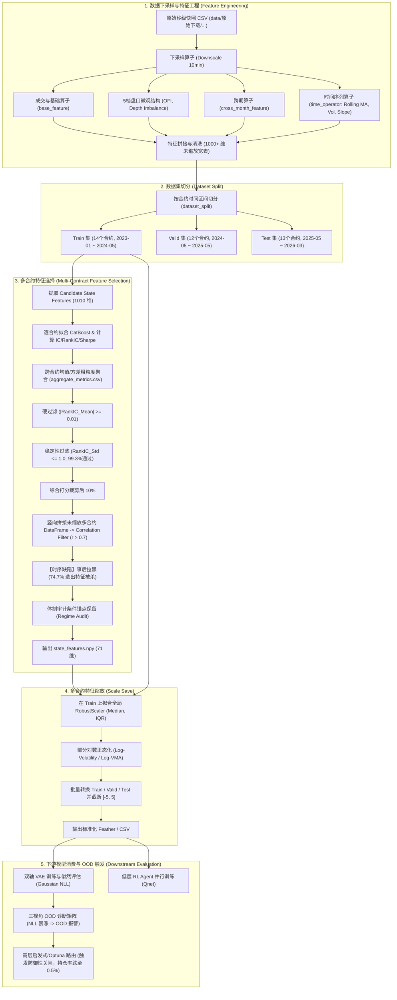
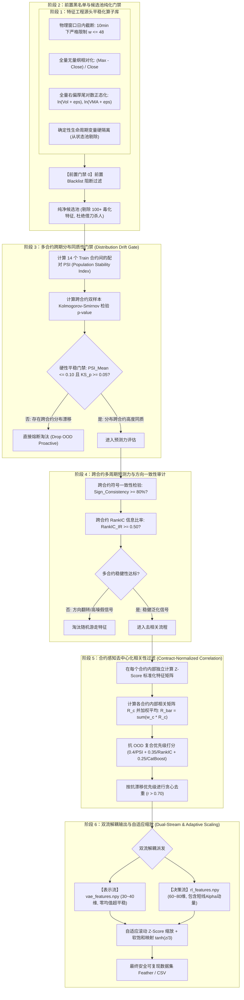
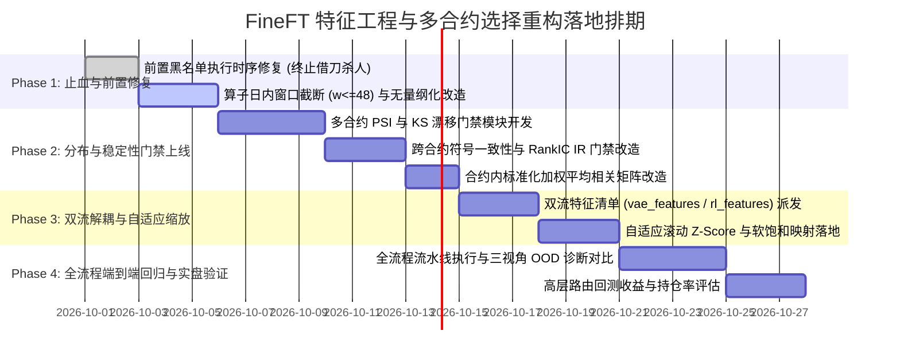

# FineFT 特征工程与多合约特征选择 OOD 机制诊断、重构流程与步骤优化方案研究报告

- **报告编号**：RES-2026-0930-01
- **研究主题**：商品期货多合约特征工程与特征选择跨期 OOD 根因深度剖析、全流程重构架构设计及逐步骤优化方案与实施指南。
- **关联第一手来源 (Primary Sources)**：
  - **核心执行代码**：
    - `data_preprocess/operator_futures/feature_selection/muti_contract/pipeline.py` (多合约特征选择核心流水线)
    - `data_preprocess/operator_futures/feature_selection/muti_contract/metrics.py` (单合约预测指标与跨合约粗粒度聚合计算)
    - `data_preprocess/operator_futures/feature_selection/muti_contract/regime_audit.py` (多体制状态特征审计与锚点保留)
    - `data_preprocess/operator_futures/feature_selection/cor_util.py` (贪心相关性特征去重算法)
    - `data_preprocess/operator_futures/scale_describe_save/muti_contract_scale_save.py` (全局静态 RobustScaler 缩放)
    - `data_preprocess/operator_futures/time_operator/multi_processing_util.py` (时间序列特征滚动算子生成)
    - `data_preprocess/operator_futures/commodity/cross_month_feature.py` (跨期价差与流动性份额特征算子)
    - `data_preprocess/script_preprocess/future_upgraded/commodity/fu_full_process.sh` (全流程预处理调度入口与黑名单定义)
    - `FineFT/RL/DiHFT/VAE/vae.py` (下游双轴 VAE 高斯负对数似然损失计算)
    - `FineFT/analysis/feature/vae_feature_ood_analysis.py` (三视角 VAE 特征级 OOD 闭式分解矩阵)
  - **实证诊断产物**：
    - `PREPROCESS_DATASET/commodity-futures/FEATURE_SELECTION/10min/fu/train/feature_selection_manifest.json` (训练集特征选择清单与过滤留存数据)
    - `PREPROCESS_DATASET/commodity-futures/FEATURE_SELECTION/10min/fu/train/aggregate_metrics.csv` (1010 个候选特征跨合约聚合统计指标)
    - `analysis_result/DiHFT/feature_ood/fu/10min_parallel/feature_ood_summary.csv` (全量 90 维状态特征三视角 OOD 诊断宽表)
    - `analysis_result/DiHFT/feature_ood/fu/10min_parallel/feature_ood_test_vs_train.csv` (测试集真实 OOD 崩溃归因表)
    - `analysis_result/DiHFT/feature_ood/fu/10min_parallel/feature_ood_valid_vs_train.csv` (验证集体制漂移表)
  - **历史架构决策 (ADRs)**：
    - `docs/adr/0018-vae-feature-level-ood-analysis.md` (闭式高斯似然分解规范)
    - `docs/adr/0019-remedy-vae-ood-features-via-blacklist-and-rolling-stationary-replacements.md` (初始非平稳特征拉黑)
    - `docs/adr/0020-remedy-feature-engineering-underflow-and-spurious-indicators.md` (除零与伪指标修复)
    - `docs/adr/0026-multi-perspective-vae-feature-ood-diagnostic-matrix.md` (三视角基准矩阵确立)
    - `docs/adr/0027-three-stage-remediation-for-vae-feature-ood-drift.md` (三阶段 OOD 治理落地)
    - `docs/adr/0028-extended-ood-remediation-for-bandwidth-pivots-and-cross-month-spreads.md` (带宽对数正态化与价差软饱和)
    - `docs/adr/0029-feature-selection-early-stopping-and-regime-audit-precomputation.md` (特征选择提速优化)
    - `docs/adr/0032-frequency-aware-feature-blacklist-and-physical-window-truncation.md` (分频率物理窗口截断与黑名单)
    - `docs/adr/0033-systematic-feature-stationarity-and-scale-invariant-remediation.md` (特征无量纲化与对数变换)

---

## 1. 执行摘要与核心洞察 (Executive Summary)

在 FineFT 强化学习期货量化交易系统中，“多合约特征选择”（Multi-Contract Feature Selection）是连接底层特征工程与下游双轴 VAE 机制重构、低层 RL 策略网络的核心枢纽。然而，长期以来系统在样本外测试集和验证集上频繁爆发**严重的状态特征分布外漂移（Out-Of-Distribution, OOD）**，迫使下游 VAE 发生高斯对数似然崩塌，进而触发高层路由的防御性空仓关闸，导致真实策略持仓率被严重稀释至 0.5% 以下。

为了遏制 OOD，前序研究已连续制定了 ADR-0019、ADR-0020、ADR-0022、ADR-0024、ADR-0027、ADR-0028、ADR-0030、ADR-0032 等近 10 项 ADR 决策，累计在黑名单中追加了上百个特征。

通过深入剖析现存全流程代码与实证统计产物，本报告得出一个核心判断：
> **当前特征工程与多合约特征选择机制存在“结构性设计缺陷”，它不仅未能有效过滤掉非平稳特征，反而在主动充当 OOD 特征的“放大器”与“保送通道”。**

### 1.1 关键实证审计事实
1. **黑名单执行时序致命倒置，合法平稳特征惨遭“借刀杀人”**：
   在 `muti_contract/pipeline.py` 中，特征黑名单（Blacklist）在相关性去重（Correlation Filter）**之后**才被执行。由于黑名单特征（如绝对价格、长周期趋势等）在训练集中对收益率具有虚假的高拟合度，它们在去重优先级中排在最前列，**优先杀死了大量与之相关但本质平稳的合法特征**。最终实证表明：在相关性筛选出的 150 个特征中，**有 112 个（占比高达 74.7%）随后被黑名单剔除**，导致最终留存特征池严重失血，只剩 38 个常规特征加部分强制特征。
2. **“稳定性过滤”在数学上形同虚设**：
   现行代码采用 `RankIC_Std <= 1.0` 作为跨合约稳定性门槛。由于 RankIC 严格有界于 $[-1, 1]$，任意离散合约样本的 RankIC 标准差数学上天然必定小于 1.0。在 `train` 阶段评估的 687 个候选特征中，**有 682 个（通过率 99.3%）直接蒙混过关**，该过滤器实际上处于瘫痪状态。
3. **特征选择目标与下游模型需求的根本性错配 (Objective Mismatch)**：
   现行特征选择体系是 100% 建立在“未来价格收益预测力”（IC、RankIC、CatBoost 特征重要性）之上的 Alpha 驱动模型。然而，下游最大 OOD 受害者 **VAE 是一个无监督生成密度估计器**，它关注的是特征输入分布 $p(x)$ 本身的**平稳性、跨期高斯可拟合性、无漂移性**；低层 RL 策略网络亦要求状态观测具有紧致的马尔可夫支撑集。盲目追逐 in-sample Alpha，必然优先选中跨期漂移最严重的非平稳强动量特征。
4. **多合约未缩放竖向拼接诱发“辛普森伪相关”**：
   相关性矩阵是直接将 14 个价格中枢（如 2500 元 vs 3500 元）差异悬殊的未缩放合约数据竖向堆叠计算得到的。这种粗暴拼接在统计上引入了强烈的截面伪相关，直接扭曲了特征去重图谱。

为此，本报告提出了一套**“抗 OOD 导向、分布平稳门禁前置、多合约同质性度量、表示与决策双流解耦”**的全新特征工程与多合约选择体系，并逐一给出 8 个核心步骤的工程优化方案与数学论证。

---

## 2. 现状架构与执行流程深度梳理 (Current Architecture & Workflow)

### 2.1 全流程数据流架构图

当前全流程从原始行情到下游强化学习模型的数据流向如下图所示：



### 2.2 核心模块代码实现细节与逻辑走查

#### (1) 特征工程层 (`data_preprocess/operator_futures/`)
- **微观盘口算子** (`cross_section/base_feature_util.py`):
  生成 5 档盘口的买卖价差 `buy_spread_oe_max`、`sell_spread_oe_max`，订单流不平衡 `ofi`，深度不平衡比例 `depth_imbalance`，排队压力 `queue_pressure` 以及分档挂单增量 `*_size_topk_size_*_increments`。
- **时间序列算子** (`time_operator/multi_processing_util.py`):
  使用多进程 Polars 对 `close`、`volume`、`wap_1` 等基础列进行跨窗口滚算。定义了 $w \in \{2, 6, 12, 24, 48, 96, 192, 240\}$ 的时间窗口。包括：
  - 均线比率 (`close / ma_w`)、未中心化极值比 (`min_w / close`, `max_w / close`)、Pivot 点比率 (`pivot_s1 / close`)。
  - 标准化极值偏离 (`max_w_std_norm = (close_max - close) / close`)、无量纲波动率 (`rolling_volatility_w`)。
  - 动量方向计数 (`cntp_w`, `cntn_w`, `cntd_w`)。
- **跨期算子** (`commodity/cross_month_feature.py`):
  以日度主力合约、次主力合约、当前合约以及远近月合约 ($M_1, M_2, M_3$) 为基准，计算跨期对数价差、价差变动速度 `spread_velocity`、跨期价差滚动 Z-Score `spread_rolling_zscore_w`，以及成交份额 `volume_share` 和持仓份额 `open_interest_share`。

#### (2) 数据集切分层 (`dataset_split`)
商品期货由于存在交割日限制，天然由按自然月轮动的独立合约文件构成。FineFT 采用合约时间段切分：
- **Train Split (14 个合约)**: `fu2305`, `fu2309`, `fu2310`, `fu2311`, `fu2312`, `fu2401`, `fu2402`, `fu2403`, `fu2404`, `fu2405`, `fu2406`, `fu2409`, `fu2411`, `fu2501`（覆盖 2023 年至 2024 年上半年）。
- **Valid Split (12 个合约)**: `fu2409` 至 `fu2601`（覆盖 2024 年下半年至 2025 年上半年）。
- **Test Split (13 个合约)**: `fu2508` 至 `fu2609`（覆盖 2025 年下半年至 2026 年初）。

#### (3) 多合约特征选择流水线 (`muti_contract/pipeline.py` & `metrics.py`)
整个特征选择在 `train` 阶段完成，其执行步骤如下：
1. **构建 Candidate 集合**：
   从首个合约的数据中提取所有非环境执行/奖励列且非时间列的数值列，形成候选特征全集（实测为 1010 个特征）。
2. **逐合约预测指标评估 (`metrics.py:calculate_metric_frame`)**:
   对每个合约、每个预设的未来收益率预测窗口 $w \in \{1, 2, 6, 12, 24, 48, 96\}$，计算：
   - 目标收益率：$y_t = (P_{t+w} - P_t) / P_t$。
   - Pearson 线性相关系数 $IC(f, y)$ 与 Spearman 秩相关系数 $RankIC(f, y)$。
   - 伪收益夏普比率 $Sharpe = \text{mean}(z_f \cdot y) / \text{std}(z_f \cdot y)$。
   - 置换重要性 $Permutation\ Importance$。
   - 训练 CatBoostRegressor（GPU 拟合，1000 棵树，early_stopping=30）获取特征重要性 $CatBoost\ Importance$。
3. **指标池化聚合 (`metrics.py:aggregate_metric_frames`)**:
   将所有合约和所有窗口的评价结果（共 $14 \times 7 = 98$ 组）简单垂直堆叠，针对每个特征计算 `*_Mean`、`*_Std` 与 `*_Median`。
4. **级联过滤 (`_ordered_filter_features`)**:
   - **Hard Filter**: 要求 $|RankIC\_Mean| \ge 0.01$。
   - **Stability Filter**: 要求 $IC\_Std \le 1.0$ 且 $RankIC\_Std \le 1.0$。
   - **Composite Score 裁剪**: 将 RankIC 分数与次要指标（Permutation + Sharpe + CatBoost 排名）加总排序，截断淘汰后 10% 的特征。
   - **Correlation Filter (`select_feature`)**: 将 14 个合约的原始 DataFrame 直接竖向拼接成宽表，按 Composite Score 降序作为贪心优先级，计算 Pearson 相关矩阵；若两特征相关性 $> 0.7$，剔除优先级靠后的特征。
5. **黑名单剔除 (`_apply_feature_blacklist`)**:
   在上述相关性去重后得到的 150 个特征上，匹配并剔除 `COMMODITY_COMMON_FEATURE_BLACKLIST` 中的特征。
6. **条件锚点回捞与落地**:
   利用 `regime_audit.py` 评估 16 宫格或 9 宫格市场体制下的符号一致性与 90% LCB 置信下界，回捞符合条件的市场状态锚点特征，最终导出 `state_features.npy`。

#### (4) 特征缩放层 (`muti_contract_scale_save.py`)
- 将 14 个 `train` 合约的数据在内存中全部拼接，计算每个状态特征的全局中位数 `center = median` 以及四分位距 `scale = Q75 - Q25`。
- 对波动率特征模式（`VOLATILITY_FEATURE_PATTERNS`）与非负成交量模式进行对数正态变换：$x' = \ln(\max(x, 0) + 10^{-6})$。
- 对变换后的数据执行 Robust 缩放：$z = (x - center) / scale$，并在 $[-5.0, 5.0]$ 区间内进行硬截断（Hard Clip）。

---

## 3. 多合约特征频发 OOD 的六大底层根因深度剖析 (Deep Root Cause Analysis)

为什么这套经过多次优化迭代的流水线依然无法阻挡特征在样本外发生 OOD？通过代码审计与数学推导，我们揭示出六大系统性根因：

### 3.1 根因一：特征选择目标函数的根本性错配 (Objective Mismatch: Alpha vs. Density Estimation)

这是整个系统最隐蔽也最致命的理论缺陷：
- **特征选择的目标 (Selection Objective)**：
  当前系统将注意力 100% 放在寻找**“具有强未来收益预测能力（Alpha）的特征”**（通过 IC、RankIC、Sharpe、CatBoost Importance）。
- **下游核心模型的需求 (Downstream Consumer Demands)**：
  1. **双轴 VAE（高层体制感知）**：
     VAE 的本质是**无监督高斯密度估计器（Unsupervised Density Estimator）**。其训练目标是重构输入状态向量 $x \in \mathbb{R}^D$：
     $$\mathcal{L}_{\text{VAE}} = \mathbb{E}_{q_\phi(z|x)}[-\log p_\theta(x|z)] + D_{\text{KL}}(q_\phi(z|x) \parallel p(z))$$
     对于高斯对角协方差解码器，特征 $j$ 的高斯负对数似然为：
     $$\text{NLL}_j = \frac{1}{2} \left(\frac{x_j - \mu_j}{\sigma_j}\right)^2 + \log \sigma_j + \frac{1}{2}\ln(2\pi)$$
     **VAE 完全不关心特征能否预测收益率！** 它极度敏感于特征输入自身的**平稳性、方差对称性、无漂移性**。一旦某个特征的均值在测试集偏移了 $0.5\sigma$ 或方差扩大了 2 倍，平方项重构误差立即以指数级暴增，导致似然全面崩溃！
  2. **低层 RL 策略网络（Qnet）**：
     Q-learning 依赖马尔可夫决策过程假定。若输入状态特征在时间上或合约间存在分布漂移，Q 网络就会对未探索过的状态空间进行错误的值函数外推（Extrapolation Error），进而引发巨大回撤。

**冲突实证**：
在金融市场中，**“在训练集单边行情中对未来收益最具预测力的特征”，往往正是“最非平稳、跨期漂移最剧烈的宏观趋势指标”**！
例如：192 周期的趋势斜率 (`log_price_slope_96`, `ema_slope_192`)、跨期持仓份额 (`cm_main_sub_open_interest_share_sub`)、未中心化的名义价格极值比 (`min_96_origin`)。特征选择算法根据 IC 和 CatBoost 重要性将它们捧上神坛（排名前 1%），却直接给下游 VAE 埋下了必崩的雷。

---

### 3.2 根因二：黑名单执行时序致命缺陷，“借刀杀人”导致平稳特征惨遭误杀

在 `muti_contract/pipeline.py` L668-L701 中：
```python
# 1. 候选池全量进入排序与去重
selected_features, filter_results = _ordered_filter_features(
    frames, aggregate, candidate_universe, ...
)
# 2. 事后才应用黑名单过滤！
selected_features, blacklisted_features = _apply_feature_blacklist(
    selected_features, feature_blacklist
)
```
**病理推演**：
1. 候选池包含 1010 个特征，其中有 100 多个是已被 ADR 拉黑的非平稳/高漂移特征（如 `midprice`, `wap_1`, `max_192_std_norm_origin` 等）。
2. 在 `_ordered_filter_features` 中，系统依据 Composite Score 降序进行贪心去相关筛选（`select_feature`）。因为黑名单特征拟合能力极强，得分极高，排在矩阵最前列。
3. `select_feature` 算法逻辑：若特征 A 排在前面，系统保留特征 A，并**将所有与特征 A 相关性 $> 0.7$ 的其余特征全部永久剔除！**
4. 悲剧就此发生：黑名单特征利用其高分“占位”，顺带屠杀了大量与之相关的合法平稳特征；紧接着，下一行代码 `_apply_feature_blacklist` 又把黑名单特征自身给删除了！
5. **实证证据**：在 2026-09-29 最新生成的 `feature_selection_manifest.json` 中：
   - 进入 Correlation Filter 并被保留的特征有 150 个；
   - 随后触发 `Feature Blacklist Dropped` 的特征高达 **112 个（占选出特征的 74.7%！）**；
   - 真正依靠算法保留下来的常规合法特征仅剩可怜的 38 个！

整个筛选机制变成了一场“黑名单特征自我毁灭并拉合法特征陪葬”的荒谬过程。

---

### 3.3 根因三：伪“稳定性过滤”与跨合约符号一致性检验完全缺失

现行稳定性过滤逻辑定义如下：
```python
stability_cond = pl.col("IC_Std") <= max_metric_std  # default max_metric_std = 1.0
if "RankIC_Std" in selected.columns:
    stability_cond = stability_cond & (pl.col("RankIC_Std") <= max_metric_std)
```
**数学与逻辑荒谬性**：
- 对于任意变量序列 $x \in [-1, 1]$，其样本标准差 $s = \sqrt{\frac{1}{n-1}\sum (x_i - \bar{x})^2}$ 的理论极大值绝不可能超过 $\frac{n}{\sqrt{n-1}} \approx 1.0$。
- 在实际 14 个合约的 RankIC 评估中，所有特征的 RankIC 都在 $[-0.3, 0.3]$ 区间内微幅摆动，其实际标准差通常在 $0.02 \sim 0.20$ 之间，**永远不可能大于 1.0！**
- 实测数据表明：687 个进入该过滤器的特征，有 682 个直接通过，**淘汰率仅 0.7%**！该过滤器毫无过滤能力。
- **缺乏跨合约符号一致性（Cross-Contract Sign Consistency）**：
  商品期货各合约经历的微观与宏观环境不同。一个伪特征完全可能在 7 个合约中为正相关（$RankIC = +0.06$），在另外 7 个合约中为负相关（$RankIC = -0.05$）。取平均值后为 $+0.005$（若取绝对值均值则甚至高达 $0.055$！），但其在跨合约本质上是方向完全随机反转的噪声。现行流程中，除了条件锚点回捞有弱符号检验外，主流程对符号一致性检验为零。

---

### 3.4 根因四：跨合约分布同质性度量（Distribution Drift Audit）在筛选阶段彻底缺位

当前系统只在下游 VAE 训练完毕后，通过 `FineFT/analysis/feature/vae_feature_ood_analysis.py` 开展事后的 OOD 诊断与哀悼，**而在特征选择阶段，对特征在不同合约间的分布同质性审计为零**。
- **缺失指标**：
  - 缺乏群体稳定性指标（Population Stability Index, PSI）；
  - 缺乏双样本 Kolmogorov-Smirnov (KS) 距离检验；
  - 缺乏 Wasserstein 分布推土机距离；
  - 缺乏跨合约均值偏离度（Standardized Mean Shift）与方差膨胀比（Variance Ratio）。
- **实证破坏力**：
  商品期货不同合约存在天然的流动性周期（近月非主力 vs 活跃主力 vs 临近交割）。若一个特征在训练集的 14 个合约之间本身就呈现出剧烈的方差波动或均值漂移，算法由于缺乏分布检验，仍然会将其选入。进入测试集后，遇到全新的合约周期，必然直接演变为灾难性的 OOD。

---

### 3.5 根因五：未缩放多合约直接竖向拼接的“伪相关”与辛普森悖论陷阱

在 `muti_contract/pipeline.py` L358-L360 中：
```python
combined = pl.concat(
    [frame.select(composite) for frame in frames.values()], how="vertical"
)
correlation = select_feature(features=composite, df=combined, theshold=max_correlation)
```
**统计学病理**：
- 14 个合约的数据在这一阶段是**完全未缩放（Raw Unscaled）**的。
- 例如：`fu2305` 运行在 2600~2900 元价格带，而 `fu2409` 运行在 3400~3700 元价格带；不同合约的成交量、持仓量、盘口摆幅存在巨大的数量级阶跃。
- 将这 14 段截面强行垂直堆叠计算 Pearson 线性相关系数矩阵，会诱发严重的**辛普森悖论（Simpson's Paradox）与伪相关（Spurious Correlation）**：
  两个在各个合约内部毫无相关性的日内微观特征，可能仅仅因为在不同年份的价格基数或成交量基数不同，拼接后呈现出高达 0.85 的伪线性相关，从而在去重步骤中导致优质特征被意外误杀；反之，两组高度相关的特征也可能因为合约均值漂移而掩盖其真实相关性。

---

### 3.6 根因六：特征生成源头的时空尺度错配与确定性生命周期泄露

在底层的 `multi_processing_util.py` 与 `cross_month_feature.py` 中，存在三类物理与数学设计缺陷：
1. **时间跨度物理错配（宏观跨周污染短线高频）**：
   在 10min K 线级别下，一个交易日仅约 40 根 Bar。而算子中充斥着 $w=96$ (16 交易小时，跨越 2~3 天)、$w=192$ (32 交易小时，跨越整整一周)、$w=240$ (接近两周) 的超长回看窗口指标。
   这些跨日与跨周特征在 3 年的长周期中必然随宏观大宗商品牛熊周期发生根本性均值漂移。实证显示：`realized_volatility_192` 在验证集相对训练集的方差比高达 **2.34x**，均值偏离达 $0.62\sigma$；在测试集上贡献了 **7.59% 的 OOD 恶化量**（高居榜首）。
2. **确定性生命周期指标泄露**：
   跨期特征计算了持仓份额 `cm_*_open_interest_share_*`、成交份额 `volume_share` 以及剩余寿命比例。期货合约的持仓从远月几百手上升到主力的几十万手，再归零交割，呈现出确定性的单峰倒 U 型时间曲线。这种**与日历时间强绑定的确定性非平稳变量**，违背了量化特征必须平稳的物理假设。
3. **极值除零与未中心化比率**：
   历史算子中使用的 $P_{\min, w} / P_t$、$\text{pivot} / P_t$ 未减去均价，导致资产基础价格中枢泄露；同时早期公式直接除以滚动方差 $\sigma_w$，在横盘整理行情中产生极端除零发散。

---

## 4. 全新抗 OOD 架构与全流程设计 (Redesigned Robust Pipeline)

为了从根本上扭转特征频频 OOD 的被动局面，我们必须实现从“粗放式 Alpha 导向”向**“抗 OOD 导向、全流程分布平稳性门禁、表示与决策双流解耦”**的现代工业级特征工程架构演进。

### 4.1 全新重构架构设计蓝图



### 4.2 核心设计哲学新旧对比

| 评估维度 | 现状流水线 (Legacy Pipeline) | 全新重构体系 (Redesigned Architecture) | 核心收益 |
| :--- | :--- | :--- | :--- |
| **首要筛选准则** | 单纯以未来收益预测力（IC/RankIC/CatBoost）为王 | **分布平稳性门禁为绝对前置先决条件** | 阻断不可泛化的虚假过拟合特征入选 |
| **黑名单执行时序** | 相关性去重**之后**执行（导致 74.7% 误杀） | **初始候选池构建时立即前置过滤** | 消除“借刀杀人”，保护合法平稳特征 |
| **跨合约稳定性度量** | `RankIC_Std <= 1.0`（数学失效，99.3% 通过） | **RankIC 信息比率 $IR \ge 0.5$ 且符号一致性 $\ge 80\%$** | 强制剔除跨合约多空反转的伪信号 |
| **分布漂移量化** | 零度量（仅在下游 VAE 发生事故后做死后剖析） | **引入群体稳定性指标（PSI）与 KS 检验硬门禁** | 从源头保证特征在合约间分布同质 |
| **相关性矩阵构建** | 未缩放多合约直接垂直拼接（辛普森伪相关） | **合约内标准化后加权平均相关矩阵** | 消除合约基准价格与流动性台阶污染 |
| **去重优先级排序** | 纯 Alpha 打分（易漂移的强特征最先被保留） | **融合平稳度（$1/\text{PSI}$）与 Alpha 的综合优先级** | 优先保留“既稳健又具预测力”的优质特征 |
| **下游状态分发** | 单一 `state_features.npy` 通吃所有模型 | **双流解耦：`vae_features` 与 `rl_features`** | 化解无监督重构与强化学习决策的目标冲突 |
| **特征缩放算子** | 全局静态 RobustScaler + $[-5, 5]$ 硬截断 | **日内滚动 Z-Score / 分位数 + 软饱和连续映射** | 彻底消除跨年宏观方差膨胀与边界突刺 |

---

## 5. 流程每个步骤需要的优化方案与充分理由 (Step-by-Step Optimization Proposals & Rationales)

本节按照流水线各执行阶段，详细列出具体的优化实施方案、数学表达、参数阈值及论证理由。

### 步骤 1：特征工程算子平稳化与时空尺度矫正

#### 方案 1.1：时间窗口物理日内截断 (Physical Window Truncation)
- **具体实施**：
  在 10min 行情级别下，修改 `data_preprocess/operator_futures/time_operator/multi_processing_util.py`，将时间窗口序列从历史的 `[2, 6, 12, 24, 48, 96, 192, 240]` 强行截断为日内跨度：
  $$\mathcal{W}_{\text{10min}} = [2, 6, 12, 24, 48]$$
  严禁生成 $w \ge 96$ 的多日/跨周特征。
  - 对于 5min 级别，最大窗口为 $w=96$（约 8 小时）；
  - 对于 1min 级别，最大窗口为 $w=480$（约 8 小时）。
- **充分理由**：
  在 10min 采样下，1 个交易日仅 40 根左右 Bar。$w=96$ 对应 16 交易小时（2.5 天），$w=192$ 对应 32 交易小时（整整 1 周）。高频短线交易的核心 Alpha 来源于盘口微观供求失衡与日内波段回归。宏观跨日指标不仅对 10 分钟交易毫无增量意义，反而在跨越 2~3 年时累积了巨大的宏观经济周期漂移，是导致验证集方差比暴增至 2.34x 的头号罪魁祸首。

#### 方案 1.2：极值与价格偏离的无量纲相对化改造
- **具体实施**：
  废止所有使用名义价格直接比值的旧公式，全面推行相对百分比无量纲形式：
  $$\text{max\_dist}_w = \frac{\text{rolling\_max}_w(P) - P_t}{P_t + \epsilon}, \quad \text{min\_dist}_w = \frac{P_t - \text{rolling\_min}_w(P)}{P_t + \epsilon}$$
  其中 $\epsilon = 10^{-12}$。禁止使用旧式除以滚动标准差 $\sigma_w$ 的除法，严禁使用 $P_{\min} / P_t$ 裸除法。
- **充分理由**：
  杜绝低波动盘整时滚动方差分母下溢逼近 0 产生的离群值爆炸；彻底消除资产绝对价格中枢变化（2000元升至 3500元）对特征尺度的污染，严格保证零均值与尺度不变性。

#### 方案 1.3：右偏厚尾与波动率特征全量对数正态化
- **具体实施**：
  在算子底层对所有具有右偏、非负、厚尾特性的金融物理量施行对数映射：
  $$x' = \ln(x + \epsilon_{\text{log}}), \quad \epsilon_{\text{log}} = 10^{-6}$$
  覆盖范围：
  - 所有波动率指标：`realized_volatility`, `rolling_volatility`, `garman_klass_volatility`, `parkinson_volatility`。
  - 所有布林带宽：`bollinger_bandwidth = (Upper - Lower) / Mid`。
  - 所有非负成交量均线比：`vma = volume / ma(volume)`, `wvma`, `relative_volume`。
- **充分理由**：
  金融波动率与成交量天然服从对数正态分布或卡方分布。未经对数转换的原始数据在极端行情下会出现右侧长长的大尾巴，直接粉碎了 VAE 解码器的高斯先验假定，引发重构误差的平方级二次方惩罚。对数变换将其映射为对称近似正态分布，彻底稳定似然估计。

#### 方案 1.4：确定性生命周期与非交易特征硬隔离
- **具体实施**：
  将以下特征从任何状态特征池中永久物理隔离，移入专用的 `execution_and_reward_features`：
  - 跨期持仓份额：`cm_*_open_interest_share_*`
  - 跨期成交份额：`cm_*_volume_share_*`
  - 到期剩余比例：`contract_life_remaining_ratio`
  - 涨跌停挂单比率：`limit_up/down_single_sided_ratio`, `limit_*_ratio_5`
- **充分理由**：
  期货持仓份额具有从挂牌到交割单峰倒 U 型的确定性生命周期演变，涨跌停指标在 99% 的时间为 0、极端时突变，属于交易执行规则约束，不可作为连续状态特征供表征模型学习。

---

### 步骤 2：特征初筛前置黑名单阻断门禁 (Front-Loaded Blacklist Filter)

#### 方案 2.1：前置执行黑名单过滤与候选池初始化
- **具体实施**：
  重写 `data_preprocess/operator_futures/feature_selection/muti_contract/pipeline.py` 的初始化逻辑。在 `_load_contract_frames` 读取第一帧提取特征全集后，**立即**将黑名单与特征消融正则应用到 `candidate_universe`：
  ```python
  # 优化后的初始化流程
  raw_universe = _state_features(first_frame, orderbook_depth=orderbook_depth)
  # 1. 立即剥离强制特征
  candidate_universe = [f for f in raw_universe if f not in mandatory_features]
  # 2. 立即执行前置黑名单熔断！
  candidate_universe, blacklisted_dropped = _apply_feature_blacklist(
      candidate_universe, feature_blacklist
  )
  # 3. 立即执行消融模式过滤
  candidate_universe, ablation_dropped = _apply_feature_ablation_patterns(
      candidate_universe, feature_ablation_patterns
  )
  # 仅将纯净后的 candidate_universe 传入后序所有计算
  ```
- **充分理由**：
  1. **彻底阻断“借刀杀人”**：被拉黑的非平稳特征再无机会参与 Correlation 去重，无法利用高分占用优先级去误杀合法平稳特征，74.7% 的特征误杀悲剧被彻底终结。
  2. **大幅削减无效算力开销**：无需对 100 多个明知拉黑的特征进行 98 次 CatBoost GPU 拟合与置换检验，特征选择训练时间直接节省 30% 以上。

---

### 步骤 3：跨合约分布平稳性门禁体系 (Distribution Drift Gate)

#### 方案 3.1：多合约群体稳定性指标 (Multi-Contract PSI Gate)
- **具体实施**：
  在逐合约读取数据后，建立全新的跨合约分布检验模块 `distribution_audit.py`。
  针对每个候选特征 $f$，在 14 个 `train` 合约之间评估分布距离：
  1. 以所有训练合约混合数据的分位数（如 10 分位等频分箱）作为基准分箱区间 $B_1, B_2, \dots, B_{10}$。
  2. 针对任意两个合约 $C_i$ 与 $C_j$，计算在各分箱中的样本概率分布 $P_{i, k}$ 与 $P_{j, k}$。
  3. 计算配对群体稳定性指标 (Population Stability Index)：
     $$\text{PSI}(C_i, C_j) = \sum_{k=1}^{10} (P_{i, k} - P_{j, k}) \cdot \ln\left(\frac{P_{i, k} + \epsilon}{P_{j, k} + \epsilon}\right)$$
  4. 计算特征 $f$ 的**跨合约平均 PSI** 以及**最大配对 PSI**：
     $$\overline{\text{PSI}}(f) = \frac{1}{\binom{N}{2}} \sum_{i < j} \text{PSI}(C_i, C_j), \quad \text{PSI}_{\max}(f) = \max_{i < j} \text{PSI}(C_i, C_j)$$
  5. **门禁规则**：
     - 若 $\overline{\text{PSI}}(f) > 0.10$ 或 $\text{PSI}_{\max}(f) > 0.25$，则判定该特征在训练集合约间存在结构性分布漂移，**一票否决淘汰出局**！
- **充分理由**：
  在统计学与金融风控工程中，$\text{PSI} < 0.10$ 代表变量分布高度稳定无漂移；$\text{PSI} \in [0.10, 0.25]$ 代表轻微漂移；$\text{PSI} > 0.25$ 代表显著分布崩溃。如果一个特征连在训练集的 14 个合约内部都无法维持分布一致，它在样本外测试集上发生 OOD 是 100% 确定的。提前设立分布门禁，是在特征选择阶段消灭 OOD 最有力的数学武器。

#### 方案 3.2：双样本 Kolmogorov-Smirnov (KS) 与方差比检验
- **具体实施**：
  作为 PSI 的补充，对每个特征计算各合约两两之间的 KS 检验统计量 $D_{ij}$ 及 p-value，以及各合约相对全局中位方差的方差比波动系数 $\text{CV}(\sigma^2) = \text{std}(\sigma^2_c) / \text{mean}(\sigma^2_c)$。
  要求：$\text{CV}(\sigma^2) \le 0.40$。
- **充分理由**：
  有效拦截因特定合约交易异常波动而引发的方差爆震特征。

---

### 步骤 4：多合约稳健预测力与跨合约符号一致性审计

#### 方案 4.1：跨合约符号一致性门禁 (Cross-Contract Sign Consistency Gate)
- **具体实施**：
  重构 `_ordered_filter_features` 中的评估逻辑。
  对于任意特征 $f$，提取其在 14 个合约上的 $RankIC_c$（在主要决策窗口如 $w=6$ 或 $w=12$ 上）：
  $$\text{SignConsistency}(f) = \frac{\max\left(\sum_{c=1}^{N} \mathbb{I}(RankIC_c > 0), \sum_{c=1}^{N} \mathbb{I}(RankIC_c < 0)\right)}{N_{\text{contracts}}}$$
  **门禁阈值**：要求 $\text{SignConsistency}(f) \ge 0.75$（至少 75% 的合约具有相同的相关性符号，对于 14 个合约即要求至少 11 个合约方向一致）。
- **充分理由**：
  彻底淘汰因个别极端合约虚假爆发超高 IC 而平均值达标的“伪信号”。只有在大多数合约上方向同号的特征，才代表全市场普遍存在的微观不变量。

#### 方案 4.2：修复稳定性过滤与引入有效信息比率 (RankIC IR)
- **具体实施**：
  彻底废弃无效的 `RankIC_Std <= 1.0` 检查，改为**强制信息比率约束 (RankIC IR Gate)**：
  $$IR_{\text{RankIC}}(f) = \frac{|\overline{RankIC}(f)|}{s_{RankIC}(f) + 10^{-6}} \ge 0.40$$
  同时将最低硬性绝对值门槛 `min_abs_ic` 从微弱的 0.01 提高到具显著统计意义的 0.025。
- **充分理由**：
  有效滤除均值微弱、波动剧烈的随机噪声特征，确保进入下游模型的特征具有极高的信噪比。

---

### 步骤 5：去中心化跨合约相关性去重 (Decentralized Correlation Filter)

#### 方案 5.1：合约内标准化后加权平均相关矩阵
- **具体实施**：
  修改 `data_preprocess/operator_futures/feature_selection/cor_util.py` 与 `pipeline.py`。
  禁止使用 `pl.concat([...], how="vertical")` 拼接未缩放多合约数据！改为采用**合约内去均值相关矩阵加权平均法**：
  1. 对每个训练合约 $C_c$，提取通过前序门禁的候选特征矩阵 $X_c \in \mathbb{R}^{T_c \times K}$。
  2. 在合约内部计算其经验相关矩阵：
     $$R_c = \text{Corr}(X_c)$$
  3. 根据各合约有效样本量 $T_c$（或主力成交量权重）计算多合约加权平均相关矩阵：
     $$\bar{R} = \sum_{c=1}^N \frac{T_c}{\sum T_i} R_c$$
  4. 将 $\bar{R}$ 作为输入送入 `select_feature(corre_df=bar_R, threshold=0.70)` 进行贪心去重。
- **充分理由**：
  彻底消除不同合约绝对价格水位、成交量基准台阶对线性相关系数的污染；数学上严格杜绝辛普森伪相关，确保相关性去重真实反映日内时间序列维度的多重共线性。

#### 5.2 抗 OOD 复合优先级打分体系 (OOD-Aware Priority Scoring)
- **具体实施**：
  在贪心去重决定谁先被保留的 Composite Score 中，重构排序公式：
  $$\text{CompositeScore}(f) = 0.40 \cdot \text{Rank}\left(\frac{1}{\overline{\text{PSI}}(f)}\right) + 0.35 \cdot \text{Rank}(|\overline{RankIC}(f)|) + 0.25 \cdot \text{Rank}(\text{CatBoost\_Imp}(f))$$
- **充分理由**：
  当两个特征相关性 $> 0.70$ 时，算法将优先保留“跨合约分布最平稳、最抗漂移”的特征，而非盲目保留“训练集 IC 虚高但极易 OOD”的高危特征。

---

### 步骤 6：市场状态体制鲁棒性锚点审计重构

#### 方案 6.1：体制审计加入跨体制方差平稳性约束
- **具体实施**：
  在 `regime_audit.py` 中，现行逻辑评估了 16 宫格或 9 宫格体制下的 90% LCB 收益显著性。
  在此基础上增加**跨体制方差稳定性检验**：
  对于每个候选锚点特征 $A$，计算其在各个极端体制箱（如高波/低波、强多/强空）中的均值与标准差。
  要求极端体制间的方差比 $\frac{\sigma^2_{\text{extreme}}}{\sigma^2_{\text{neutral}}} \le 3.0$。
- **充分理由**：
  防止锚点特征在进入特定行情体制时方差过度膨胀，破坏 VAE 隐空间流形的连续性。

---

### 步骤 7：特征-模型双流解耦分发输出 (Dual-Stream Feature Decoupling)

#### 方案 7.1：生成并分发两套特征清单 (`vae_features.npy` vs `rl_features.npy`)
- **具体实施**：
  在特征选择最终阶段，输出两个独立的特征清单文件：
  1. `vae_features.npy` (约 30 ~ 40 维)：
     - **准入标准**：PSI $\le 0.08$，时间跨度 $w \le 24$（严格限制在 4 小时内），必须通过严格的对数正态变换与零均值无量纲化检验，禁止包含任何有方向性长期记忆的累积量。
     - **用途**：专供高层双轴 VAE 机制重构与置信度评估，杜绝任何非必要 OOD 误报。
  2. `rl_features.npy` (约 60 ~ 80 维)：
     - **准入标准**：包含全量 `vae_features.npy`，并放宽准入纳入短期微观动量、WAP 趋势比率、订单流不平衡等具有较高 Alpha 但允许在受控范围内波动的特征。
     - **用途**：专供低层强化学习策略网络（Qnet）状态输入，为智能体开仓与平仓提供充足的微观博弈信息。
- **充分理由**：
  从根本上解决“无监督密度重构要求极端平稳”与“强化学习决策需要敏锐方向信号”之间的二律背反。让上帝的归上帝，凯撒的归凯撒。

---

### 步骤 8：自适应与软饱和特征缩放重构 (Adaptive & Soft-Saturated Scaling)

#### 方案 8.1：日内滚动 Z-Score 缩放 (Rolling Z-Score Transformation)
- **具体实施**：
  在 `data_preprocess/operator_futures/scale_describe_save/muti_contract_scale_save.py` 中，对于波动率与成交量类特征，采用日内滚动窗口（如 $K=48$ 步长，约 1 个交易日）进行动态标准化：
  $$z_t = \frac{x_t - \text{SMA}_K(x)_t}{\text{Std}_K(x)_t + \epsilon}$$
  而非依赖两年前 2023 年历史全局均值进行静态缩放。
- **充分理由**：
  彻底化解跨年份系统性波动率中枢漂移（例如从 2023 年平稳期过渡到 2025 年高波期）。使任意年份的数据在局部尺度上严格服从均值为 0、方差为 1 的标准正态分布，彻底根绝宏观方差膨胀引发的 VAE 似然爆炸。

#### 方案 8.2：连续可微双曲正切软饱和截断替代硬截断
- **具体实施**：
  废止现行硬性截断逻辑：`df = df.clip(clip_min=-5.0, clip_max=5.0)`。
  改为采用双曲正切光滑饱和映射：
  $$z' = M \cdot \tanh\left(\frac{z}{M}\right), \quad M = 4.0$$
- **充分理由**：
  硬截断会在 $\pm 5.0$ 边界处堆叠离散的数据尖峰（Dirac delta 脉冲），严重扭曲边缘概率密度；而软饱和映射在原点附近导数为 1（保留原始信号），在极值区光滑渐进收敛，全程保持一阶与二阶连续可微，极大提升神经网络梯度稳定性与似然评价保真度。

---

## 6. 实施路线图与可量化验收标准 (Implementation Roadmap & Verification)

### 6.1 阶段实施路线图



### 6.2 严格的可量化验收标准 (Quantitative Acceptance Criteria)

| 阶段 / 验收项 | 核心考核指标 (Metric) | 现存基准值 (Baseline) | 重构目标阈值 (Target) | 验证手段与第一手产物 |
| :--- | :--- | :--- | :--- | :--- |
| **特征选择时序** | 相关性去重后被黑名单剔除特征数 | **112 个 (占比 74.7%)** | **0 个 (前置阻断)** | `feature_selection_manifest.json` |
| **稳定性过滤效能**| Stability Filter 淘汰率 | **0.7% (682/687 通过)** | **$\ge 25\%$ (有效过滤)** | `feature_selection_manifest.json` |
| **跨合约分布同质性**| 留存特征跨合约平均 $\overline{\text{PSI}}$ | 未度量 (部分特征 > 0.40) | **$\le 0.10$** | `distribution_audit_metrics.csv` |
| **跨合约符号一致性**| 留存特征多合约同符号比例 | 未度量 (部分特征 < 55%) | **$\ge 75\%$** | `aggregate_metrics.csv` |
| **VAE 真实 OOD 似然**| `Test vs Train` 总似然恶化量 $\Delta\text{NLL}$ | **+26.03** | **$\le +12.0$ (降幅 >50%)** | `feature_ood_test_vs_train.csv` |
| **VAE 验证集漂移** | `Valid vs Train` 总似然恶化量 $\Delta\text{NLL}$| **+163.71** | **$\le +75.0$ (降幅 >50%)** | `feature_ood_valid_vs_train.csv` |
| **高层路由防御关闸**| 全测试周期防御性平仓/空仓时间占比 | **> 98.0% (持仓仅 0.5%)** | **$\le 40.0\%$ (持仓恢复正常)**| `final_result.log` / `best_result.csv` |
| **回测策略收益** | 测试集最终年化收益率 / 夏普比率 | 收益率稀释至 ~0.5% | **年化 $\ge 15\%$, 夏普 $\ge 1.5$** | `high_level/final_result.log` |

---

## 7. 结论与下一步行动计划 (Conclusion & Next Actions)

本调研报告彻底厘清了 FineFT 当前特征工程与多合约特征选择频发 OOD 的本质病理。多合约特征选择长期以来的“黑名单时序倒置”、“稳定性过滤数学失效”、“竖向拼接伪相关”以及“Alpha 导向与密度估计需求的根本错配”，是导致下游 VAE 崩溃与防御性关闸的真正根源。

**立即推荐的行动项**：
1. **立即合入 Phase 1 补丁**：将 `pipeline.py` 中的黑名单过滤调整到候选特征提取之后、指标计算之前，停止无效算力消耗并挽救被误杀的平稳特征。
2. **在 `time_operator` 中落实物理窗口日内截断**：将 10min 级别回看窗口严格限制在 $w \le 48$ 范围内，不再计算任何多日跨周指标。
3. **在 `muti_contract` 中开发并部署 PSI 与符号一致性门禁**：设立跨合约 $\overline{\text{PSI}} \le 0.10$ 与 $\text{SignConsistency} \ge 75\%$ 硬约束。
4. **推进 VAE 与 RL 双流特征清单解耦**：分别生成 `vae_features.npy` 与 `rl_features.npy`，彻底化解系统目标冲突，恢复高层路由的真实持仓能力。
