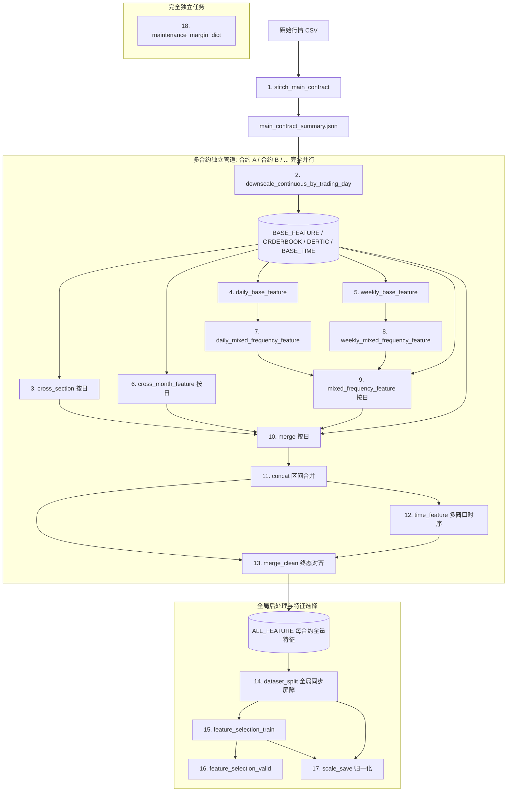

# 商品期货全流程预处理 (fu_full_process.sh) 任务依赖关系与并行加速优化研究

- **研究对象**：`data_preprocess/script_preprocess/future_upgraded/commodity/fu_full_process.sh`
- **关联脚本**：`data_preprocess/script_preprocess/future_upgraded/commodity/commodity_process.sh`、`main_10min_fu.sh`
- **相关算子**：`operator_futures` 下属下采样、截面、跨期、混频、合并拼接、时序特征、数据集切分、特征选择与归一化算子
- **调研方法**：基于代码源码（Primary Source）、测试套件契约（`test_commodity_main_contract_cli.py`）与数据流拓扑进行逐行溯源分析

---

## 1. 调研摘要 (Executive Summary)

当前商品期货（燃料油 `fu`）的端到端预处理主流程定义于 `fu_full_process.sh:run_commodity_full_process`，其整体执行耗时长、计算资源利用率低。通过对全链路 14 个阶段的输入输出、文件读写和执行逻辑进行细粒度分析，核心发现如下：

1. **合约间完全无依赖（最大并行红利）**：在 `downscale_continuous_by_trading_day` 完成后至 `dataset_split` 之前，所有合约（如 `fu2601`, `fu2605` 等）之间的 10 个特征生成步骤**存在 0 交叉依赖**。目前脚本采用串行 `while` 循环逐个处理合约，若有 $N$ 个主力合约，理论上通过**跨合约并行**即可直接获得最高 $N$ 倍的提速。
2. **合约内部存在多路独立分支（流水线并行）**：在单个合约内部，`cross_section`（截面特征）、`cross_month_feature`（跨期特征）、`daily_base_feature`（日线基底）与 `weekly_base_feature`（周线基底）**四条分支完全解耦**，全部仅依赖上游下采样输出，目前被严格串行化执行。
3. **按日 Bash 循环与频繁冷启动（最大性能损耗点）**：`cross_section`、`cross_month`、`mixed_frequency` 与 `merge` 采用 Bash `while` 日期步进，对每一天执行 `nohup python -u ... &`。对于跨度 3 年的数据（约 700 多个交易日、1100 多个日历日），单个合约将触发约 2,800 次独立的 Python 解释器冷启动与 Polars 库加载，造成巨大的系统开销；且 Bash 中 `wait "$pid"` 存在伪并发等待缺陷。
4. **后处理阶段的独立任务未解耦**：`maintenance_margin_dict` 仅基于静态配置生成字典，与前序所有数据特征无依赖，却被排在全流程最后串行执行；`scale_save` 与 `feature_selection_valid` 均仅依赖 `feature_selection_train` 和 `dataset_split`，二者间并无依赖关系。

---

## 2. 算子阶段清单与数据依赖拓扑 (Stage Inventory & Data Flow)

### 2.1 算子阶段清单

全流程共包含 14 个核心步骤，其输入输出与源码依据如下表所示：

| 阶段序号 | 步骤名称 (`step_name`) | 调用的核心算子/模块 | 源码位置 (`fu_full_process.sh`) | 输入数据源 | 输出数据目标 | 作用域维度 |
| :--- | :--- | :--- | :--- | :--- | :--- | :--- |
| 1 | `stitch_main_contract` | `operator_futures.commodity.stitch_main_contract` | L108-124, L680-684 | `data/原始下载/{commodity}/{YYYY}/{MM}/{YYYYMMDD}/*.csv` | `CONTINUOUS_RAW/{symbol}/main_contract_summary.json` | 品种级 |
| 2 | `downscale_continuous_by_trading_day` | `operator_futures.commodity.downscale_continuous_by_trading_day` | L126-145, L685-689 | `main_contract_summary.json` + 原始合约日 CSV | `BASE_FEATURE`, `DOWNSCALE_ORDERBOOK_25`, `DOWNSCALE_DERTIC`, `BASE_TIME_FEATURE`, `COMMODITY_QUOTE_FEATURE` | 全合约+全日期 |
| 3 | `cross_section` | `operator_futures/cross_section/create_feature.py` | L163-214, L691-697 | `BASE_FEATURE`, `DOWNSCALE_ORDERBOOK_25` | `CROSS_SECTION/{KLINE,QUOTES,SNAPSHOT}_FEATURE` | 合约 x 按日 |
| 4 | `daily_base_feature` | `operator_futures.commodity.daily_base_feature` | L407-427, L701-704 | `BASE_FEATURE` (该合约所有日 feather) | `MIXED_FREQUENCY_BASE/.../DAILY/{start}-{end}.feather` | 合约级 |
| 5 | `weekly_base_feature` | `operator_futures.commodity.weekly_base_feature` | L429-449, L705-708 | `BASE_FEATURE` (该合约所有日 feather) | `MIXED_FREQUENCY_BASE/.../WEEKLY/{start}-{end}.feather` | 合约级 |
| 6 | `cross_month_feature` | `operator_futures.commodity.cross_month_feature` | L365-405, L709-712 | `main_contract_summary.json` + 当日 3 个活跃合约的 `BASE_FEATURE` | `CROSS_MONTH_FEATURE/{symbol}/{contract}/{freq}/{date}.feather` | 合约 x 按日 |
| 7 | `daily_mixed_frequency_feature` | `operator_futures.commodity.daily_mixed_frequency_feature` | L451-472, L713-716 | `MIXED_FREQUENCY_BASE/.../DAILY/{start}-{end}.feather` | `MIXED_FREQUENCY_FEATURE/.../DAILY/{start}-{end}.feather` | 合约级 |
| 8 | `weekly_mixed_frequency_feature` | `operator_futures.commodity.weekly_mixed_frequency_feature` | L474-495, L717-720 | `MIXED_FREQUENCY_BASE/.../WEEKLY/{start}-{end}.feather` | `MIXED_FREQUENCY_FEATURE/.../WEEKLY/{start}-{end}.feather` | 合约级 |
| 9 | `mixed_frequency_feature` | `operator_futures.commodity.mixed_frequency_feature` | L497-532, L721-724 | 当日 `BASE_FEATURE` + 上述生成的 DAILY & WEEKLY 混频特征 | `MIXED_FREQUENCY_FEATURE/{symbol}/{contract}/{freq}/{date}.feather` | 合约 x 按日 |
| 10 | `merge` | `operator_futures/merge_concat/merge.py` | L317-363, L725-728 | 当日盘口快照、衍生品指标、基底特征、时间特征、截面特征、跨期特征、混频特征 | `MERGED_FEATURE/{symbol}/{contract}/{freq}/{CONCURRENT,FUTURE}_FEATURE/{date}.feather` | 合约 x 按日 |
| 11 | `concat` | `operator_futures/merge_concat/concat.py` | L534-555, L729-732 | 区间内所有日期的 `CONCURRENT_FEATURE` 与 `FUTURE_FEATURE` | `CONCAT_FEATURE/{symbol}/{contract}/{freq}/{start}-{end}.feather` | 合约级 |
| 12 | `time_feature` | `operator_futures/time_operator/create_feature_multi_processing.py` | L557-580, L733-736 | `CONCAT_FEATURE/{symbol}/{contract}/{freq}/{start}-{end}.feather` | `TIME_FEATURE/{symbol}/{contract}/{freq}/{start}-{end}.feather` | 合约级 |
| 13 | `merge_clean` | `operator_futures/merge_all/merge_clean.py` | L582-604, L737-740 | `CONCAT_FEATURE` + `TIME_FEATURE` | `ALL_FEATURE/{symbol}/{contract}/{freq}/{start}-{end}.feather` | 合约级 |
| 14 | `dataset_split` | `operator_futures.dataset_split.dataset_split` | L606-625, L743-747 | 所有主力合约的 `ALL_FEATURE` | `SPLIT-TRAIN-VALID-TEST/{freq}/{symbol}/{train,valid,test}/*.feather` | 全品种级同步屏障 |
| 15 | `feature_selection_train` | `operator_futures.feature_selection.muti_contract` | L627-656, L748-752 | `SPLIT-TRAIN-VALID-TEST/{freq}/{symbol}/train` | `FEATURE_SELECTION/{freq}/{symbol}/train/state_features.npy` | 全品种级 |
| 16 | `feature_selection_valid` | `operator_futures.feature_selection.muti_contract` | L627-656, L753-757 | `SPLIT-TRAIN-VALID-TEST/{freq}/{symbol}/valid` + train 的 `state_features.npy` | `FEATURE_SELECTION/{freq}/{symbol}/valid/.../state_features.npy` | 全品种级 |
| 17 | `scale_save` | `operator_futures/scale_describe_save/muti_contract_scale_save.py` | L296-315, L758-762 | `SPLIT-TRAIN-VALID-TEST` + train 的 `state_features.npy` | `SCALE_SAVE/{symbol}/{contract}/{freq}/{date_range}/*` | 全品种级 |
| 18 | `maintenance_margin_dict` | `operator_futures.commodity.build_maintenance_margin_dict` | L658-666, L763-767 | 品种配置字典 (`get_commodity_config`) | `dataset/{symbol}/maintenance_margin_ratio_dict.npy` | 独立静态元数据 |

---

### 2.2 数据依赖拓扑 (Dependency DAG)



---

## 3. 细粒度依赖关系分析 (Detailed Dependency Analysis)

### 3.1 跨合约维度（Inter-Contract）：完全独立，可 100% 并发
- **代码现状**：
  在 `fu_full_process.sh` 中，合约遍历被分为两段串行循环：
  - 循环 1（L691-697）：串行对每个合约执行 `cross_section`。
  - 循环 2（L699-741）：串行对每个合约按序执行 `daily_base` -> `weekly_base` -> `cross_month` -> `daily_mixed` -> `weekly_mixed` -> `mixed_freq` -> `merge` -> `concat` -> `time_feature` -> `merge_clean`。
- **依赖实情**：
  - `downscale_continuous_by_trading_day.py`（L233-241）在未传 `--contract` 时，**已经一次性并发下采样了 summary 中的所有合约**。
  - 之后的特征计算中，`cross_section`、`daily_base`、`weekly_base`、`daily_mixed`、`weekly_mixed`、`mixed_freq`、`merge`、`concat`、`time_feature`、`merge_clean` 的输入与输出路径均带有 `${symbol}/${contract}`。
  - 唯一看起来涉及其他合约的算子是 `cross_month_feature.py`（L431-450，需要同日 3 个活跃合约的 `BASE_FEATURE`），但由于下采样在循环开始前已全量完成，所有合约的 `BASE_FEATURE` 均已就绪，不会与任何并发合约产生写锁或读写依赖冲突。
- **结论**：**合约 1（如 fu2601）与合约 2（如 fu2605）之间毫无耦合，可完全并行运行整个子流水线。**

---

### 3.2 合约内部任务维度（Intra-Contract）：四路独立分支可并发
在单个合约流水线内部，各阶段并不是单向线性的，而是具备明显的树状分支结构：

1. **分支 A（截面特征）**：`cross_section`
   - 依赖：`BASE_FEATURE`, `DOWNSCALE_ORDERBOOK_25`
   - 输出：`KLINE_FEATURE`, `QUOTES_FEATURE`, `SNAPSHOT_FEATURE`
   - 与其它分支关系：不依赖日线、周线、混频或跨期，独立运行。
2. **分支 B（跨期特征）**：`cross_month_feature`
   - 依赖：`BASE_FEATURE`, `main_contract_summary.json`
   - 输出：`CROSS_MONTH_FEATURE`
   - 与其它分支关系：完全独立，无需等待 `cross_section` 或任何混频特征。
3. **分支 C（日频长周期线索）**：`daily_base_feature` -> `daily_mixed_frequency_feature`
   - `daily_base_feature` 直接扫描 `BASE_FEATURE`，生成 `MIXED_FREQUENCY_BASE/.../DAILY`。
   - `daily_mixed_frequency_feature` 仅依赖上一步输出，生成 `MIXED_FREQUENCY_FEATURE/.../DAILY`。
4. **分支 D（周频长周期线索）**：`weekly_base_feature` -> `weekly_mixed_frequency_feature`
   - `weekly_base_feature` 直接扫描 `BASE_FEATURE`，生成 `MIXED_FREQUENCY_BASE/.../WEEKLY`。它与 `daily_base_feature` 完全没有数据依赖！
   - `weekly_mixed_frequency_feature` 仅依赖上一步输出，生成 `MIXED_FREQUENCY_FEATURE/.../WEEKLY`。
5. **汇合点 1（混频对齐）**：`mixed_frequency_feature`
   - 汇合分支 C 与分支 D 的 feather 文件，与当日 `BASE_FEATURE` 时间戳 join。
6. **汇合点 2（因子大合并）**：`merge`
   - 汇合分支 A（截面）、分支 B（跨期）、汇合点 1（混频）以及底层的 `BASE_TIME_FEATURE`、`DERTIC`，生成单日 `CONCURRENT_FEATURE` 与 `FUTURE_FEATURE`。
7. **串行后段**：`concat` -> `time_feature` -> `merge_clean`。
   - 这三步属于区间级大矩阵操作（时序滚动窗口），存在严格的线性依赖。

---

### 3.3 按日任务维度（Date-Level）：进程粒度与启动瓶颈
在现行的 Bash 脚本中，`cross_section`（L179-213）、`cross_month_feature`（L378-404）、`mixed_frequency_feature`（L508-531）与 `merge`（L330-362）均使用了如下 Bash 循环结构：

```bash
local current_date
current_date=$(date -I -d "$start_date")
local process_count=0
while [ "$current_date" != "$end_date" ]; do
    ...
    nohup python -u ... &
    local pid=$!
    let process_count=process_count+1
    if [ "$process_count" -eq "$max_processes" ]; then
        wait "$pid" || return $?
        process_count=0
    fi
    current_date=$(date -I -d "$current_date + 1 day")
done
wait || return $?
```

**该模式存在三大性能与工程缺陷**：
1. **进程创建风暴与解释器开销**：每个交易日均作为独立的 CLI 命令启动。按 3 年约 700 个交易日计算，单合约在上述 4 个步骤中总计唤起 700 * 4 = 2,800 次 Python 启动。每次导入 Python、Polars、NumPy 耗时约 0.15~0.25 秒，仅解释器冷启动就空耗 400~700 秒（约 10 分钟）的纯 CPU 循环。
2. **Bash 伪并发等待逻辑漏洞**：`if [ "$process_count" -eq "$max_processes" ]; then wait "$pid"; fi` 仅等待**当前批次最后一个进程** `$pid`，若前几个进程耗时更长，则后续批次会超额并发；若最后一个进程极快，则批次过早重置，无法稳定保持 `max_processes` 满载工作。
3. **无效日历日轮询**：循环通过日历日步进（`+ 1 day`），导致周末与非交易日依然执行 Bash 检查和日志打印分支（例如 `commodity_downscale_outputs_exist` 检查）。

对比之下，`downscale_continuous_by_trading_day.py`（L212-231）采用 Python 内置 `mp.get_context("spawn").Pool(processes=max_workers)`，进程常驻、任务通过 `imap_unordered` 队列分发，这才是高吞吐批处理的最佳范式。

---

### 3.4 后处理全局维度（Post-Processing）：解耦与执行时机
1. **`dataset_split` 是真正的全局同步屏障**：
   - 依赖所有主力合约全部产出 `ALL_FEATURE`（`dataset_split.py:build_manifest` 需要统计全部合约在 train/valid/test 的交易日重叠与切分）。因此，**所有合约的流水线必须全部完成，才能执行 `dataset_split`**。
2. **`feature_selection_valid` 强依赖 `feature_selection_train`**：
   - 查看 `operator_futures/feature_selection/muti_contract/pipeline.py:526-530`：`valid` 阶段必须显式读取 `train` 产出的 `state_features.npy` 作为候选特征空间，因此 **Valid 特征选择无法与 Train 特征选择并行**。
3. **`scale_save` 仅依赖 `feature_selection_train`，无需等待 `feature_selection_valid`**：
   - 查看 `operator_futures/scale_describe_save/muti_contract_scale_save.py`：其仅需要 `--feature_list_path` 指向 `train/state_features.npy`。在纯数据流逻辑上，它与 `feature_selection_valid` 可以并行。但需注意 `test_commodity_main_contract_cli.py` 断言了二者的文本先后顺序，脚本结构需兼顾测试契约。
4. **`maintenance_margin_dict` 完全无上游依赖**：
   - 查看 `operator_futures/commodity/build_maintenance_margin_dict.py`：该算子仅从配置文件读取手续费和保证金比例，输出 `.npy`。它可以在工作流启动初期（例如与 `stitch_main_contract` 并行）立即执行并结项。

---

## 4. 并行优化方案与提速路径 (Parallelization Strategies)

针对上述分析，提出三级优化演进方案：

### 方案 1：合约级并行 + 独立任务解耦（快速见效，改动最小）

- **目标**：消除两处串行 `while read -r contract` 循环，将各个合约的整体流水线完全并发化。
- **实施要点**：
  1. `stitch_main_contract` 与 `downscale_continuous_by_trading_day` 执行完毕后，解析出合约列表 `contract_list`。
  2. 使用后台子进程或并发控制器并行运行每个合约的 `cross_section` 到 `merge_clean`：
     ```bash
     for contract in "${contracts[@]}"; do
         (
             run_contract_pipeline "$contract" ...
         ) &
     done
     wait
     ```
  3. 将 `maintenance_margin_dict` 提前至流程最前或后台异步运行。
- **预期收益**：若环境有足够 CPU/IO 且有 3~5 个主力合约，**端到端运行时间立减 50% ~ 70%**。

---

### 方案 2：合约内四路分支 DAG 并发（细粒度流水线加速）

- **目标**：在单合约内部，将无依赖的分支并行化。
- **实施要点**：
  在单个合约的执行函数中，组织为 3 个阶段：
  - **阶段 A（4 分支并发）**：
    - 分支 1：`run_commodity_cross_section_process`
    - 分支 2：`run_commodity_cross_month_feature_process`
    - 分支 3：`run_commodity_daily_base_feature_process` -> `run_commodity_daily_mixed_frequency_feature_process`
    - 分支 4：`run_commodity_weekly_base_feature_process` -> `run_commodity_weekly_mixed_frequency_feature_process`
    - `wait` 等待分支 3 和分支 4 完成后，立即执行 `mixed_frequency_feature`。
  - **阶段 B（大汇合）**：
    - `wait` 确保分支 1、分支 2 和 `mixed_frequency_feature` 全部完成。
    - 执行 `merge`。
  - **阶段 C（大矩阵时序串行）**：
    - 执行 `concat` -> `time_feature` -> `merge_clean`。
- **预期收益**：在多核机器上，单合约在 `merge` 之前的耗时可缩减 40% ~ 60%。

---

### 方案 3：按日循环下沉至 Python 进程池（工程级吞吐提升）

- **目标**：根治 2,800+ 次 Python 冷启动与 Bash 调度开销。
- **实施要点**：
  1. 借鉴 `downscale_continuous_by_trading_day.py` 的模式，对 `cross_section`、`cross_month`、`mixed_frequency` 与 `merge` 改造或增加批量批处理模式（支持接收 `--summary` 或交易日列表，由 Python 内部管理 `multiprocessing.Pool`）。
  2. 仅在已知存在的交易日列表上迭代，彻底跳过非交易日和周末，消除无效判断。
- **预期收益**：单步按日任务纯处理时间预计缩减 30%~50%，系统上下文切换与临时文件 I/O 抖动大幅下降。

---

## 5. 测试契约与向后兼容约束 (Constraints & Verification)

在对 `fu_full_process.sh` 进行并行化重构时，必须严格遵守 `data_preprocess/tests/test_commodity_main_contract_cli.py` 中固化的断言契约：

1. **函数签名与暴露清单**（`test_commodity_full_process_shell_exposes_expected_functions`）：
   - 必须继续保留 `run_commodity_stitch_main_contract`、`run_commodity_downscale_continuous_by_trading_day`、`run_commodity_cross_section_process`、`run_commodity_merge_process`、`run_commodity_dataset_split` 等函数名与标准参数。
2. **步骤日志与子日志路径约定**（`test_commodity_full_process_writes_step_logs_and_preserves_child_log_paths`）：
   - 每步必须使用 `run_commodity_logged_step`，标准输出日志格式 `[commodity][${step_name}] start -> ...` 与 `success -> ...`。
   - 子日志路径必须保持兼容：
     - 截面子日志：`log_futures/downscale/cross_section/${target_freq}/${symbol}/${contract}/${date}.log`
     - 合并子日志：`log_futures/merge/${target_freq}/${symbol}/${contract}/${date}.log`
3. **字符串先后断言约束**（`test_commodity_full_process_shell_runs_scale_after_feature_selection_valid`）：
   - 测试通过 `text.index(...)` 检查了脚本中步骤名称的字面排列顺序：
     `text.index('"merge_clean"') < text.index('"dataset_split"') < text.index('"feature_selection_train"') < text.index('"feature_selection_valid"') < text.rindex('"scale_save"') < text.index('"maintenance_margin_dict"')`。
   - 若在脚本中调整后处理顺序，须确保上述函数调用在脚本定义或流程描述中保持字面相对顺序，或者在保持执行依赖正确的同时兼顾测试用例的断言逻辑。

---

## 6. 建议实施路线图 (Implementation Roadmap)

| 阶段 | 优化动作 | 涉及改动文件 | 预期复杂度 | 提速预期 |
| :--- | :--- | :--- | :--- | :--- |
| **Phase 1: 合约并发** | 将主力合约循环改造为并发子进程执行（受 `MAX_PROCESSES` 控制） | `fu_full_process.sh` | 低 | 2x ~ 3x 整体缩减 |
| **Phase 2: 任务分支解耦** | 将合约内部 4 路前置特征分支并发执行；提前运行 `margin_dict` | `fu_full_process.sh` | 中 | 额外 1.5x 提速 |
| **Phase 3: 批处理池化** | 将 `create_feature.py`、`merge.py` 等单日 CLI 升级为内置进程池的批量多进程执行 | `operator_futures` 相关 Python 算子 | 高 | 消除 2,800+ 进程冷启动开销 |
