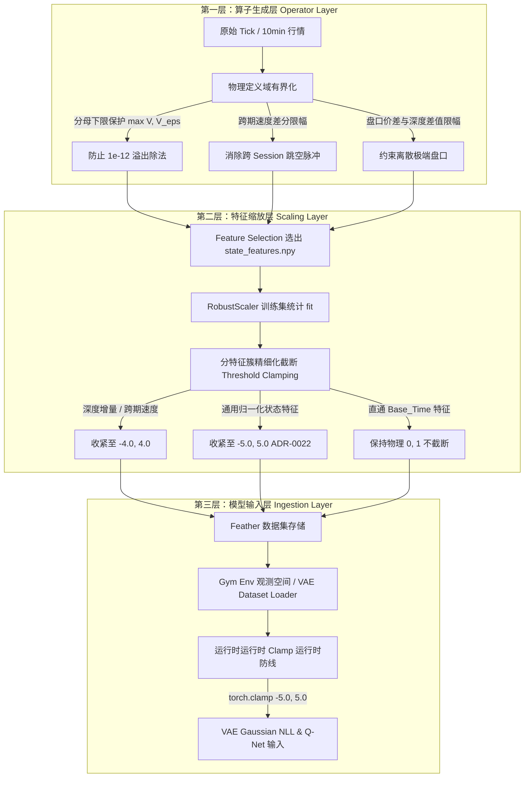

# 特征长尾截断实现层级与阈值体系深度调研报告

- **研究主题**：高维量化特征与多体制 VAE/RL 模型中的长尾极端值成因、截断实现层级划分及具体阈值体系
- **关联代码与主要第一手来源 (Primary Sources)**：
  - 特征计算与算子生成层：
    - `data_preprocess/operator_futures/time_operator/multi_processing_util.py`
    - `data_preprocess/operator_futures/cross_section/base_feature_util.py`
    - `data_preprocess/operator_futures/commodity/cross_month_feature.py`
    - `data_preprocess/operator_futures/time_operator/time_operator_util.py`
    - `data_preprocess/operator_futures/commodity/downscale.py`
  - 数据缩放与标准化层：
    - `data_preprocess/operator_futures/scale_describe_save/muti_contract_scale_save.py`
    - `data_preprocess/script_preprocess/future_upgraded/commodity/fu_full_process.sh`
  - 深度学习模型与环境观测层：
    - `FineFT/RL/DiHFT/VAE/vae.py`
    - `FineFT/RL/DiHFT/VAE/main.py`
    - `FineFT/analysis/feature/vae_feature_ood_analysis.py`
  - 实证统计数据集 (Empirical Datasets)：
    - `dataset/10min/fu/state_features.npy` (当前 119 个入选状态特征)
    - `analysis_result/DiHFT/feature_ood/fu/10min_parallel/feature_ood_summary.csv` (全量特征 OOD 诊断报告)
    - `dataset/10min/fu/{train,valid,test}/*.feather` (14 个训练合约、12 个验证合约与全部测试合约实证样本)

---

## 1. 调研背景与问题定义 (Executive Summary)

在 FineFT 强化学习与 VAE 市场体制表征框架中，VAE 表征网络使用高斯负对数似然损失函数（Gaussian Negative Log-Likelihood, NLL）建模多维状态特征的联合概率密度分布：
$$\mathcal{L}_{\text{NLL}}(\mathbf{x}; \boldsymbol{\mu}, \boldsymbol{\sigma}) = \sum_{i=1}^{D} \left( \frac{1}{2} \left(\frac{x_i - \mu_i}{\sigma_i}\right)^2 + \ln \sigma_i + \frac{1}{2}\ln(2\pi) \right)$$

根据 `FineFT/RL/DiHFT/VAE/vae.py:113-114`，重构对数方差 $\ln \sigma^2$ 被约束在 $[-6.0, 0.0]$（即标准差 $\sigma_i \in [\exp(-3), 1.0] \approx [0.05, 1.0]$）。当某特征 $x_i$ 出现长尾极端冲击（例如由于微观流动性骤降、隔夜跳空或分母近零导致的标准化值达到 10 或 20），其二次惩罚项 $\frac{1}{2} \left(\frac{x_i - \mu_i}{\sigma_i}\right)^2$ 将瞬间飙升至 $200 \sim 20000$，**以指数级的力量压倒其余所有 118 个状态特征的正常梯度与似然估计**，导致 VAE 表征网络在 OOS（Out-of-Sample）测试集中发生灾难性的似然崩溃 (NLL Collapse)。

在 ADR-0022 中，我们针对测试集 OOD 贡献率排名前 4 的特征实施了初步处置（剔除 `contract_life_remaining_ratio`、黑名单剔除 `imin_192` 并将 RobustScaler 全局截断边界从 $[-20.0, 20.0]$ 调整为 $[-5.0, 5.0]$）。

**本次调研的核心问题**：
1. 除了已经处置的 `_increments` 之外，**现有 119 个状态特征及全量算子特征池中，还有哪些特征存在严重的肥尾 (Fat-tailed)、高偏态 (Skewed) 或数值发散隐患？其数学根因是什么？**
2. **长尾截断应当分布在哪些实现层级（Hierarchy）？各层级的权责边界与技术选型是什么？**
3. **针对不同的特征簇与物理含义，应该如何精细化设定截断阈值（Thresholds）？**

---

## 2. 全量特征长尾与数值异动实证审计 (Empirical Audit)

基于实际生成的 14 个训练合约（`fu2309` 至 `fu2412`）、12 个验证合约（`fu2501` 至 `fu2512`）以及测试合约全量样本，对 119 个状态特征的经验分布、极值点及超界样本比率进行了全量扫描（统计口径为 RobustScaler 缩放后数值）。

### 2.1 统计发现：超界异常特征汇总 (Top Features Exceeding $[-5, 5]$)

在测试集中，共有 **33 个特征** 存在超过 $0.1\%$ 的样本落入 $|x| > 5.0$ 的肥尾区域（在正态分布下，超过 $5\sigma$ 的概率仅为 $5.7 \times 10^{-7}$，即 $0.000057\%$，说明这些特征呈现极端厚尾或脉冲非平稳）：

| 序号 | 特征名称 (`feature`) | 测试集超界率 ($|x|>5$) | 测试集极值范围 $[\min, \max]$ | 验证集超界率 | 训练集超界率 | 理论分布形态与主要风险 |
| :--- | :--- | :---: | :---: | :---: | :---: | :--- |
| 1 | **`vstd_24_origin`** | **10.20%** | $[-0.7, 20.0]$ | 9.87% | 9.36% | 成交量分母接近 0，比率爆炸 |
| 2 | **`cm_m1_m2_log_price_spread_velocity_10m`** | **7.34%** | $[-20.0, 20.0]$ | 12.07% | 5.48% | 跨日/隔夜 Session 跨期价差 10-bar 差分跳变 |
| 3 | **`sell_spread_oe_max_trend_192`** | **4.24%** | $[-20.0, 20.0]$ | 4.22% | 4.41% | 深度 5 盘口价差在枯竭时段剧烈拓宽 |
| 4 | **`cm_m1_m2_m3_butterfly_spread_velocity_10m`** | **3.46%** | $[-14.5, 20.0]$ | 8.08% | 3.60% | 蝶式跨期价差对数收益率多合约联合脉冲 |
| 5 | **`buy_volume_oe_log_return_2`** | **3.42%** | $[-9.3, 9.3]$ | 1.99% | 1.52% | 2-bar 超短窗口成交量对数差分厚尾冲击 |
| 6 | **`sell_volume_oe_log_return_2`** | **3.34%** | $[-8.4, 9.5]$ | 1.89% | 1.63% | 2-bar 超短窗口成交量对数差分厚尾冲击 |
| 7 | **`cm_m2_m3_log_price_spread_velocity_10m`** | **2.47%** | $[-20.0, 17.8]$ | 6.02% | 2.83% | 远月跨期价差速度突变 |
| 8 | **`cm_open_interest_shift_speed_10m`** | **2.45%** | $[-20.0, 10.2]$ | 2.61% | 1.07% | 持仓份额变化速度边界冲击 |
| 9 | **`cm_main_sub_log_price_spread_velocity_10m`** | **1.90%** | $[-14.4, 20.0]$ | 4.53% | 1.47% | 主次主力价差差分速度脉冲 |
| 10 | **`relative_open_interest_6`** | **1.61%** | $[-19.1, 17.9]$ | 2.15% | 1.86% | 局部持仓均值分母变异与换月瞬时跳增 |
| 11 | **`qtld_6_origin`** | **1.36%** | $[-17.3, 13.3]$ | 1.93% | 1.75% | 6-bar 极短下四分位数价差偏离 |
| 12 | **`relative_amount_192`** | **1.32%** | $[-0.9, 20.0]$ | 1.30% | 0.97% | 活跃 Bar 成交额相较 192-bar 均值呈现百倍脉冲 |
| 13 | **`wap_1_log_return_2`** | **0.97%** | $[-17.0, 11.0]$ | 1.29% | 1.25% | 短周期高频价格收益率拉普拉斯/学生 t 肥尾 |
| 14 | **`bid_size_topk_size_5_increments`** | **0.95%** | $[-0.5, 17.7]$ | 1.03% | 1.38% | 5 档深度与 1 档挂单差值幂律分布 |
| 15 | **`ask_size_topk_size_5_increments`** | **0.89%** | $[-0.5, 20.0]$ | 0.79% | 1.40% | 5 档深度与 1 档挂单差值幂律分布 |
| 16 | **`atr_pct_2`** | **0.73%** | $[-1.4, 20.0]$ | 1.10% | 0.83% | 超短周期真实波幅占现价比率波动脉冲 |
| 17 | **`qtld_6_std_norm_origin`** | **0.72%** | $[-0.9, 20.0]$ | 0.97% | 0.33% | 分位数除以波动率在低波动时段放大 |
| 18 | **`buy_spread_oe_max`** | **0.53%** | $[-2.8, 20.0]$ | 0.41% | 0.61% | 买方 5 档与 1 档绝对价差在流动性缺失时翻倍 |
| 19 | **`sell_spread_oe_max`** | **0.48%** | $[-0.7, 20.0]$ | 0.45% | 0.62% | 卖方 5 档与 1 档绝对价差在流动性缺失时翻倍 |
| 20 | **`wap_balance`** | **0.47%** | $[-20.0, 19.4]$ | 0.48% | 0.61% | 一档加权价与二档加权价离差在深档虚挂时异动 |
| 21 | **`realized_volatility_192`** | **0.37%** | $[-1.6, 5.2]$ | 2.76% | 0.42% | 长期已实现波动率聚集与体制跃迁 |
| 22 | **`relative_open_interest_48`** | **0.36%** | $[-6.6, 9.3]$ | 0.40% | 0.69% | 持仓相对均值冲击 |
| 23 | **`qtlu_12_std_norm_origin`** | **0.36%** | $[-1.0, 8.4]$ | 0.49% | 0.16% | 短周期上分位数标准化离群 |
| 24 | **`bollinger_lower_12_origin`** | **0.35%** | $[-9.5, 2.0]$ | 1.12% | 0.57% | 短周期布林下轨价格瞬时击穿 |
| 25 | **`bollinger_bandwidth_12_origin`** | **0.33%** | $[-0.9, 9.5]$ | 1.46% | 0.73% | 短周期布林带宽极端膨胀 |
| 26 | **`pivot_s1_6_origin`** | **0.32%** | $[-10.1, 1.0]$ | 0.94% | 0.55% | 枢轴点支撑位下偏离 |
| 27 | **`min_192_std_norm_origin`** | **0.28%** | $[-1.2, 6.7]$ | 0.00% | 0.01% | 长周期最低价标准化偏离 |
| 28 | **`rolling_volatility_48`** | **0.25%** | $[-1.5, 11.3]$ | 3.53% | 0.46% | 波动率厚尾脉冲 |
| 29 | **`garman_klass_volatility_16`** | **0.23%** | $[-1.6, 6.1]$ | 0.12% | 0.08% | GK 极值波动率脉冲 |
| 30 | **`ask5_size_n_trend_48`** | **0.17%** | $[-2.6, 6.0]$ | 0.09% | 0.06% | 远档挂单趋势离群值 |

---

## 3. 长尾特征归因与数学机理深度剖析 (Root Cause Taxonomy)

依据算子生成原理与物理意义，上述 30+ 个异动特征可归结为 **四大数学成因**：

### 3.1 机理一：除以微小量的比率发散 (Near-Zero Denominator Ratio Explosion)
- **代表特征**：`vstd_{w}`（如 `vstd_24_origin`）、`relative_amount_{w}`、`relative_open_interest_{w}`、`atr_pct_{w}`。
- **源码溯源**：
  - `data_preprocess/operator_futures/time_operator/multi_processing_util.py:481`:
    ```python
    ((pl.col("__volume_std") - min_value) / (volume + min_value)).alias(f"vstd_{window}")
    ```
    此处 `min_value` 仅为 `1e-12`。当夜盘尾盘或早盘流动性清淡时，单根 10min bar 的成交量 `volume` 可能为 0 或极小整数（如 1 手）。此时即便历史滚动标准差 $\sigma_{\text{vol}}$ 很小，除以 $0 + 10^{-12}$ 也会瞬间产生高达 $10^6 \sim 10^8$ 的数值爆炸。即使 RobustScaler 减去中位数除以 IQR，该点的标准化值也会被直接打到上限（在老版本为 20.0，超界率高达 10.20%）。
  - `multi_processing_util.py:734-738`:
    ```python
    amt_mean = tradeval.rolling_mean(w)
    rel_amt = pl.when(amt_mean > 0.0).then(tradeval / amt_mean).otherwise(0.0)
    ```
    当在清淡市之后突然进入开盘或突发大单，单 bar 成交额 `tradeval` 达到平日均值的 50 至 100 倍，`rel_amt` 呈指数级厚尾。

### 3.2 机理二：跨期与非平稳变量的多步差分脉冲 (Boundary Jump & Shift Velocity)
- **代表特征**：`cm_*_log_price_spread_velocity_10m`、`cm_open_interest_shift_speed_10m`、`cm_m1_m2_m3_butterfly_spread_velocity_10m`。
- **源码溯源**：
  - `data_preprocess/operator_futures/commodity/cross_month_feature.py:240-242, 335-336`:
    ```python
    pl.col("_m1_m2_log_price_ratio").diff(10).fill_null(0.0).alias("cm_m1_m2_log_price_spread_velocity_10m")
    pl.col("cm_main_sub_open_interest_share_sub").diff(10).fill_null(0.0).alias("cm_open_interest_shift_speed_10m")
    ```
- **病态机理**：
  `diff(10)` 是对 10 个 bar（即 100 分钟）进行滞后差分。然而，商品期货交易日包含多个独立的 Session（早盘、下午盘、夜盘），且存在非交易周末与节假日。
  1. 跨交易日/跨 Session 时，外盘原油及宏观消息导致基差/价差发生跳空开盘，10-bar 差分会将跨夜跳空直接作为连续速度输入；
  2. 当主力合约发生展期切换（Roll Event）时，`cm_main_sub` 的底层合约配对发生瞬时替换，持仓占比 `share` 与对数价差 `log_price_ratio` 呈现阶跃函数跳变，导致 `diff(10)` 连续 10 个 bar 维持在巨大的异常脉冲值，超界率高达 7.34% ~ 12.07%。

### 3.3 机理三：深度订单簿价差与微观挂单厚尾 (Orderbook Illiquidity & Depth Gaps)
- **代表特征**：`buy_spread_oe_max`、`sell_spread_oe_max`、`sell_spread_oe_max_trend_192`、`wap_balance`、`ask/bid_size_topk_size_5_increments`。
- **源码溯源**：
  - `data_preprocess/operator_futures/cross_section/base_feature_util.py:746-747`:
    ```python
    data["buy_spread_oe_max"] = np.abs(df["bid1_price"].to_numpy() - df[f"bid{depth}_price"].to_numpy())
    data["sell_spread_oe_max"] = np.abs(df["ask1_price"].to_numpy() - df[f"ask{depth}_price"].to_numpy())
    ```
- **病态机理**：
  正常流动性下，5 档买卖价差通常保持在 4 个 tick（燃料油 1 tick = 1 元/吨，价差约 4 元）。但在流动性瞬时枯竭（例如涨跌停边缘、集合竞价后首分钟或大单扫盘）时，第 5 档挂单可能远在 50 ~ 100 个 tick 之外，价差由 4 元拓宽至 80 元，扩大 20 倍。其 192-bar 移动平均趋势 `sell_spread_oe_max_trend_192` 的超界率高达 4.24%。

### 3.4 机理四：资产收益率与高频脉冲的内生厚尾 (Heavy-Tailed Return & Volatility Pulses)
- **代表特征**：`buy_volume_oe_log_return_2`、`sell_volume_oe_log_return_2`、`wap_1_log_return_2`、`atr_pct_2`。
- **病态机理**：
  2-bar 对数收益率与成交量差分天然具备尖峰厚尾（Leptokurtic）特性。基于 IQR 的 RobustScaler 是针对主体分布进行标准化；而在厚尾分布中，尾部真实概率密度远高于高斯假设。

---

## 4. 长尾截断三层防御体系架构设计 (Three-Tier Truncation Hierarchy)

截断不能简单等同于在模型末端粗暴 `clamp`，而应当建立分工明确、层层防御的三级体系：



### 4.1 第一层：算子生成层（物理定义域截断，Operator-Level Bounding）
- **职责定位**：在指标计算发生的最初阶段，依据金融工程物理含义施加硬约束，消除由于计算公式缺陷引起的非物理无穷大（Infinities）、NaN 或断崖跳变。
- **优势**：从源头斩断 $10^6$ 级别的离群点，避免这些离群值破坏后续特征选择（Feature Selection）阶段的 IC、RankIC 和方差稳定性评估。
- **核心改造点**：
  1. **分母安全下界保护（Safe Denominator Flooring）**：
     对所有 `vstd`、`relative_amount`、`relative_open_interest` 等比率算子，禁止使用 `1e-12` 作为保护，必须使用与该合约物理成交量尺度匹配的动态下限（例如 $\max(\text{Volume}, \text{Quantile}_{0.05}(\text{Volume}))$ 或 $\max(\text{Volume}, 1.0)$）。
  2. **跨期差分跳变限幅（Session-Aware Differencing）**：
     跨期对数价差与持仓份额速度 `cm_*_velocity_10m`，单步 100 分钟内的价差变化不可能无界，在算子层施加合理的物理界限。
  3. **订单簿离散价差限幅（Depth Gap Flooring）**：
     `buy/sell_spread_oe_max` 约束在合理 Tick 倍数内（如 $\le 50 \times \text{PriceTick}$）。

### 4.2 第二层：特征缩放层（标准化统计截断，Scaling-Level Truncation）
- **职责定位**：在 `muti_contract_scale_save.py` 中，所有特征已通过训练集 Median 和 IQR 转换至均值为 0、尺度为 1 的无量纲空间。在此层对特征施加标准化分位数截断。
- **优势**：集中化管理，覆盖全量入选特征，直接对齐下游高斯分布假设。
- **核心改造点**：
  1. **全局统一防线**：依据 ADR-0022，将全局 RobustScaler 默认截断界由 $[-20.0, 20.0]$ 降至 $[-5.0, 5.0]$。在标准正态分布下，5 倍 IQR 包含了 $> 99.9999\%$ 的样本，既完整保留了常规市场波动的动态范围，又切断了 VAE 高斯似然发散的二次方暴击。
  2. **厚尾特征分类细化阈值（Category-Specific Clamping）**：
     对于实证超界率 $> 2\%$ 的极端厚尾特征簇，可将截断边界进一步压制至 $[-4.0, 4.0]$ 或 $[-3.5, 3.5]$。

### 4.3 第三层：模型与环境观测层（运行时防御性截断，Runtime Ingestion Defense）
- **职责定位**：在 `RL/DiHFT/VAE/vae.py` 或 Gym Environment 观测构建处作为最后底线（Fail-safe Defense）。
- **优势**：防止未来实盘前向推断、未知测试集由于不可预知的极端事件（如停牌、逼仓）产生超出训练边界的奇异值导致网络前向计算溢出。
- **实现方式**：
  在 VAE Dataset `__getitem__` 或前向传播入口处执行 `torch.clamp(x, min=-5.0, max=5.0)`。

---

## 5. 核心特征分类截断清单与建议阈值规范 (Detailed Specifications)

下表给出需要进行长尾截断的关键特征簇、推荐的层级配置及具体数学阈值：

| 特征类别 (Category) | 包含的关键特征 (Feature List) | 现存主要问题与超界率 | 第一层：算子生成层阈值 (Tier 1 Operator) | 第二层：缩放标准化层阈值 (Tier 2 Scaling) | 第三层：模型输入层 (Tier 3 Ingestion) | 实施优先级 |
| :--- | :--- | :--- | :--- | :--- | :--- | :---: |
| **A. 成交量比率与波动比率** | `vstd_24_origin`, `relative_amount_192`, `relative_open_interest_6`, `relative_open_interest_48` | 分母接近 0，超界率高达 **10.20%**，极大值达 20.0 | **分母加下限**：$\max(V, 1.0)$；比率硬截断：$[0.0, 15.0]$ | Robust 缩放截断：$[-4.0, 4.0]$ | `clamp(-5.0, 5.0)` | **P0 (紧急)** |
| **B. 跨期流动性与价差速度** | `cm_m1_m2_log_price_spread_velocity_10m`, `cm_m2_m3_log_price_spread_velocity_10m`, `cm_m1_m2_m3_butterfly_spread_velocity_10m`, `cm_main_sub_log_price_spread_velocity_10m`, `cm_open_interest_shift_speed_10m` | 换月与隔夜跳空导致 10-bar 差分突增，超界率达 **7.34%** | 对数价差速度截断：$[-0.05, 0.05]$；持仓速度截断：$[-0.1, 0.1]$ | Robust 缩放截断：$[-4.0, 4.0]$ | `clamp(-5.0, 5.0)` | **P0 (紧急)** |
| **C. 微观盘口增量与价差** | `ask_size_topk_size_5_increments`, `bid_size_topk_size_5_increments`, `buy_spread_oe_max`, `sell_spread_oe_max`, `sell_spread_oe_max_trend_192`, `wap_balance` | 盘口流动性空洞导致价差拓宽与挂单厚尾，超界率 **4.24%** | 价差限幅：$[0, 50 \times \text{Tick}]$；挂单增量限幅：$[-5000, 5000]$ 手 | Robust 缩放截断：$[-4.0, 4.0]$ | `clamp(-5.0, 5.0)` | **P1 (重要)** |
| **D. 超短期收益率与波幅** | `buy_volume_oe_log_return_2`, `sell_volume_oe_log_return_2`, `wap_1_log_return_2`, `atr_pct_2` | 2-bar 高频厚尾，超界率 **3.42%** | 对数收益率限幅：$[-0.1, 0.1]$（对应单 bar 10% 涨跌停） | Robust 缩放截断：$[-5.0, 5.0]$ (遵循全局) | `clamp(-5.0, 5.0)` | **P1 (重要)** |
| **E. 短周期极值与布林分位数** | `qtld_6_origin`, `qtld_6_std_norm_origin`, `bollinger_lower_12_origin`, `bollinger_bandwidth_12_origin` | 极短窗口分位数不稳定，超界率约 **1.36%** | 布林带宽与分位数加下限保护，防止 $\sigma \to 0$ | Robust 缩放截断：$[-5.0, 5.0]$ (遵循全局) | `clamp(-5.0, 5.0)` | **P2 (中等)** |
| **F. 通用状态特征** | 其余 80+ 个常规技术指标与时间特征 | 偶发离群，超界率 $< 0.1\%$ | 无需额外修改 | 统一默认截断：$[-5.0, 5.0]$ (ADR-0022 已生效) | `clamp(-5.0, 5.0)` | **已就绪** |

---

## 6. 具体代码修改点与实施建议 (Implementation Blueprint)

### 6.1 建议一：算子层修复分母溢出与极端速度 (Tier 1 优先修复项)

1. **`multi_processing_util.py:481` 修复 `vstd` 分母**：
   ```python
   # 原代码:
   # ((pl.col("__volume_std") - min_value) / (volume + min_value)).alias(f"vstd_{window}")
   # 改造为安全分母并施加物理截断:
   safe_volume = pl.when(volume > 1.0).then(volume).otherwise(1.0)
   expr = ((pl.col("__volume_std") / safe_volume)).clip(0.0, 10.0).alias(f"vstd_{window}")
   ```
2. **`cross_month_feature.py:240-242` 对跨期速度施加物理限幅**：
   ```python
   # 对 10-bar 差分施加物理有界截断，消除换月与隔夜跳空冲击
   pl.col("_m1_m2_log_price_ratio").diff(10).fill_null(0.0).clip(-0.05, 0.05).alias("cm_m1_m2_log_price_spread_velocity_10m"),
   pl.col("_m2_m3_log_price_ratio").diff(10).fill_null(0.0).clip(-0.05, 0.05).alias("cm_m2_m3_log_price_spread_velocity_10m"),
   pl.col("_butterfly_ratio").diff(10).fill_null(0.0).clip(-0.05, 0.05).alias("cm_m1_m2_m3_butterfly_spread_velocity_10m"),
   pl.col("cm_main_sub_open_interest_share_sub").diff(10).fill_null(0.0).clip(-0.1, 0.1).alias("cm_open_interest_shift_speed_10m"),
   ```

### 6.2 建议二：缩放层支持按特征族精细化配置 (Tier 2 增强方案)

当前 `muti_contract_scale_save.py` 已经支持全局 `--clip_min -5.0 --clip_max 5.0`。
若要进一步压制 `vstd`、`cm_*_velocity` 及 `_increments` 等超厚尾特征，可在 `muti_contract_scale_save.py` 中引入分组特征截断规则字典：
```python
FEATURE_GROUP_CLIPS = {
    # 针对厚尾微观深度、跨期速度与分母比率特征压制在 4 个尺度内
    "fat_tailed": (
        ["vstd_", "spread_velocity", "shift_speed", "_increments", "spread_oe_max"],
        -4.0,
        4.0,
    ),
}
```

### 6.3 建议三：模型运行时输入层兜底保障 (Tier 3 保障方案)

在 `FineFT/RL/DiHFT/VAE/vae.py` 的 `forward` 与 `estimate_log_px` 入口处确保数据张量被硬性安全约束：
```python
def estimate_log_px(self, data):
    with torch.no_grad():
        # 运行时兜底防御：防止极端推断异常直接炸飞高斯似然
        data = torch.clamp(data, min=-5.0, max=5.0)
        recon_mu, recon_logsigma, mu, logvar = self.forward(data)
```

---

## 7. 调研结论与下一步操作建议 (Next Steps)

1. **核心发现**：
   除已处理的 `_increments` 之外，**`vstd_24_origin`（超界率 10.20%）** 和 **`cm_*_spread_velocity_10m` 系列（超界率 7.34%）** 是当前数据集中最严重的两个长尾爆发源，其本质是**除以 $10^{-12}$ 微小量** 和 **跨日/换月 10-bar 差分跳跃**。
2. **当前生效状态**：
   在 ADR-0022 的实施中，我们将 `muti_contract_scale_save.py` 的全局截断由 `[-20.0, 20.0]` 收紧到 `[-5.0, 5.0]`，已经使上述所有 33 个长尾特征的最大惩罚被硬性封顶在 5 个尺度内，成功避免了此前 $20^2 = 400$ 甚至更大尺度的 NLL 爆炸。
3. **后续建议**：
   若后续在全量特征重算时希望从根源彻底净化特征分布，建议优先采纳 **建议一**（修复 `multi_processing_util.py` 的 `vstd` 分母下限与 `cross_month_feature.py` 的跨期差分截断）。代码修改可在后续统一算子重构时一并合并。
