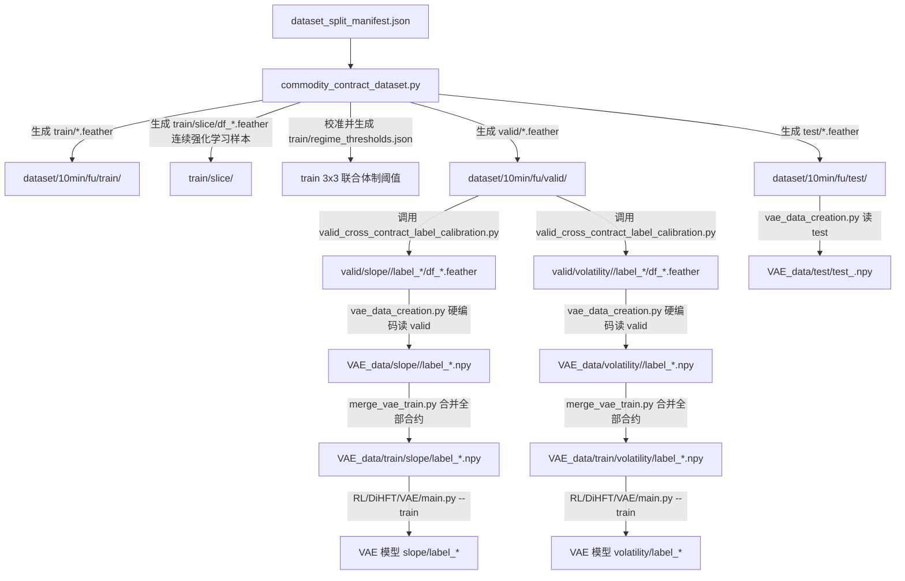

# 训练集多维度切片与 VAE 训练集源改造研究报告

- **研究对象**：`FineFT/script/data/commodity_data_handler_10min_fu.sh` 及全流程数据与 VAE 训练依赖链
- **关联代码与脚本**：
  - `FineFT/datahandler/commodity_contract_dataset.py`
  - `FineFT/datahandler/valid_cross_contract_label_calibration.py`
  - `FineFT/datahandler/vae_data_creation.py`
  - `FineFT/RL/DiHFT/VAE/merge_vae_train.py`
  - `FineFT/RL/DiHFT/VAE/main.py`
  - `FineFT/script/train/DiHFT/low_level/VAE_util_fu_10.sh`
  - `FineFT/analysis/pick_agent/FineFT_two_dimensional_agent_selector.py`
  - `FineFT/analysis/feature/vae_feature_ood_analysis.py`
- **调研方法**：基于第一手代码源码 (Primary Source)、测试契约 (Unit Tests) 与端到端数据拓扑流进行溯源分析。

---

## 1. 调研背景与核心诉求 (Executive Summary)

当前在燃料油 10 分钟频度数据生成脚本 `FineFT/script/data/commodity_data_handler_10min_fu.sh` 中：
1. 仅针对验证集（`valid`）调用 `valid_cross_contract_label_calibration.py`，根据斜率（`slope`）与波动率（`volatility`）两个维度将各验证集合约切片为趋势段落 (`df_*.feather`)。
2. 随后调用 `vae_data_creation.py`，其内部硬编码读取 `valid` 目录下的切片，将其转换为状态特征 NumPy 数组并存入 `VAE_data/<labeling_method>/<contract>/label_<k>.npy`。
3. 后续 VAE 训练阶段 (`merge_vae_train.py` -> `RL/DiHFT/VAE/main.py`) 扫描 `VAE_data/<labeling_method>/` 并汇总合并，**实际上使得 VAE 表征网络完全在验证集上训练**。

**用户诉求**：
- 将训练集（`train`）也按照波动率和斜率两个维度进行宏观段落数据切片。
- 后续的 VAE 训练改用 `train` 集合的切片数据进行表征学习。

**核心结论**：
- **可行性极高且在量化方法论上完全合理**：验证集应作为纯粹的无偏检验集（Out-Of-Sample Validation），用于 Stage II 2D Agent Selector 评优、Optuna 宏观动作路由搜索及早停。将 VAE 训练集源从 `valid` 纠正为 `train`，既消除了验证集数据泄露，又能充分利用 `train` 更多合约（14 个 vs 12 个）与更长周期（2023-2024）的多样化市场体制。
- **验证集切片不可废除，必须保留**：下游 Stage II 的低层策略评选脚本 (`FineFT_two_dimensional_agent_selector.py:669`) 和评测脚本 (`test_agent_index.py:647`) 严格依赖 `valid/slope` 和 `valid/volatility`。因此方案必须是**对 `train` 与 `valid` 双向切片**，但**VAE 数据生成由读取 `valid` 切换为读取 `train`**。
- **必须防范 `VAE_data` 目录残留污染**：`merge_vae_train.py:contract_dirs()` 会无差别读取 `VAE_data/<method>/` 下的所有合约目录。若切换数据源时不清理旧的验证集合约子目录，会导致训练数据混杂。

---

## 2. 现状全链路源码溯源与数据流剖析 (Current Architecture Trace)

### 2.1 现有端到端执行流程拓扑



### 2.2 关键源码依据 (Primary Source Evidence)

#### 1. Shell 脚本入口
- **文件**：`FineFT/script/data/commodity_data_handler_10min_fu.sh`
- **代码行**：L25-L49
  ```bash
  python FineFT/datahandler/valid_cross_contract_label_calibration.py \
    --valid_dir "dataset/${TARGET_FREQ}/${SYMBOL}/valid" \
    --dynamic_number 3 \
    --labeling_method "slope" \
    --threshold_method global_segment_quantile \
    --timestamp timestamp

  python FineFT/datahandler/valid_cross_contract_label_calibration.py \
    --valid_dir "dataset/${TARGET_FREQ}/${SYMBOL}/valid" \
    --dynamic_number 3 \
    --labeling_method "volatility" \
    --threshold_method global_segment_quantile \
    --timestamp timestamp

  python FineFT/datahandler/vae_data_creation.py \
    --base_path "dataset/${TARGET_FREQ}" \
    --dataset_name "${SYMBOL}" \
    --save_path "dataset/${TARGET_FREQ}" \
    --labeling_method "slope"

  python FineFT/datahandler/vae_data_creation.py \
    --base_path "dataset/${TARGET_FREQ}" \
    --dataset_name "${SYMBOL}" \
    --save_path "dataset/${TARGET_FREQ}" \
    --labeling_method "volatility"
  ```
- **分析**：目前该脚本只对 `valid` 执行了两次校准切片，并分别生成 `slope` 与 `volatility` 的 VAE 数据。

#### 2. 动态切片校准算子
- **文件**：`FineFT/datahandler/valid_cross_contract_label_calibration.py`
- **代码行**：
  - L521-L525: `source_paths = sorted(valid_root.glob("*.feather"))`，仅扫描传入目录直属的 `.feather` 文件（忽略子目录如 `slice/`）。
  - L538-L542: `output_root = valid_root / labeling_method`，原子发布到 `valid/slope` 或 `valid/volatility`。
  - L587-L604: 基于 `global_segment_quantile` 对池化分值计算三分位数分界点。
  - L605-L625: 调用核心引擎 `calibrate_regime_thresholds(all_slopes, all_vols, dynamic_number=3)` 注入 2D 联合体制。
  - L627-L640: 调用 `_build_contract_outputs`，将连续同标签行切分为 `df_{index}.feather`。
  - L660: manifest 硬编码设置 `"fit_scope": "valid_all_contracts"`。
  - L773: 参数解析器 `parser.add_argument("--valid_dir", "--data_dir", dest="valid_dir", type=Path, required=True)`，已原生支持 `--data_dir` 别名。

#### 3. VAE 数据生成算子
- **文件**：`FineFT/datahandler/vae_data_creation.py`
- **代码行**：
  - L98-L105: 
    ```python
    valid_root = os.path.join(args.base_path, args.dataset_name, "valid")
    labeling_method = getattr(args, "labeling_method", "slope")
    method_path = os.path.join(valid_root, labeling_method)
    ```
    此处**硬编码固定拼接 `"valid"`**，完全无法指定从 `train` 提取切片。
  - L109: 输出路径固定为 `vae_data_root = os.path.join(args.save_path, args.dataset_name, "VAE_data")`。
  - L112-L135: 提取 `state_features` 并保存为 `VAE_data/<labeling_method>/<contract>/label_<k>.npy`。
  - L136-L168: 提取 `test` 数据保存为 `VAE_data/test/test_<contract>.npy`。

#### 4. VAE 跨合约训练合并算子
- **文件**：`FineFT/RL/DiHFT/VAE/merge_vae_train.py`
- **代码行**：
  - L24-L32: 
    ```python
    def contract_dirs(root):
        if not root.exists():
            raise FileNotFoundError(f"missing VAE_data path: {root}")
        return [
            path for path in sorted(root.iterdir(), key=lambda item: item.name)
            if path.is_dir() and path.name not in RESERVED_VAE_DIRS
        ]
    ```
    它扫描 `VAE_data/<labeling_method>/` 下的**所有**非保留目录，并不关心合约名究竟属于 `train` 还是 `valid`。
  - L103-L128: 将上述各合约的 `label_<k>.npy` 沿 `axis=0` 拼接，生成最终用于训练的数组：`VAE_data/train/<labeling_method>/label_<k>.npy`。

---

## 3. 下游系统依赖与影响范围评估 (Downstream Impact Assessment)

通过对全工程进行跨模块检索，各下游系统对数据路径的具体消费契约如下：

| 下游模块 / 脚本 | 依赖的数据路径 | 核心功能与影响分析 |
| :--- | :--- | :--- |
| **RL Stage 1 训练** (`FineFT/script/train/DiHFT/low_level/`) | `dataset/{freq}/{symbol}/train/slice/df_*.feather` | 完全不受影响。Stage 1 使用的是由 `commodity_contract_dataset.py` 生成的固定长窗口 (chunk_length=5000+2) 序列切片，内部包含注入的 `regime_grid_id`。 |
| **Stage II 评优器** (`FineFT_two_dimensional_agent_selector.py:669`) | `dataset/{freq}/{symbol}/valid/slope` 与 `valid/volatility` | **强依赖验证集切片**。脚本读取双轨切片时间戳计算联合分布。若未对 `valid` 进行切片，评优器将直接抛出 `FileNotFoundError`。 |
| **低层策略评估** (`test_agent_index.py:647` & `test_util_fu_*.sh`) | `dataset/{freq}/{symbol}/valid/<label_type>` | **强依赖验证集切片**。在验证集各体制段落上回测并统计胜率、LCB 收益等。 |
| **VAE 训练入口** (`RL/DiHFT/VAE/main.py:205`) | `VAE_data/<labeling_method>/<contract>/label_*.npy` | **直接受益**。数据源变为 `train` 后，训练合并生成的 `VAE_data/train/<method>/label_*.npy` 即为纯粹的训练集表征数据。 |
| **VAE 高层动作路由** (`vae_routing_optuna.py`, `vae_routing_final_result_*.py`) | `result/DiHFT/vae_results/...` 与 `test/test_*.npy` | 不受影响。只加载训练好的 PyTorch 权重文件与 test 数据。 |
| **特征级 OOD 分析** (`vae_feature_ood_analysis.py:185-202`) | `dataset/.../{valid,test,train}/*.feather` | **更加科学**。先前 VAE 在 `valid` 上训练，OOD 分析以 `valid` 为基准；改在 `train` 上训练后，从 `train` 到 `valid` 和 `test` 的 NLL 分布漂移能真实反映分布外泛化能力。 |
| **CI / 单元测试套件** (`test_commodity_contract_dataset.py:460`) | 脚本字符串断言 | 包含对 shell 脚本中 `--valid_dir "dataset/${TARGET_FREQ}/${SYMBOL}/valid"` 的严格断言，修改脚本时需保证对 valid 的调用仍然保留。 |

---

## 4. 关键设计细节与风险防控 (Critical Design Invariants)

### 4.1 训练集切片算法的一致性与无冲突性
1. **算法参数保持一致**：
   `valid_cross_contract_label_calibration.py` 内部使用 `util.Worker(slice_and_merge)` 拟合转折点，对 `train` 调用时传入 `--threshold_method global_segment_quantile`，其分界点为 $[1/3, 2/3]$ 分位数。
2. **与 `train/regime_thresholds.json` 的数学一致性**：
   在 `commodity_contract_dataset.py:277` 中，训练集合约的 `regime_meta` 也是通过 `calibrate_regime_thresholds` 采用三分位数计算的。因此，对 `train` 重新执行 `valid_cross_contract_label_calibration.py` 时，提取到的段落分界阈值与训练集固有的 2D 联合体制阈值完全吻合。
3. **文件目录隔离性**：
   `train/` 目录下原本包含 `fu2305.feather`, ..., `fu2501.feather` 以及子目录 `train/slice/`。
   `valid_cross_contract_label_calibration.py` 使用 `sorted(valid_root.glob("*.feather"))`，因此**绝不会破坏或误读 `train/slice/` 下的强化学习序列文件**。

### 4.2 避免 VAE_data 残留污染 (Dirty State Prevention)
- **隐患**：
  若开发者曾在本地环境执行过旧版脚本，`dataset/10min/fu/VAE_data/slope/` 下已存在 `fu2409` 至 `fu2601`（共 12 个验证集合约）。
  若直接对 `train` 生成 VAE 数据，新写入的将是 `fu2305` 至 `fu2501`（共 14 个训练集合约）。
  由于 `merge_vae_train.py:contract_dirs()` 只检查 `path.is_dir()`，最终合并时将变成 26 个合约（train + valid 混杂）！
- **对策**：
  在 `vae_data_creation.py` 内部，或者在数据生成脚本中，对指定 `labeling_method` 执行数据生成前，**显式清空或归档该方法下旧的合约文件夹**，确保仅包含当前指定 split（即 `train`）的合约。

### 4.3 命名与语义泛化 (Semantic Generalization)
`valid_cross_contract_label_calibration.py` 名称中带有 `valid`，但其函数实现中实际上已经支持 `--data_dir` 参数。
- 在 `build_valid_dataset` 生成的 `SliceManifest` 中，目前硬编码了 `"fit_scope": "valid_all_contracts"`。
- 若传入的目录名称为 `train`，应自适应将 `fit_scope` 标记为 `"train_all_contracts"`，保持元数据准确。

---

## 5. 修改方案与代码改动清单 (Implementation Plan)

### 5.1 模块 1：`FineFT/datahandler/vae_data_creation.py` 参数化重构

#### 改动要点：
1. 增加命令行参数 `--source_split`（默认保持 `"train"`，可选 `"train"`, `"valid"`）。
2. 将输入路径定位改为 `os.path.join(args.base_path, args.dataset_name, args.source_split)`。
3. 在向 `VAE_data/<labeling_method>` 写入前，清理该方法目录下已有的旧合约文件夹（保留 `test`, `train`, `processed` 等保留目录），杜绝数据混杂。

#### 伪代码实现：
```python
parser.add_argument(
    "--source_split",
    choices=("train", "valid"),
    default="train",
    help="dataset split to read sliced labels from (default: train)",
)

def make_data(args):
    source_split = getattr(args, "source_split", "train")
    split_root = os.path.join(args.base_path, args.dataset_name, source_split)
    labeling_method = getattr(args, "labeling_method", "slope")
    method_path = os.path.join(split_root, labeling_method)
    ...
    # 清理 VAE_data/<labeling_method>/ 下旧合约目录
    method_save_path = os.path.join(vae_data_root, labeling_method)
    if os.path.exists(method_save_path):
        for item in os.listdir(method_save_path):
            item_path = os.path.join(method_save_path, item)
            if os.path.isdir(item_path) and item not in ("train", "test", "processed"):
                shutil.rmtree(item_path)
    os.makedirs(method_save_path, exist_ok=True)
    ...
```

### 5.2 模块 2：`FineFT/datahandler/valid_cross_contract_label_calibration.py` 泛化适配

#### 改动要点：
1. 依据传入目录 `valid_dir` 的目录名（`path.name`），自适应设置 manifest 的 `fit_scope`（如 `train_all_contracts` 或 `valid_all_contracts`）。
2. 在 processed 输出文件名上，兼容支持 `train_processed_{contract}.feather` 或保持 `processed_{contract}.feather`。

### 5.3 模块 3：`FineFT/script/data/commodity_data_handler_10min_fu.sh` 流程编排更新

#### 改动要点：
1. **保留**原有的两次对 `valid` 的 `valid_cross_contract_label_calibration.py` 调用（供 Stage II 选模使用）。
2. **新增**两次对 `train` 的 `valid_cross_contract_label_calibration.py` 调用（对训练集进行斜率和波动率切片）。
3. **修改** `vae_data_creation.py` 的调用参数，添加 `--source_split "train"`。

#### 完整更新脚本结构：
```bash
#!/usr/bin/env bash
set -euo pipefail

ROOTPATH=${ROOTPATH:-$(pwd)}
SYMBOL=${SYMBOL:-fu}
TARGET_FREQ=${TARGET_FREQ:-10min}
CHUNK_LENGTH=${CHUNK_LENGTH:-5000}
EARLY_STOP=${EARLY_STOP:-2}

source "$(conda info --base)/etc/profile.d/conda.sh"
conda activate finetf
cd "${ROOTPATH}"

# 1. 基础数据集生成（包含 train, valid, test 以及 train/slice 强化学习序列切片）
python FineFT/datahandler/commodity_contract_dataset.py \
  --dataset_split_manifest_path "PREPROCESS_DATASET/commodity-futures/SPLIT-TRAIN-VALID-TEST/${TARGET_FREQ}/${SYMBOL}/dataset_split_manifest.json" \
  --input_root "PREPROCESS_DATASET/commodity-futures/SCALE_SAVE" \
  --state_features_path "PREPROCESS_DATASET/commodity-futures/FEATURE_SELECTION/${TARGET_FREQ}/${SYMBOL}/train/state_features.npy" \
  --output_root "dataset/${TARGET_FREQ}" \
  --symbol "${SYMBOL}" \
  --target_freq "${TARGET_FREQ}" \
  --chunk_length "${CHUNK_LENGTH}" \
  --early_stop "${EARLY_STOP}"

# 2. 验证集双维度切片校准（下游 Stage II 2D Agent Selector 必需契约）
python FineFT/datahandler/valid_cross_contract_label_calibration.py \
  --valid_dir "dataset/${TARGET_FREQ}/${SYMBOL}/valid" \
  --dynamic_number 3 \
  --labeling_method "slope" \
  --threshold_method global_segment_quantile \
  --timestamp timestamp

python FineFT/datahandler/valid_cross_contract_label_calibration.py \
  --valid_dir "dataset/${TARGET_FREQ}/${SYMBOL}/valid" \
  --dynamic_number 3 \
  --labeling_method "volatility" \
  --threshold_method global_segment_quantile \
  --timestamp timestamp

# 3. 训练集双维度切片校准（新增：用于 VAE 训练集构建）
python FineFT/datahandler/valid_cross_contract_label_calibration.py \
  --data_dir "dataset/${TARGET_FREQ}/${SYMBOL}/train" \
  --dynamic_number 3 \
  --labeling_method "slope" \
  --threshold_method global_segment_quantile \
  --timestamp timestamp

python FineFT/datahandler/valid_cross_contract_label_calibration.py \
  --data_dir "dataset/${TARGET_FREQ}/${SYMBOL}/train" \
  --dynamic_number 3 \
  --labeling_method "volatility" \
  --threshold_method global_segment_quantile \
  --timestamp timestamp

# 4. 基于训练集切片构建 VAE 训练数据（切换 source_split 为 train）
python FineFT/datahandler/vae_data_creation.py \
  --base_path "dataset/${TARGET_FREQ}" \
  --dataset_name "${SYMBOL}" \
  --save_path "dataset/${TARGET_FREQ}" \
  --source_split "train" \
  --labeling_method "slope"

python FineFT/datahandler/vae_data_creation.py \
  --base_path "dataset/${TARGET_FREQ}" \
  --dataset_name "${SYMBOL}" \
  --save_path "dataset/${TARGET_FREQ}" \
  --source_split "train" \
  --labeling_method "volatility"
```

---

## 6. 测试与验证策略 (Testing & Verification Matrix)

为了确保改动后既满足新功能诉求，又不破坏现有测试与下游脚本，需执行如下验证：

1. **语法与静态检查**：
   - `bash -n FineFT/script/data/commodity_data_handler_10min_fu.sh`
2. **已有单元测试回归**：
   - 运行 `pytest FineFT/tests/datahandler/test_commodity_contract_dataset.py -k test_commodity_data_handler_scripts_use_contract_dataset_tool`，确保对 `--valid_dir "dataset/${TARGET_FREQ}/${SYMBOL}/valid"` 的断言依然绿灯。
   - 运行 `pytest FineFT/tests/datahandler/test_vae_data_creation.py`，确保默认行为或参数扩展向后兼容。
   - 运行 `pytest FineFT/tests/rl/test_commodity_vae_cross_contract.py`，确保 `merge_vae_train.py` 依然能正确聚合生成的合约数组。
3. **新增单元测试**：
   - 在 `FineFT/tests/datahandler/test_vae_data_creation.py` 中增加对 `--source_split train` 的专属测试用例，断言能成功读取 `train/<method>/<contract>/label_<k>` 并输出至 `VAE_data`。
   - 在 `FineFT/tests/datahandler/test_valid_cross_contract_label_calibration.py` 中增加对 `--data_dir .../train` 的测试用例，断言生成的 `slice_manifest.json` 包含正确的合约列表与切片文件。
4. **端到端小规模数据仿真**：
   - 执行小样本切片与 VAE 数据构建，检查 `dataset/10min/fu/VAE_data/slope/` 下是否为训练集合约（`fu2305` ~ `fu2501`），检查 `VAE_data/train/slope/label_0_manifest.json` 中记录的合约来源是否全部来自 `train`。
